## Implementation Task Matrix — wi_89fd8c62ff5f66a9b409

**Matrix ID:** `wi_89fd8c62ff5f66a9b409-r1` · **Generated:** 2026-09-29T12:36:18.492293+00:00 · **Source:** `tasks` · **Verdict:** **READY**

### Summary

| Metric | Value |
| :--- | :--- |
| Tasks total | 45 |
| AI-allocated | 45 |
| Manual-allocated | 0 |
| Waves | 14 |
| Conflicts | 0 |
| Requirements uncovered | 0 |
| Low-confidence allocations (<0.6) | 0 |

### Wave 0

| Task | Title | Repo | Owner | Allocation | Confidence | Status |
| :--- | :--- | :--- | :--- | :--- | :--- | :--- |
| T001 | Add `AimOnboardingSessions = 'aim_onboarding_sessions'` to `Kochava.Aim.Portal.DataAccess/Mongo/CollectionName | Kochava/mmm-portal-api | coding-agent | ai | 0.70 | planned |
| T010 | Add a mos-iam `GetUserByEmail` helper that resolves the caller's `is_as_admin` (cached, fail closed; `x-user-i | Kochava/mmm-portal-api | coding-agent | ai | 0.70 | planned |
| T101 | Create session and wizard-state types (use `campaignGrouping` and `campaignGroupingChoice`, PascalCase API con | Kochava/frontend-mos | coding-agent | ai | 0.90 | planned |
| T103 | Register the third tab (`aimOnboarding` v-tab and v-window-item, i18n key `mmm_config.tabs.aim_onboarding`) in | Kochava/frontend-mos | coding-agent | ai | 0.90 | planned |
| T201 | Add an Oathkeeper access rule for the onboarding-sessions route (GET/POST/PUT, api-key authorizer, `noop` muta | Kochava/ko-k8s-apps | sre-agent | ai | 0.90 | planned |

### Wave 1

| Task | Title | Repo | Owner | Allocation | Confidence | Status |
| :--- | :--- | :--- | :--- | :--- | :--- | :--- |
| T002 | Create the `OnboardingSession` aggregate POCO with embedded `Wizard`, `Tier`, `ScopeOfWork`, `TimelineState`,  | Kochava/mmm-portal-api | coding-agent | ai | 0.70 | planned |
| T102 | Create `onboardingService` (`getLatest`, `create`, `update`, `bookMeeting`, `approve`, `sowApproval`, `updateT | Kochava/frontend-mos | coding-agent | ai | 0.90 | planned |
| TG2 | Run tests & validate build | Kochava/ko-k8s-apps | test-change-gate | ai | 0.90 | planned |

### Wave 2

| Task | Title | Repo | Owner | Allocation | Confidence | Status |
| :--- | :--- | :--- | :--- | :--- | :--- | :--- |
| T003 | Create `IOnboardingSessionDataLayer` (`GetLatestByAdvertiserAsync`, `CreateAsync`, `ReplaceAsync`, `AppendChan | Kochava/mmm-portal-api | coding-agent | ai | 0.70 | planned |
| T006 | Create `OnboardingSessionDto` and `OnboardingSessionUpsertDto` (mirror the model, no server-owned fields writa | Kochava/mmm-portal-api | coding-agent | ai | 0.70 | planned |
| T104 | Create `recommendTier` with the 8 prototype bug-fixes (budgetMonthly/Annual and annual divided by 12, 12-month | Kochava/frontend-mos | coding-agent | ai | 0.90 | planned |
| T105 | Create `buildProvisionPlan` (Data Schema dimension and metric columns from funnel events and sources, flattene | Kochava/frontend-mos | coding-agent | ai | 0.90 | planned |
| T106 | Create per-step and output validation, routing flags (`uaUeRoutingFlag`, `brandRoutingFlag`) and the milestone | Kochava/frontend-mos | coding-agent | ai | 0.90 | planned |
| T124 | Build shared `ToggleCard` (checkbox affordance for multi-select), `ShareAllocator` (sliders summing to 100) an | Kochava/frontend-mos | coding-agent | ai | 0.90 | planned |

### Wave 3

| Task | Title | Repo | Owner | Allocation | Confidence | Status |
| :--- | :--- | :--- | :--- | :--- | :--- | :--- |
| T004 | Create `OnboardingSessionDataLayer` extending `MongoDataLayerBase` with an advertiser-scoped filter (SavedView | Kochava/mmm-portal-api | coding-agent | ai | 0.70 | planned |
| T107 | Add Vitest unit tests for the three logic modules (annual to monthly, 12 to 24 month qualification, business-m | Kochava/frontend-mos | coding-agent | ai | 0.90 | planned |
| T108 | Create `useAimOnboarding` (flat state, computed flags, step navigation, per-step validation derivation) in `pa | Kochava/frontend-mos | coding-agent | ai | 0.90 | planned |

### Wave 4

| Task | Title | Repo | Owner | Allocation | Confidence | Status |
| :--- | :--- | :--- | :--- | :--- | :--- | :--- |
| T005 | Add NUnit tests (advertiser scoping, latest-wins, replace rejected after approval; Moq `IMongoCollection`) in  | Kochava/mmm-portal-api | coding-agent | ai | 0.70 | planned |
| T112 | Build Steps 1-2 (Your Team, About Your Product) with progressive disclosure in `packages/advertiser/src/views/ | Kochava/frontend-mos | coding-agent | ai | 0.90 | planned |
| T113 | Build Step 3 Marketing Setup including the `campaignGrouping` question in `packages/advertiser/src/views/Analy | Kochava/frontend-mos | coding-agent | ai | 0.90 | planned |
| T114 | Build Step 4 Business Model and Funnel (model change clears LTV and `webFunnel` state) in `packages/advertiser | Kochava/frontend-mos | coding-agent | ai | 0.90 | planned |
| T115 | Build Steps 5-6 (Data Sources, External Factors) in `packages/advertiser/src/views/Analytics/MmmInsightsConfig | Kochava/frontend-mos | coding-agent | ai | 0.90 | planned |
| T116 | Build Steps 7-8 (Objectives, Review) with Generate (1.6s animation, no backend call) in `packages/advertiser/s | Kochava/frontend-mos | coding-agent | ai | 0.90 | planned |

### Wave 5

| Task | Title | Repo | Owner | Allocation | Confidence | Status |
| :--- | :--- | :--- | :--- | :--- | :--- | :--- |
| T007 | Create `IOnboardingSessionService` and `OnboardingSessionService` (get-latest, create, full-doc replace stampi | Kochava/mmm-portal-api | coding-agent | ai | 0.70 | planned |
| T117 | Build the collapsible Setup Summary panel (steps 2-6, tier chip) and component tests for representative steps  | Kochava/frontend-mos | coding-agent | ai | 0.90 | planned |

### Wave 6

| Task | Title | Repo | Owner | Allocation | Confidence | Status |
| :--- | :--- | :--- | :--- | :--- | :--- | :--- |
| T008 | Create `OnboardingSessionsController` with `GET` (latest), `POST`, `PUT /{id}` under `/mmm/advertisers/{advert | Kochava/mmm-portal-api | coding-agent | ai | 0.70 | planned |
| T009 | Add NUnit service tests (create, replace stamps `UpdatedAt`, replace after approval conflicts) in `Kochava.Aim | Kochava/mmm-portal-api | coding-agent | ai | 0.70 | planned |
| T111 | Complete the `AimOnboardingTab` wrapper: status routing from the latest session (wizard, Continue, or read-onl | Kochava/frontend-mos | coding-agent | ai | 0.90 | planned |

### Wave 7

| Task | Title | Repo | Owner | Allocation | Confidence | Status |
| :--- | :--- | :--- | :--- | :--- | :--- | :--- |
| T011 | Add a service-layer super-admin guard returning `DataUpdateResult.AccessDenied` (maps to 403 through `ForbidWi | Kochava/mmm-portal-api | coding-agent | ai | 0.70 | planned |
| T013 | Create `OnboardingSowApprovalService` and controller `PUT /{id}/sow-approval` (requires `CsmApproved`; sets ap | Kochava/mmm-portal-api | coding-agent | ai | 0.70 | planned |
| T015 | Create `OnboardingTimelineService` and controller `PUT /{id}/timeline` (milestone status, new-date delay store | Kochava/mmm-portal-api | coding-agent | ai | 0.70 | planned |
| T017 | Add `OnboardingMeetingRequested.html` and `.txt` SES templates (subject, body and Reply-To per design-consolid | Kochava/mmm-portal-api | coding-agent | ai | 0.70 | planned |
| T109 | Add hybrid autosave to the composable (localStorage buffer, debounced full-doc PUT on step or tab switch and m | Kochava/frontend-mos | coding-agent | ai | 0.90 | planned |

### Wave 8

| Task | Title | Repo | Owner | Allocation | Confidence | Status |
| :--- | :--- | :--- | :--- | :--- | :--- | :--- |
| T012 | Create `OnboardingCsmService` and `OnboardingCsmController` with `POST /{id}/approve` (sets `CsmApproved`) and | Kochava/mmm-portal-api | coding-agent | ai | 0.70 | planned |
| T019 | Add NUnit test for book-meeting success and SES-failure responses in `Kochava.Aim.Portal.Tests/OnboardingMeeti | Kochava/mmm-portal-api | coding-agent | ai | 0.70 | planned |
| T110 | Add Vitest tests for autosave (debounce, failure retry, load on mount, 409) with a mocked service in `packages | Kochava/frontend-mos | coding-agent | ai | 0.90 | planned |

### Wave 9

| Task | Title | Repo | Owner | Allocation | Confidence | Status |
| :--- | :--- | :--- | :--- | :--- | :--- | :--- |
| T016 | Add NUnit tests: 403 for non-admin on approve and tier-override, change-log appended with session email, sow-a | Kochava/mmm-portal-api | coding-agent | ai | 0.70 | planned |
| T119 | Create SoW-only PDF export (print stylesheet plus `window.print()`, excludes empty placeholders) in `packages/ | Kochava/frontend-mos | coding-agent | ai | 0.90 | planned |
| T120 | Build the Timeline tab as a bare `v-data-table` (6 milestones, computed dates anchored on `approvedAt`, status | Kochava/frontend-mos | coding-agent | ai | 0.90 | planned |
| T121 | Build the Data Schema tab (Kochava-collects versus you-provide split from `buildProvisionPlan`, downloadable C | Kochava/frontend-mos | coding-agent | ai | 0.90 | planned |

### Wave 10

| Task | Title | Repo | Owner | Allocation | Confidence | Status |
| :--- | :--- | :--- | :--- | :--- | :--- | :--- |
| T118 | Build the SoW tab (generated sections in mono document style, tier band, inline notes editable after approval, | Kochava/frontend-mos | coding-agent | ai | 0.90 | planned |
| TG3 | Run tests & validate build | Kochava/mmm-portal-api | test-change-gate | ai | 0.90 | planned |

### Wave 11

| Task | Title | Repo | Owner | Allocation | Confidence | Status |
| :--- | :--- | :--- | :--- | :--- | :--- | :--- |
| T122 | Build the output shell with validation summary and deep links, output `v-tabs`, CSM Approve button, and the 'B | Kochava/frontend-mos | coding-agent | ai | 0.90 | planned |

### Wave 12

| Task | Title | Repo | Owner | Allocation | Confidence | Status |
| :--- | :--- | :--- | :--- | :--- | :--- | :--- |
| T123 | Add component tests for output tabs (SoW render, schema rows, CSM gating, book-meeting retry) in `packages/adv | Kochava/frontend-mos | coding-agent | ai | 0.90 | planned |

### Wave 13

| Task | Title | Repo | Owner | Allocation | Confidence | Status |
| :--- | :--- | :--- | :--- | :--- | :--- | :--- |
| TG1 | Run tests & validate build | Kochava/frontend-mos | test-change-gate | ai | 0.90 | planned |

### Dependency Graph

```mermaid
graph LR
    T001["T001: Add `AimOnboardingSessions = 'aim_onboarding_sessions'` to `Kochava.Aim.Portal.DataAccess/Mongo/CollectionName"]
    T010["T010: Add a mos-iam `GetUserByEmail` helper that resolves the caller's `is_as_admin` (cached, fail closed; `x-user-i"]
    T002["T002: Create the `OnboardingSession` aggregate POCO with embedded `Wizard`, `Tier`, `ScopeOfWork`, `TimelineState`, "]
    T003["T003: Create `IOnboardingSessionDataLayer` (`GetLatestByAdvertiserAsync`, `CreateAsync`, `ReplaceAsync`, `AppendChan"]
    T004["T004: Create `OnboardingSessionDataLayer` extending `MongoDataLayerBase` with an advertiser-scoped filter (SavedView"]
    T005["T005: Add NUnit tests (advertiser scoping, latest-wins, replace rejected after approval; Moq `IMongoCollection`) in "]
    T006["T006: Create `OnboardingSessionDto` and `OnboardingSessionUpsertDto` (mirror the model, no server-owned fields writa"]
    T007["T007: Create `IOnboardingSessionService` and `OnboardingSessionService` (get-latest, create, full-doc replace stampi"]
    T008["T008: Create `OnboardingSessionsController` with `GET` (latest), `POST`, `PUT /{id}` under `/mmm/advertisers/{advert"]
    T009["T009: Add NUnit service tests (create, replace stamps `UpdatedAt`, replace after approval conflicts) in `Kochava.Aim"]
    T011["T011: Add a service-layer super-admin guard returning `DataUpdateResult.AccessDenied` (maps to 403 through `ForbidWi"]
    T012["T012: Create `OnboardingCsmService` and `OnboardingCsmController` with `POST /{id}/approve` (sets `CsmApproved`) and"]
    T013["T013: Create `OnboardingSowApprovalService` and controller `PUT /{id}/sow-approval` (requires `CsmApproved`; sets ap"]
    T015["T015: Create `OnboardingTimelineService` and controller `PUT /{id}/timeline` (milestone status, new-date delay store"]
    T017["T017: Add `OnboardingMeetingRequested.html` and `.txt` SES templates (subject, body and Reply-To per design-consolid"]
    T016["T016: Add NUnit tests: 403 for non-admin on approve and tier-override, change-log appended with session email, sow-a"]
    T019["T019: Add NUnit test for book-meeting success and SES-failure responses in `Kochava.Aim.Portal.Tests/OnboardingMeeti"]
    T101["T101: Create session and wizard-state types (use `campaignGrouping` and `campaignGroupingChoice`, PascalCase API con"]
    T102["T102: Create `onboardingService` (`getLatest`, `create`, `update`, `bookMeeting`, `approve`, `sowApproval`, `updateT"]
    T103["T103: Register the third tab (`aimOnboarding` v-tab and v-window-item, i18n key `mmm_config.tabs.aim_onboarding`) in"]
    T104["T104: Create `recommendTier` with the 8 prototype bug-fixes (budgetMonthly/Annual and annual divided by 12, 12-month"]
    T105["T105: Create `buildProvisionPlan` (Data Schema dimension and metric columns from funnel events and sources, flattene"]
    T106["T106: Create per-step and output validation, routing flags (`uaUeRoutingFlag`, `brandRoutingFlag`) and the milestone"]
    T107["T107: Add Vitest unit tests for the three logic modules (annual to monthly, 12 to 24 month qualification, business-m"]
    T108["T108: Create `useAimOnboarding` (flat state, computed flags, step navigation, per-step validation derivation) in `pa"]
    T124["T124: Build shared `ToggleCard` (checkbox affordance for multi-select), `ShareAllocator` (sliders summing to 100) an"]
    T109["T109: Add hybrid autosave to the composable (localStorage buffer, debounced full-doc PUT on step or tab switch and m"]
    T110["T110: Add Vitest tests for autosave (debounce, failure retry, load on mount, 409) with a mocked service in `packages"]
    T112["T112: Build Steps 1-2 (Your Team, About Your Product) with progressive disclosure in `packages/advertiser/src/views/"]
    T113["T113: Build Step 3 Marketing Setup including the `campaignGrouping` question in `packages/advertiser/src/views/Analy"]
    T114["T114: Build Step 4 Business Model and Funnel (model change clears LTV and `webFunnel` state) in `packages/advertiser"]
    T115["T115: Build Steps 5-6 (Data Sources, External Factors) in `packages/advertiser/src/views/Analytics/MmmInsightsConfig"]
    T116["T116: Build Steps 7-8 (Objectives, Review) with Generate (1.6s animation, no backend call) in `packages/advertiser/s"]
    T117["T117: Build the collapsible Setup Summary panel (steps 2-6, tier chip) and component tests for representative steps "]
    T111["T111: Complete the `AimOnboardingTab` wrapper: status routing from the latest session (wizard, Continue, or read-onl"]
    T119["T119: Create SoW-only PDF export (print stylesheet plus `window.print()`, excludes empty placeholders) in `packages/"]
    T118["T118: Build the SoW tab (generated sections in mono document style, tier band, inline notes editable after approval,"]
    T120["T120: Build the Timeline tab as a bare `v-data-table` (6 milestones, computed dates anchored on `approvedAt`, status"]
    T121["T121: Build the Data Schema tab (Kochava-collects versus you-provide split from `buildProvisionPlan`, downloadable C"]
    T122["T122: Build the output shell with validation summary and deep links, output `v-tabs`, CSM Approve button, and the 'B"]
    T123["T123: Add component tests for output tabs (SoW render, schema rows, CSM gating, book-meeting retry) in `packages/adv"]
    T201["T201: Add an Oathkeeper access rule for the onboarding-sessions route (GET/POST/PUT, api-key authorizer, `noop` muta"]
    TG1["TG1: Run tests & validate build"]
    TG2["TG2: Run tests & validate build"]
    TG3["TG3: Run tests & validate build"]
    T001 --> T002
    T010 --> T002
    T001 --> T003
    T010 --> T003
    T002 --> T003
    T001 --> T004
    T010 --> T004
    T003 --> T004
    T001 --> T005
    T010 --> T005
    T004 --> T005
    T001 --> T006
    T010 --> T006
    T002 --> T006
    T002 --> T007
    T003 --> T007
    T004 --> T007
    T005 --> T007
    T006 --> T007
    T002 --> T008
    T003 --> T008
    T004 --> T008
    T005 --> T008
    T006 --> T008
    T007 --> T008
    T002 --> T009
    T003 --> T009
    T004 --> T009
    T005 --> T009
    T006 --> T009
    T007 --> T009
    T007 --> T011
    T008 --> T011
    T009 --> T011
    T010 --> T011
    T007 --> T012
    T008 --> T012
    T009 --> T012
    T011 --> T012
    T007 --> T013
    T008 --> T013
    T009 --> T013
    T007 --> T015
    T008 --> T015
    T009 --> T015
    T007 --> T017
    T008 --> T017
    T009 --> T017
    T007 --> T016
    T008 --> T016
    T009 --> T016
    T012 --> T016
    T013 --> T016
    T015 --> T016
    T007 --> T019
    T008 --> T019
    T009 --> T019
    T017 --> T019
    T101 --> T102
    T101 --> T104
    T102 --> T104
    T103 --> T104
    T101 --> T105
    T102 --> T105
    T103 --> T105
    T101 --> T106
    T102 --> T106
    T103 --> T106
    T101 --> T107
    T102 --> T107
    T103 --> T107
    T104 --> T107
    T105 --> T107
    T106 --> T107
    T101 --> T108
    T102 --> T108
    T103 --> T108
    T104 --> T108
    T105 --> T108
    T106 --> T108
    T101 --> T124
    T102 --> T124
    T103 --> T124
    T008 --> T109
    T201 --> T109
    T102 --> T109
    T104 --> T109
    T105 --> T109
    T106 --> T109
    T107 --> T109
    T108 --> T109
    T124 --> T109
    T104 --> T110
    T105 --> T110
    T106 --> T110
    T107 --> T110
    T108 --> T110
    T124 --> T110
    T109 --> T110
    T104 --> T112
    T105 --> T112
    T106 --> T112
    T107 --> T112
    T108 --> T112
    T124 --> T112
    T104 --> T113
    T105 --> T113
    T106 --> T113
    T107 --> T113
    T108 --> T113
    T124 --> T113
    T104 --> T114
    T105 --> T114
    T106 --> T114
    T107 --> T114
    T108 --> T114
    T124 --> T114
    T104 --> T115
    T105 --> T115
    T106 --> T115
    T107 --> T115
    T108 --> T115
    T124 --> T115
    T104 --> T116
    T105 --> T116
    T106 --> T116
    T107 --> T116
    T108 --> T116
    T124 --> T116
    T104 --> T117
    T105 --> T117
    T106 --> T117
    T107 --> T117
    T108 --> T117
    T124 --> T117
    T112 --> T117
    T113 --> T117
    T112 --> T111
    T113 --> T111
    T114 --> T111
    T115 --> T111
    T116 --> T111
    T117 --> T111
    T104 --> T111
    T105 --> T111
    T106 --> T111
    T107 --> T111
    T108 --> T111
    T124 --> T111
    T109 --> T119
    T110 --> T119
    T112 --> T119
    T113 --> T119
    T114 --> T119
    T115 --> T119
    T116 --> T119
    T117 --> T119
    T111 --> T119
    T119 --> T118
    T013 --> T118
    T109 --> T118
    T110 --> T118
    T112 --> T118
    T113 --> T118
    T114 --> T118
    T115 --> T118
    T116 --> T118
    T117 --> T118
    T111 --> T118
    T015 --> T120
    T201 --> T120
    T109 --> T120
    T110 --> T120
    T112 --> T120
    T113 --> T120
    T114 --> T120
    T115 --> T120
    T116 --> T120
    T117 --> T120
    T111 --> T120
    T105 --> T121
    T109 --> T121
    T110 --> T121
    T112 --> T121
    T113 --> T121
    T114 --> T121
    T115 --> T121
    T116 --> T121
    T117 --> T121
    T111 --> T121
    T012 --> T122
    T017 --> T122
    T201 --> T122
    T109 --> T122
    T110 --> T122
    T112 --> T122
    T113 --> T122
    T114 --> T122
    T115 --> T122
    T116 --> T122
    T117 --> T122
    T111 --> T122
    T121 --> T122
    T118 --> T122
    T120 --> T122
    T109 --> T123
    T110 --> T123
    T112 --> T123
    T113 --> T123
    T114 --> T123
    T115 --> T123
    T116 --> T123
    T117 --> T123
    T111 --> T123
    T122 --> T123
    T123 --> TG1
    T201 --> TG2
    T016 --> TG3
    T019 --> TG3
```

### Open Questions

None.

---
> Generated by: taskmatrix 0.1.0
