## Implementation Task Matrix — wi_prd061_c04edf

**Matrix ID:** `wi_prd061_c04edf-r1` · **Generated:** 2026-10-08T14:52:02.189426+00:00 · **Source:** `tasks` · **Verdict:** **READY with 4 warnings**

### Summary

| Metric | Value |
| :--- | :--- |
| Tasks total | 46 |
| AI-allocated | 45 |
| Manual-allocated | 1 |
| Waves | 16 |
| Conflicts | 0 |
| Requirements uncovered | 0 |
| Low-confidence allocations (<0.6) | 0 |

### Wave 0

| Task | Title | Repo | Owner | Allocation | Confidence | Status |
| :--- | :--- | :--- | :--- | :--- | :--- | :--- |
| T001 | Add `AimOnboardingSessions = 'aim_onboarding_sessions'` to `Kochava.Aim.Portal.… | Kochava/mmm-portal-api | coding-agent | ai | 0.70 | planned |
| T003 | Create `IOnboardingSessionDataLayer` in `DataAccess/Mongo/DataLayers/Interfaces… | Kochava/mmm-portal-api | coding-agent | ai | 0.70 | planned |
| T005 | Add NUnit tests for the data layer (advertiser scoping, latest-wins) in `Kochav… | Kochava/mmm-portal-api | coding-agent | ai | 0.70 | planned |
| T009 | NUnit service tests (create/replace, updatedAt stamp) in `Tests/OnboardingSessi… | Kochava/mmm-portal-api | coding-agent | ai | 0.70 | planned |
| T016 | NUnit tests: 403 for non-admin on each privileged op; change-log appended; casc… | Kochava/mmm-portal-api | coding-agent | ai | 0.70 | planned |
| T019 | NUnit test for book-meeting success/failure response | Kochava/mmm-portal-api | coding-agent | ai | 0.70 | planned |
| T101 | Create `AimOnboardingTab/interfaces/aimOnboarding.ts` — session + wizard state… | Kochava/frontend-mos | coding-agent | ai | 0.80 | planned |
| T105 | `logic/buildProvisionPlan.ts` (Data Schema rows from state) | Kochava/frontend-mos | coding-agent | ai | 0.80 | planned |
| T106 | `logic/validation.ts` (per-step + output validation) + flag computation (`uaUeR… | Kochava/frontend-mos | coding-agent | ai | 0.80 | planned |
| T110 | Vitest tests for autosave (debounce, failure-retry, load-on-mount) with mocked… | Kochava/frontend-mos | coding-agent | ai | 0.80 | planned |
| T117 | Setup Summary panel (steps 2–6) + component tests for representative steps | Kochava/frontend-mos | coding-agent | ai | 0.80 | planned |
| T123 | Component tests for output tabs (SoW render, schema rows, CSM gating) | Kochava/frontend-mos | coding-agent | ai | 0.80 | planned |
| T201 | Add Oathkeeper route rule for `…/onboarding-sessions<.*>` (GET/POST/PUT/DELETE)… | Kochava/ko-k8s-apps | manual-developer | manual | 0.90 | planned |

### Wave 1

| Task | Title | Repo | Owner | Allocation | Confidence | Status |
| :--- | :--- | :--- | :--- | :--- | :--- | :--- |
| T002 | Create `OnboardingSession` POCO (+ embedded `Wizard`, `Tier`, `ScopeOfWork`, `T… | Kochava/mmm-portal-api | coding-agent | ai | 0.70 | planned |
| T004 | Create `OnboardingSessionDataLayer` in `DataAccess/Mongo/DataLayers/` — extend… | Kochava/mmm-portal-api | coding-agent | ai | 0.70 | planned |
| T102 | Create `AimOnboardingTab/services/onboarding.ts` — `onboardingService.{getLates… | Kochava/frontend-mos | coding-agent | ai | 0.80 | planned |
| T107 | Vitest unit tests for T104–T106 (incl. annual→monthly, 12–24mo qualifies, busin… | Kochava/frontend-mos | coding-agent | ai | 0.80 | planned |
| TG2 | Run tests & validate build | Kochava/ko-k8s-apps | test-change-gate | ai | 0.90 | planned |

### Wave 2

| Task | Title | Repo | Owner | Allocation | Confidence | Status |
| :--- | :--- | :--- | :--- | :--- | :--- | :--- |
| T006 | Create DTOs (`OnboardingSessionDto`, `OnboardingSessionUpsertDto`) in `Kochava.… | Kochava/mmm-portal-api | coding-agent | ai | 0.70 | planned |
| T103 | Register the 3rd tab in `MmmInsightsConfiguration.vue` (`aimOnboarding` v-tab +… | Kochava/frontend-mos | coding-agent | ai | 0.80 | planned |
| T108 | `composables/useAimOnboarding.ts` — flat state, computed flags, step nav | Kochava/frontend-mos | coding-agent | ai | 0.80 | planned |

### Wave 3

| Task | Title | Repo | Owner | Allocation | Confidence | Status |
| :--- | :--- | :--- | :--- | :--- | :--- | :--- |
| T007 | Create `IOnboardingSessionService` + `OnboardingSessionService` in `Services/`… | Kochava/mmm-portal-api | coding-agent | ai | 0.70 | planned |
| T104 | `AimOnboardingTab/logic/recommendTier.ts` with the 8 prototype bug-fixes (budge… | Kochava/frontend-mos | coding-agent | ai | 0.80 | planned |
| T109 | Add Mongo hybrid autosave to the composable — localStorage buffer; debounced fu… | Kochava/frontend-mos | coding-agent | ai | 0.80 | planned |

### Wave 4

| Task | Title | Repo | Owner | Allocation | Confidence | Status |
| :--- | :--- | :--- | :--- | :--- | :--- | :--- |
| T008 | Create `OnboardingSessionsController` in `Api/Areas/App/Controllers/` — `GET` (… | Kochava/mmm-portal-api | coding-agent | ai | 0.70 | planned |
| T111 | `AimOnboardingTab/AimOnboardingTab.vue` wrapper — status routing (wizard vs rea… | Kochava/frontend-mos | coding-agent | ai | 0.80 | planned |

### Wave 5

| Task | Title | Repo | Owner | Allocation | Confidence | Status |
| :--- | :--- | :--- | :--- | :--- | :--- | :--- |
| T010 | Add a mos-iam client/helper to resolve caller `is_as_admin` (cache) and surface… | Kochava/mmm-portal-api | coding-agent | ai | 0.70 | planned |
| T112 | Steps 1–2: Your Team, About Your Product (`steps/Step1Team.vue`, `steps/Step2Pr… | Kochava/frontend-mos | coding-agent | ai | 0.80 | planned |

### Wave 6

| Task | Title | Repo | Owner | Allocation | Confidence | Status |
| :--- | :--- | :--- | :--- | :--- | :--- | :--- |
| T011 | Service-layer super-admin gate → `DataUpdateResult.AccessDenied` (→ 403 via `Ha… | Kochava/mmm-portal-api | coding-agent | ai | 0.70 | planned |
| T113 | Step 3 Marketing Setup incl. §3.9 `campaignGrouping` (`steps/Step3Marketing.vue… | Kochava/frontend-mos | coding-agent | ai | 0.80 | planned |

### Wave 7

| Task | Title | Repo | Owner | Allocation | Confidence | Status |
| :--- | :--- | :--- | :--- | :--- | :--- | :--- |
| T012 | `POST /{id}/approve` (CSM) → set `csmApproved` | Kochava/mmm-portal-api | coding-agent | ai | 0.70 | planned |
| T114 | Step 4 Business Model & Funnel (`steps/Step4Funnel.vue`) — model change clears… | Kochava/frontend-mos | coding-agent | ai | 0.80 | planned |

### Wave 8

| Task | Title | Repo | Owner | Allocation | Confidence | Status |
| :--- | :--- | :--- | :--- | :--- | :--- | :--- |
| T013 | `PUT /{id}/sow-approval` (client) → set `approverName`/`approverJobTitle`/`appr… | Kochava/mmm-portal-api | coding-agent | ai | 0.70 | planned |
| T115 | Steps 5–6: Data Sources, External Factors (`steps/Step5Data.vue`, `steps/Step6F… | Kochava/frontend-mos | coding-agent | ai | 0.80 | planned |

### Wave 9

| Task | Title | Repo | Owner | Allocation | Confidence | Status |
| :--- | :--- | :--- | :--- | :--- | :--- | :--- |
| T014 | `POST /{id}/unlock` (CSM) → reset `approvedAt`; audit append | Kochava/mmm-portal-api | coding-agent | ai | 0.70 | planned |
| T116 | Steps 7–8: Objectives, Review (`steps/Step7Objectives.vue`, `steps/Step8Review.… | Kochava/frontend-mos | coding-agent | ai | 0.80 | planned |

### Wave 10

| Task | Title | Repo | Owner | Allocation | Confidence | Status |
| :--- | :--- | :--- | :--- | :--- | :--- | :--- |
| T015 | `PUT /{id}/timeline` (CSM) → milestone status/delay/notes + cascade + tier-over… | Kochava/mmm-portal-api | coding-agent | ai | 0.70 | planned |
| T118 | SoW tab `output/SowTab.vue` — generated sections, inline notes (editable post-a… | Kochava/frontend-mos | coding-agent | ai | 0.80 | planned |

### Wave 11

| Task | Title | Repo | Owner | Allocation | Confidence | Status |
| :--- | :--- | :--- | :--- | :--- | :--- | :--- |
| T017 | Add `OnboardingMeetingRequested.html/.txt` SES templates (embedded resources) +… | Kochava/mmm-portal-api | coding-agent | ai | 0.70 | planned |
| T119 | PDF export — print stylesheet (`@media print` + `window.print()`), SoW only, ex… | Kochava/frontend-mos | coding-agent | ai | 0.80 | planned |

### Wave 12

| Task | Title | Repo | Owner | Allocation | Confidence | Status |
| :--- | :--- | :--- | :--- | :--- | :--- | :--- |
| T018 | Write/read `onboarding_status` on the `app_config` collection (not_started/in_p… | Kochava/mmm-portal-api | coding-agent | ai | 0.70 | planned |
| T120 | Timeline tab `output/TimelineTab.vue` — 6 milestones + computed dates (anchor f… | Kochava/frontend-mos | coding-agent | ai | 0.80 | planned |

### Wave 13

| Task | Title | Repo | Owner | Allocation | Confidence | Status |
| :--- | :--- | :--- | :--- | :--- | :--- | :--- |
| T121 | Data Schema tab `output/DataSchemaTab.vue` — split (Kochava-collects vs you-pro… | Kochava/frontend-mos | coding-agent | ai | 0.80 | planned |
| TG3 | Run tests & validate build | Kochava/mmm-portal-api | test-change-gate | ai | 0.90 | planned |

### Wave 14

| Task | Title | Repo | Owner | Allocation | Confidence | Status |
| :--- | :--- | :--- | :--- | :--- | :--- | :--- |
| T122 | CSM-mode UI: CSM Approval button, Unlock to Edit, 'Book my onboarding meeting'… | Kochava/frontend-mos | coding-agent | ai | 0.80 | planned |

### Wave 15

| Task | Title | Repo | Owner | Allocation | Confidence | Status |
| :--- | :--- | :--- | :--- | :--- | :--- | :--- |
| TG1 | Run tests & validate build | Kochava/frontend-mos | test-change-gate | ai | 0.90 | planned |

### Dependency Graph

```mermaid
graph LR
    T001["T001: Add `AimOnboardingSessions = 'aim_onboarding_sessions'` to…"]
    T002["T002: Create `OnboardingSession` POCO (+ embedded `Wizard`, `Tier…"]
    T003["T003: Create `IOnboardingSessionDataLayer` in `DataAccess/Mongo/D…"]
    T004["T004: Create `OnboardingSessionDataLayer` in `DataAccess/Mongo/Da…"]
    T005["T005: Add NUnit tests for the data layer (advertiser scoping, lat…"]
    T006["T006: Create DTOs (`OnboardingSessionDto`, `OnboardingSessionUpse…"]
    T007["T007: Create `IOnboardingSessionService` + `OnboardingSessionServ…"]
    T008["T008: Create `OnboardingSessionsController` in `Api/Areas/App/Con…"]
    T009["T009: NUnit service tests (create/replace, updatedAt stamp) in `T…"]
    T010["T010: Add a mos-iam client/helper to resolve caller `is_as_admin`…"]
    T011["T011: Service-layer super-admin gate → `DataUpdateResult.AccessDe…"]
    T012["T012: `POST /{id}/approve` (CSM) → set `csmApproved`"]
    T013["T013: `PUT /{id}/sow-approval` (client) → set `approverName`/`app…"]
    T014["T014: `POST /{id}/unlock` (CSM) → reset `approvedAt`; audit append"]
    T015["T015: `PUT /{id}/timeline` (CSM) → milestone status/delay/notes +…"]
    T016["T016: NUnit tests: 403 for non-admin on each privileged op; chang…"]
    T017["T017: Add `OnboardingMeetingRequested.html/.txt` SES templates (e…"]
    T018["T018: Write/read `onboarding_status` on the `app_config` collecti…"]
    T019["T019: NUnit test for book-meeting success/failure response"]
    T101["T101: Create `AimOnboardingTab/interfaces/aimOnboarding.ts` — ses…"]
    T102["T102: Create `AimOnboardingTab/services/onboarding.ts` — `onboard…"]
    T103["T103: Register the 3rd tab in `MmmInsightsConfiguration.vue` (`ai…"]
    T104["T104: `AimOnboardingTab/logic/recommendTier.ts` with the 8 protot…"]
    T105["T105: `logic/buildProvisionPlan.ts` (Data Schema rows from state)"]
    T106["T106: `logic/validation.ts` (per-step + output validation) + flag…"]
    T107["T107: Vitest unit tests for T104–T106 (incl. annual→monthly, 12–2…"]
    T108["T108: `composables/useAimOnboarding.ts` — flat state, computed fl…"]
    T109["T109: Add Mongo hybrid autosave to the composable — localStorage…"]
    T110["T110: Vitest tests for autosave (debounce, failure-retry, load-on…"]
    T111["T111: `AimOnboardingTab/AimOnboardingTab.vue` wrapper — status ro…"]
    T112["T112: Steps 1–2: Your Team, About Your Product (`steps/Step1Team.…"]
    T113["T113: Step 3 Marketing Setup incl. §3.9 `campaignGrouping` (`step…"]
    T114["T114: Step 4 Business Model & Funnel (`steps/Step4Funnel.vue`) —…"]
    T115["T115: Steps 5–6: Data Sources, External Factors (`steps/Step5Data…"]
    T116["T116: Steps 7–8: Objectives, Review (`steps/Step7Objectives.vue`,…"]
    T117["T117: Setup Summary panel (steps 2–6) + component tests for repre…"]
    T118["T118: SoW tab `output/SowTab.vue` — generated sections, inline no…"]
    T119["T119: PDF export — print stylesheet (`@media print` + `window.pri…"]
    T120["T120: Timeline tab `output/TimelineTab.vue` — 6 milestones + comp…"]
    T121["T121: Data Schema tab `output/DataSchemaTab.vue` — split (Kochava…"]
    T122["T122: CSM-mode UI: CSM Approval button, Unlock to Edit, 'Book my…"]
    T123["T123: Component tests for output tabs (SoW render, schema rows, C…"]
    T201["T201: Add Oathkeeper route rule for `…/onboarding-sessions<.*>` (…"]
    TG1["TG1: Run tests & validate build"]
    TG2["TG2: Run tests & validate build"]
    TG3["TG3: Run tests & validate build"]
    T001 --> T002
    T003 --> T004
    T004 --> T006
    T006 --> T007
    T007 --> T008
    T008 --> T010
    T010 --> T011
    T011 --> T012
    T012 --> T013
    T013 --> T014
    T014 --> T015
    T015 --> T017
    T017 --> T018
    T101 --> T102
    T102 --> T103
    T103 --> T104
    T106 --> T107
    T107 --> T108
    T108 --> T109
    T109 --> T111
    T111 --> T112
    T112 --> T113
    T113 --> T114
    T114 --> T115
    T115 --> T116
    T116 --> T118
    T118 --> T119
    T119 --> T120
    T120 --> T121
    T121 --> T122
    T104 --> TG1
    T105 --> TG1
    T110 --> TG1
    T117 --> TG1
    T122 --> TG1
    T123 --> TG1
    T201 --> TG2
    T002 --> TG3
    T005 --> TG3
    T009 --> TG3
    T016 --> TG3
    T018 --> TG3
    T019 --> TG3
```

### Open Questions

- `is_as_admin` vs `ROLE_CSM`; mos-iam endpoint for T010 (Satish + Identity)
- `onboarding_status` field shape on `app_config` (T018) (Satish)
- Data Schema template columns per source (T121) (Gary / Data)
- SES recipient config + copy (T017) (Gary / Backend)

### Warnings

- Open item: `is_as_admin` vs `ROLE_CSM`; mos-iam endpoint for T010
- Open item: `onboarding_status` field shape on `app_config` (T018)
- Open item: Data Schema template columns per source (T121)
- Open item: SES recipient config + copy (T017)

---
> Generated by: taskmatrix 0.1.0
