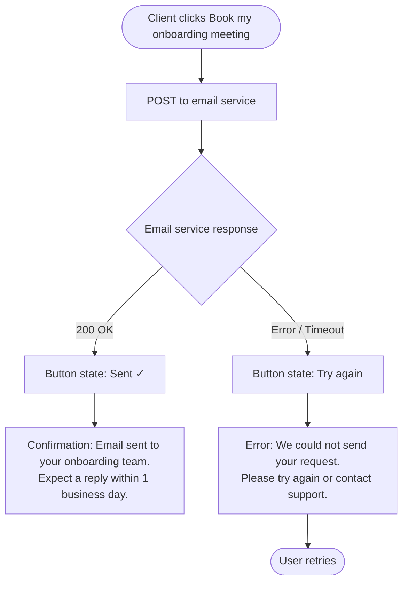

## Product Specification v2: AIM Onboarding Decision Tool

**AISDLC Phase:** 2 — Product Spec
**PRD:** 061-aim-onboarding-decision-tool
**PM:** Gary Danks
**Date:** 2026-06-04
**Version:** v2 — Post critique revision (2026-06-04)
**Supersedes:** product-spec.md (v3, 3 June 2026 — Gary Danks)
**Status:** All decisions resolved — ready to merge

---

## 1. Executive Summary

The AIM Onboarding Decision Tool is an 8-step guided wizard embedded in the K4A console that replaces Kochava's current open-ended onboarding questionnaire (a static spreadsheet) with a constrained, progressive-disclosure flow. It collects everything the data science team needs to configure an AIM model — platforms, business model, KPI, funnel events, data sources, and objectives — and auto-generates **three Phase 1 output documents**: a draft Scope of Work, a delivery Timeline, and a filtered Data Schema. Tab 4 (Model Config) is Phase 2. The tool is the prerequisite for AIM X zero-touch onboarding and the primary mechanism for eliminating scope creep from the AIM delivery process.

> **CG-002 fix:** "four output documents" → "three Phase 1 output documents." Tab 4 (Model Config) is explicitly Phase 2.

---

## 2. Problem & Goals

### Problem Statement

> "At the moment we give them a spreadsheet. It's got all questions. It's ignorant of their business model. There is no decision tree there." — Robert Pawlowicz, Lead Data Scientist

The current AIM onboarding process is open-ended: clients are asked what they want, they ask for everything, and the team says yes. This creates scope creep, delays model builds, and over-engineers ETL pipelines — the #1 internal pain point identified across every persona interviewed (CSM, Data Engineering, Data Science) in Gary's 8-interview discovery exercise (April 2026). The Klook incident is the defining case study: Kochava promised a feature not yet built, Robert had to build a new framework from scratch, the client was lost, and the TikTok partnership was damaged.

### Goals

- Eliminate scope creep at source — constrained wizard produces a deterministic, agreed Scope of Work before any engineering begins
- Enable AIM X zero-touch onboarding — wizard self-serve path requires no CSM or engineering effort per client
- Reduce model configuration time — auto-generated app_config from wizard answers; Robert's current manual interpretation time drops from hours/days to < 10 minutes
- Give clients exact data requirements — filtered Data Schema shows only what they need, not the full master schema
- Reduce CSM discovery burden — structured wizard replaces open-ended call

### Success Metrics

| Metric | Baseline | Target | Measurement |
|---|---|---|---|
| Onboarding scope changes post-SoW | Multiple per quarter per CSM | < 1 per quarter per CSM | SoW amendment log |
| Model config time (Robert) | Hours/days per client | < 10 minutes | Time from wizard completion to app_config finalised |
| AIM X CSM touches per onboarding | High | **≤ 1** (CSM Approval button activation only) | CSM effort log |
| Client data schema delivery time | Days | Same day as wizard completion | ETL pipeline start date |

> **TR-003 fix:** "Near-zero CSM effort" replaced with measurable target: ≤ 1 CSM touch.

---

## 3. User Stories

### CSM — Kade / Jacob

As a CSM, I want to run a structured onboarding questionnaire with a new AIM client so that I receive a pre-populated Data Schema and draft Scope of Work without manual interpretation work.

**Acceptance criteria (Phase 1):**

- CSM can launch the tool with Super Admin role and see CSM-mode additions throughout
- CSM can activate the CSM Approval button post-offline-meeting, unlocking the client SoW signoff
- Timeline milestone statuses are editable by CSM only (client has read-only view)
- **Tab 4 (Model Config) is NOT visible in Phase 1 — Phase 2 only**

> **CG-002 + TR-004 fix:** Removed "Model Config tab (Tab 4) is visible and populated in CSM mode" from Phase 1 acceptance criteria. Tab 4 is Phase 2.

### Client — Data Team / Marketing Manager

As a new AIM client, I want to complete an onboarding questionnaire in under 10 minutes so that I know exactly what tier I need, what data to provide, and what my delivery timeline looks like.

**Acceptance criteria:**

- Client can complete all 8 steps unassisted in client mode
- Output screen shows a clear tier recommendation (AIM X or AIM Pro) with rationale
- Data Schema tab shows only the data they need based on their answers
- Client can approve the Scope of Work in-tool (name + job title + timestamp)
- Client can save progress and return to a partially completed wizard
- Model Config tab (internal CSM document) is NOT visible in client mode

### Data Scientist — Robert

As a Lead Data Scientist, I want to receive a complete, validated model configuration from the onboarding wizard so that I can begin the AIM model build without a discovery call or manual interpretation.

**Acceptance criteria:**

- Model Config tab (Phase 2) outputs all fields required for app_config MongoDB entry
- Funnel events expressed as dep_var slugs
- UA/UE routing flag and brand routing flag computed and shown
- SKAN configuration and ATT rate estimate included for iOS

### Data Engineer — Jaya / Anupam

As a Data Engineer, I want to receive a filtered, client-specific data schema so that I can begin ETL configuration without waiting for a discovery call.

**Acceptance criteria:**

- Data Schema tab shows only schema rows relevant to the client's answers
- Each client-supplied item includes a full schema table (field name, format, required/optional)
- CSV template download available per schema type
- "Other" data source selections generate a TBC milestone in the Timeline tab

---

## 4. Feature Requirements

### 4.1 Core Features (P1 — Must Ship)

#### Wizard Shell & Navigation

- **Requirement:** 8-step linear wizard with stepper/breadcrumb navigation (K4A portal stepper component — not a custom left sidebar)
- **Behaviour:** Every step accessible from the stepper at any time. Stepper shows ✓ for completed steps and red dot for validation errors (evaluated at output). "Next" on Step 8 triggers 1.6s loader (Phase 9) then output screen (Phase 10).
- **Validation:** Non-blocking. Users can proceed with incomplete answers. Hard blocks apply only on "Next" when critical fields are empty. Full validation at output screen — surfaces as a banner with jump-back links per offending step.
- **State persistence:** All state autosaved to localStorage on tab switch. Manual save button also available. Restored on page load. Welcome screen offers "Continue saved progress" or "View your onboarding record" if already completed (see §4.4).
- **Phase routing:** Phases 1–8 map to wizard steps 1–8. Phase 9 = loader. Phase 10 = output screen. No phases skipped.

#### Step 1 — Your Team

- **Requirement:** Collect company identity and key contacts
- **Fields:**
    - Company name — text input, required
    - Project lead(s) — repeating name + email rows. At least one required. "+ Add another lead" / × remove. "Same as project lead" checkbox syncs data leads in real time.
    - Data lead(s) — same repeating row pattern. At least one required (unless synced)
- **Feeds output:** Company name and lead names populate SoW header and signoff block verbatim.

#### Step 2 — About Your Product

- **Requirement:** Establish product name, platforms, conversion split, model approach, and primary market
- **Fields:**
    - App/brand name — required
    - Platform selection — multi-select toggle cards: iOS, Android, Web. At least one required. iOS triggers ATT/SKAN callout.
    - Conversion share allocator — shown when ≥2 platforms. Sliders must total 100%. 2 platforms: moving one auto-adjusts other. 3 platforms: proportional redistribution.
    - Spend separable? — shown only when Web + ≥1 mobile. Yes / No / Not sure. "Not sure" reveals optional textarea.
    - Cross-journey migration? — shown after spend separability. Yes / No / Not sure with "See an example" disclosure.
    - Recommended model structure — Unified / Separate. Auto-recommended badge. User can override.
    - Primary market — US, UK, Germany, France, Canada, Other. Required. Locked until ≥1 platform selected.
- **Feeds output:** Platform list, share%, modelling approach, and region populate SoW and Setup Summary model count.

#### Step 3 — Marketing Setup

- **Requirement:** Collect media budget, channel mix, attribution reliability, campaign type split, and campaign grouping preference
- **Fields:**
    - Total paid media budget — slider with Monthly/Annual toggle. Monthly: $50K→$10M (hardcoded; $50K is AIM minimum). Annual: $5M→$200M+. Required. Stored as `budgetMonthly` / `budgetAnnual` + `budgetPeriod`.
    - Offline media — Yes/No. Required. If Yes: digital/offline spend split slider (default 80/20).
    - Digital media types — multi-select chips: Self-attributed (Meta, Google, TikTok, ASA), Standard attributed (DSP/programmatic), Affiliates/partner networks, Other. At least one required.
    - Attribution data reliability — Yes/No/Not sure. Required. If Yes or Not sure: gap category chip multi-select.
    - Coverage confidence — Yes/No/Not sure. Required.
    - Organic/paid split per platform — slider per platform. Defaults: iOS 65%, Android 80%, Web 50%. **Never defaults to 50/50 for all platforms.**
    - Campaign types — UA / UE / Brand toggle cards. At least one required. Toggling a type initialises its share at an equal split.
    - Budget split across campaign types — shown when ≥1 type selected. Warning banners if type is <5% or >90%.
    - **§3.9 Campaign grouping** — "Should similar campaigns be grouped together in the model?" Yes / No / Not sure. Shown after budget split answered. Stores `campaignMerge` (boolean). If Yes: "Which campaigns would you group?" free-text or chip multi-select, stores `campaignMergeChoice`. Confirmed as deliberate addition by Gary (PR comment A3, 28 May 2026). The prototype is the source of truth for this question. State keys `campaignMerge` / `campaignMergeChoice` already exist in the state shape.
- **Feeds output:** Campaign shares → `uaUeRoutingFlag` and `brandRoutingFlag`. `campaignMerge` / `campaignMergeChoice` → Model Config (Phase 2) and SoW campaign notes.

> **CG-001 fix:** §3.9 campaign grouping sub-question added. `campaignMerge` / `campaignMergeChoice` removed from Open Questions (§11) — resolved by Gary in PR comment A3.

#### Step 4 — Business Model & Conversion Funnel

- **Requirement:** Determine the KPI event and funnel structure
- **Fields:**
    - Business model — Subscription / E-commerce / Gaming. Required. **Changing this resets the funnel AND clears `wantsLtv`, `ltvCohortAvail`, `ltvPartialChoice`, and `webFunnel` from state** to prevent stale LTV schema rows in Data Schema output.
    - Gaming revenue type — IAP / Ads / Both. Required if Gaming.
    - App funnel events — checklist per business type. Required events locked; optional togglable. Min 3 on. One KPI must be set.
    - Funnel defaults: Subscription → Install (req) + Registration + Trial Start + Subscription Start (KPI: Trial Start) + Revenue. E-commerce → Install (req) + Registration + First Purchase (req, KPI) + Total Purchases + Revenue. Gaming follows e-commerce funnel.
    - Web funnel — shown if Web selected. Min 2 on.
    - LTV model — Yes/No. If Yes: cohort data available? Yes/No/Partial.
- **Feeds output:** Funnel events → dep_var slugs. KPI → SoW. LTV cohort → conditional cohort rows in Data Schema.

```gherkin
Scenario: Business model change clears downstream LTV state
  Given user has completed steps 4-6 with Subscription model and LTV opted in
  When user returns to step 4 and changes business model to Gaming
  Then funnel resets to Gaming defaults
  And wantsLtv is null
  And ltvCohortAvail is null
  And step 5 LTV question renders as unanswered
  And Data Schema tab shows no LTV cohort rows
```

#### Step 5 — Data Sources

- **Requirement:** Collect MMP, web attribution, and ad spend data source configuration
- **Fields:**
    - Historical data per platform — 12–24 months / 24–36 months / 36 months+ per platform. 12–24 months: shows warning banner (seasonality will be partially modelled — informational only, **not a tier gate**). 24+ months: green confirmation.
    - MMP selection — AppsFlyer, Adjust, Singular, Branch, Kochava, Other/none. Required if mobile. "Other/none" → TBC milestone injected into Timeline.
    - MMP collection method — Direct API (Recommended) / File / cloud.
    - AppsFlyer cohort access — Yes/No. Shown only if AppsFlyer.
    - Web attribution sources — shown if Web. Multi-select chips. Required if Web.
    - Ad spend data — collection method first, then source chips. Required.
- **Feeds output:** MMP + method → provision plan in Data Schema. "Other" → TBC milestones in Timeline. History → seasonality note in SoW.

> **CG-007 fix:** 12–24 month history warning is informational only — it does NOT gate the tier recommendation. Both "12_24" and "24_36"/"36_plus" qualify for the spend path in the tier algorithm. **Do NOT copy the prototype's `recommendTier()` history condition — the prototype incorrectly requires 24 months minimum and is a known bug. Use the spec's definition.**

#### Step 6 — External Factors (Optional)

- No hard validation.
- Auto-included factors: Seasonality (✓ Included, or ⚠ Partial if history 12–24 months) and National holidays (✓ Included, shows region).
- Additional factors — **6-item multi-select grid:** Promotional activity, Competitor activity, Major product launch/rebrand, PR/earned media spike, Macro economic event, Other. (Confirmed: 6 factors. "Regulatory change" and "Natural disaster/crisis" were intentionally consolidated into "Macro economic event" — PR comment A4. Prototype is source of truth. Spec's 8-factor list was superseded.)
- Free-text description — shown when any factor selected.
- Feeds output: Selected factors and notes appear in SoW.

#### Step 7 — Objectives (Optional)

- All fields optional. No validation.
- `objectivesGoal`, `objectivesSuccess`, `objectivesMarketing` — free-text textareas.
- **Feeds output:** All three fields appear in Step 8 review AND in a dedicated Objectives section in Tab 1 (SoW). If all three are empty, the Objectives section shows a placeholder: *"No objectives captured — add them in Step 7 or in the notes field below."* The placeholder is not included in the PDF export.

#### Step 8 — Review Your Answers

- No new input collected. Seven sections each with Edit button.
- CTA: "Generate my AIM setup" — `setPhase(9)` → `setTimeout(() => setPhase(10), 1600)`.
- **"Generate my AIM setup" triggers loader animation only. No backend call. No email. No notification of any kind.**
- Validation surfaces at output screen only.

---

### 4.2 Output Screen (Phase 10) — 3 Tabs in Phase 1

Default tab: Tab 1 (Scope of Work). Tier recommendation summary above tab strip.

**Post-approval:** Once client approves SoW, the wizard questionnaire is hidden. Only the 3 output tabs remain visible. Further edits require CSM to trigger Unlock to Edit (see Tab 1).

#### Tab 1 — Scope of Work (All Users · Default)

- Generated document pre-populated from all wizard answers.
- Sections: engagement details, platform & region, campaign types, client ad channels, business model & KPI, funnel events, data sources, external factors, model structure, objectives (from Step 7).
- Each section has an editable inline notes textarea. Inline notes remain editable after approval and are included in the PDF export.
- **Approval block:** Name field + job title field (both required). Captures `approverName`, `approverJobTitle`, and full `approvedAt` timestamp. Confirmed deliberate by Gary (PR comment A2).
- **"Download Scope of Work (PDF)" — Phase 1, real implementation.** Scope: SoW sections + inline notes + approval block. Does not include Timeline or Data Schema. Print stylesheet approach recommended. Empty objectives placeholder excluded from PDF.
- `onApproved` callback passes `approvedAt` to Timeline tab for date anchoring.

**"Book my onboarding meeting" button:**



> **CG-009 fix:** Email failure state, confirmation state, and retry UX specified.

Recipient list: **Phase 1 — stored in app config / environment variable** (not hardcoded). Phase 2 — driven by advertiser's assigned CSM in K4A. (Resolved §14.D1)

**Unlock to Edit (CSM only):**

- Core generated content locked after approval. Inline notes always editable.
- Only CSM (Super Admin role) can trigger Unlock to Edit. Advertisers cannot self-unlock.
- Unlock resets `approvedAt` to null, re-surfaces approval block, re-enables wizard Edit navigation.
- Timeline date anchoring reverts to today until re-approved.

#### Tab 2 — Timeline (All Users)

- Delivery plan showing estimated milestones from onboarding kickoff to first insights.

**Milestone list:** Confirmed by Gary Danks (PR #1300, 2026-06-04). Both tiers share the same 6 milestones. AIM Pro has longer durations on milestones 3-5 due to additional data complexity.

| # | Milestone name | Responsible | AIM X week | AIM X duration | AIM Pro week | AIM Pro duration |
|---|---|---|---|---|---|---|
| 1 | Onboarding kickoff call | Client + Kochava | Week 1 | 90 min | Week 1 | 90 min |
| 2 | Scope of Work approval | Client + Kochava | Week 1 | 1 hour | Week 1 | 1 hour |
| 3 | Data connection / file upload | Client | Week 2 | 2-3 weeks | Week 2 | 3-5 weeks |
| 4 | Data QA and validation | Kochava | Week 4 | ~1 week | Week 6 | 1-2 weeks |
| 5 | Model training | Kochava | Week 5 | 1-2 weeks | Week 7 | 2-3 weeks |
| 6 | First insights delivered | Kochava | Week 7 | 1 hour | Week 9 | 1 hour |

Notes:

- Milestones 1 and 2 both land on Week 1 — render as same-week milestones on the timeline
- "Responsible" (Client / Kochava / Client + Kochava) is a new field — add to the milestone data model
- Durations are informational only — cascade delay logic uses week offsets, not durations

- Date anchoring: cascade from `approvedAt` if set, otherwise from today. All start dates = next Monday on or after calculated date.
- Cascade delay logic: marking "Delayed" + saving new date shifts all subsequent milestones by corresponding weeks. Delay banner shows total accumulated delay.
- **Milestone names and durations are hardcoded — CSMs can adjust dates via cascade delay but cannot add or remove milestones in Phase 1.** (Gary PR comment B7)
- **Status update permissions: CSM (Super Admin) only.** Advertisers have read-only view.
- Per-milestone (CSM only): status selector (In progress / Complete / Delayed), delay date picker, notes (add/edit/delete), expand/collapse. All changes written to audit Change Log.
- Author field: reads from authenticated session email. No free-text name entry.
- **Tier override logging:** Any manual change to the tier recommendation (Pro→AIM X or AIM X→Pro when auto-rec is Pro) writes an entry to this audit Change Log with: timestamp, CSM user email (from session), original auto-recommendation, override value. (Gary PR comment B10)
- Custom connector rows (for "Other/none" MMP/web/ad spend): injected after milestone 2, default 2-week duration, cascade applies.
- Asana integration: out of scope for Phase 1.

> **CG-004 fix:** Tier override audit logging added to Tab 2 spec.

#### Tab 3 — Data Schema (All Users)

- Split: "Kochava collects automatically" vs "You need to provide."
- Provision plan built dynamically from `buildProvisionPlan(state)`.
- Conditional rows: offline media, LTV cohorts (if `wantsLtv` + cohort available), web schema (if Web), iOS SKAN (if iOS), MMP-specific column names.
- Each client-supplied item: full schema table + real CSV template download.
- If all sources are direct: green confirmation banner shown.
- **Integration with Validate Onboarding tab:** Wizard does NOT replace existing Validate Onboarding tab. Flow: client downloads custom CSV template from Data Schema → uploads to existing Validate Onboarding tab. (Gary PR comment B8)

#### Tab 4 — Model Config (Phase 2 Only)

⛔ **OUT OF SCOPE FOR PHASE 1.** Agreed in engineering sync 2 June 2026.

In Phase 1: CSM reads model configuration from Tab 4 directly and shares with Robert manually. There is no automated delivery to Robert in Phase 1. (Gary PR comment B9)

Phase 2: CSM-only tab visible when Super Admin role active. Contains full technical model configuration. Pending: Gary to obtain app_config schema from Robert to finalise field mapping.

---

### 4.3 Tier Recommendation Algorithm

Defined in `recommendTier(state)`. Starts at AIM X. Upgrades to AIM Pro if any of three conditions met:

**Condition 1 — Spend + history:**

```js
// Budget conversion — always compare on monthly basis
const effectiveMonthlyBudget =
  budgetPeriod === 'monthly' ? budgetMonthly : Math.round(budgetAnnual / 12)

// Both '12_24' and '24_36' and '36_plus' qualify — 12 months is the threshold
const condition1 =
  effectiveMonthlyBudget >= 250000 &&
  ['12_24', '24_36', '36_plus'].includes(history)
```

> **CG-008 fix:** Budget period conversion formula explicit. Annual budget divided by 12 before comparison. **CG-007 fix:** `'12_24'` explicitly included in qualifying history values — the prototype incorrectly excludes it and must not be copied.

**Condition 2 — Data sources:** ≥ 2 additional non-MMP data sources connected

**Condition 3 — UA/UE routing flag:** `uaUeRoutingFlag === "aim_pro_eligible"`

**Override policy:** AIM Pro can always be manually downgraded to AIM X. AIM X can only be manually upgraded if auto-recommendation is already Pro. Override is intentionally asymmetric — AIM X is more cost-effective; clients requiring Pro features are identified by the algorithm. **Any manual override must be logged to the Timeline audit Change Log** (see Tab 2). (Gary PR comment B10)

```gherkin
Scenario: Annual budget correctly converts for tier check
  Given user selects Annual budget toggle
  And enters $3,000,000 annual budget
  And history is 24+ months
  When output screen loads
  Then effectiveMonthlyBudget = 250000
  And tier recommendation shows "AIM Pro"

Scenario: 12-24 months history qualifies for spend path
  Given user selects 12-24 months history
  And effectiveMonthlyBudget >= 250000
  When output screen loads
  Then condition1 = true
  And tier recommendation shows "AIM Pro" (assuming no other conditions override)

Scenario: Annual budget below threshold
  Given user selects Annual budget toggle
  And enters $2,400,000 annual (= $200K/month)
  And no other Pro conditions are met
  When output screen loads
  Then effectiveMonthlyBudget = 200000
  And tier recommendation shows "AIM X"

Scenario: Tier override is logged
  Given auto-recommendation is "AIM Pro"
  When CSM manually downgrades to "AIM X"
  Then Timeline audit log records: timestamp, CSM email, original="AIM Pro", override="AIM X"
```

### 4.4 Onboarding Status & Portal Entry Point

The K4A portal must know whether to show an advertiser the onboarding wizard. This requires a server-side `onboarding_status` field per advertiser account.

**Status values:**

| Value | Meaning | Portal behaviour |
|---|---|---|
| `not_started` | No session exists | Show wizard with "Start onboarding" CTA |
| `in_progress` | Session started, SoW not approved | Show wizard with "Continue onboarding" CTA |
| `complete` | SoW approved | Hide wizard. Show output tabs only. CTA: "View your onboarding record" |

**Phase 1 behaviour (localStorage only):**

- `onboarding_status` is derived from localStorage state in Phase 1 — there is no backend flag yet.
- If localStorage is empty (new device, incognito, cleared storage): `not_started`, wizard starts fresh.
- If localStorage has state but no `approvedAt`: `in_progress`, "Continue saved progress" offered.
- If localStorage has `approvedAt`: `complete`, output tabs shown, "View your onboarding record" CTA.
- **Phase 1 limitation:** `complete` status is browser-local. A client who approved on one device sees `not_started` on another device. This is a known Phase 1 limitation — backend persistence resolves it in Phase 2. (Gary PR comment B3)

**Post-completion:**

- Wizard tab does not disappear. It becomes a read-only record.
- CTA changes: "Continue onboarding" → "View your onboarding record."
- Wizard steps are read-only. Output tabs (SoW, Timeline, Data Schema) remain accessible.
- CSM can still update Timeline milestone statuses post-completion.

> **CG-003 fix:** onboarding_status field, portal entry point logic, CTA change, and post-completion behaviour now specified. Based on Gary PR comment B3.

### 4.5 Setup Summary Panel

- Hovering panel on right edge of wizard, visible steps 2–6 only.
- Reflects every answer in real time: platform list, model count estimate, business model, KPI event, MMP, data sources.
- Hidden at Step 8 — replaced by the full review layout.

### 4.6 User Modes & Server-Side Enforcement

| Mode | Who | Access | Trigger |
|---|---|---|---|
| client | New AIM advertiser | Steps 1–8, Tabs 1–3, read-only timeline | Default (no Super Admin role) |
| csm | Kochava CSM | Steps 1–8, Tabs 1–3, timeline status edits, CSM Approval button, Unlock to Edit | Super Admin role in K4A (automatic) |

**Primary persona:** Advertiser completes the wizard. CSM reviews the generated SoW after the client submits.

**CSM mode trigger:** Super Admin role in K4A. No URL param, no separate login. Auto-activates. (Resolved: Gary PR comment B5 / June 2 meeting)

**Server-side enforcement:** The CSM Approval action, Unlock to Edit action, timeline status updates, and tier override logging **must be validated server-side** against the caller's Super Admin role. UI-only visibility checks are insufficient — a non-Super-Admin who circumvents the UI must receive a 403.

---

### 4.7 Extended Features (Phase 2)

- MongoDB app_config auto-population (LLM layer — Robert)
- Backend persistence for Timeline, SoW, and onboarding state
- Multi-session dashboard (list of past onboarding sessions per advertiser)
- `onboarding_status` server-side flag (Phase 1 uses localStorage derivation)
- Tab 4 Model Config (CSM only)
- Airflow trigger API auto-start
- Submission/CRM handoff flow

---

### 4.8 Out of Scope (Phase 1)

- Campaign-level attribution
- Offline media handling (separate ETL project)
- In-form regional routing
- Airbyte direct client access
- Full data quality validation
- AIM Enterprise bespoke configuration
- Look-back periods and weekly grouping
- Offline/cross-platform network identification post-ingestion

---

## 5. User Flows

### Flow 1: Client Self-Serve (AIM X Path)

1. Client lands on K4A → `onboarding_status = not_started` → wizard shown with "Start onboarding"
2. Completes Steps 1–8 (stepper navigation; Setup Summary panel live steps 2–6)
3. Step 8: reviews all answers, clicks "Generate my AIM setup"
4. 1.6s loader animation — **no backend call, no notification of any kind**
5. Output screen appears. Tier recommendation shown.
6. Reviews Tab 1 (SoW). Clicks "Book my onboarding meeting" → email sent to CSM team (with retry on failure)
7. Offline onboarding meeting takes place
8. CSM (Super Admin) activates CSM Approval button → SoW approval block unlocks
9. Client approves SoW (name + job title + timestamp). `onboarding_status → complete`. Wizard hidden — output tabs only.
10. Reviews Tab 2 (Timeline). Milestone dates anchored from `approvedAt`.
11. Reviews Tab 3 (Data Schema). Downloads custom CSV template. Uploads to Validate Onboarding tab.
12. ETL begins.

### Flow 2: CSM-Assisted Onboarding

1. CSM logs in — Super Admin role activates CSM mode automatically
2. CSM supports advertiser through wizard
3. Output screen: Tabs 1–3 visible (Tab 4 Phase 2)
4. Offline meeting takes place
5. CSM activates CSM Approval button
6. Client provides final SoW approval (name + job title + timestamp)
7. CSM manages Timeline milestone status updates (client read-only)
8. ETL team uses Data Schema tab

### Flow 3: Demo / Sales

1. Open tool with `BRIGHTFIT_DEMO` constant enabled
2. All answers pre-filled with BrightFit fictional subscription app
3. Jumps directly to output screen — all tabs populated

### Flow 4: Return Visit (Already Complete)

1. Client returns to K4A → localStorage has `approvedAt`
2. `onboarding_status = complete` → wizard tab shows "View your onboarding record"
3. Wizard steps read-only. Output tabs accessible.
4. CSM can still update Timeline statuses.

---

## 6. UX / Design Reference

**Source:** Claude Design prototype AIM Onboarding.html (15 May 2026). High-fidelity, reviewed by 7 stakeholders. Design system: canonical AIM X tokens.

**Design source of truth:** Claude Design (not Station One) is the authoritative source for step content and interaction patterns. The stepper/breadcrumb replaces the prototype's sidebar nav for K4A embed — the prototype content is unchanged, only the navigation chrome differs. (Gary PR comment B1)

### Key Design Decisions

| # | Principle | Decision |
|---|---|---|
| 01 | Progressive disclosure | Sub-questions hidden until parent answered; locked sections at opacity 0.32 |
| 02 | Recommendations over blank slates | Default funnel events pre-selected; "Recommended" badge on system preference |
| 03 | Contextual reassurance | Attribution gaps, iOS ATT, short history — warned, never blocked |
| 04 | Non-blocking validation | All validation deferred to output screen; hard blocks only on "Next" for empty required fields |
| 05 | Live read-back | Setup Summary panel (steps 2–6) with model count estimate |
| 06 | Mode parity | CSM and Client share same UI. CSM additions are inline notes — never a separate screen. |
| 07 | No visual noise | No emoji, no decorative gradients, minimal 1.6px icon set |
| 08 | Immediately useful outputs | SoW editable and approvable; Schema has copy-ready field names + CSV download |

### Design System

Production must use AIM X / Kochava MOS design system tokens from `colors_and_type.css`. Remove bridge alias layer (`--navy`, `--ink`, etc.) in production — reference AIM X token names directly.

- Primary: `--brand-primary-1` (`#1E4B97`)
- Secondary: `--brand-secondary` (`#0C72EE`)
- Page background: `--surface-2` (`#F8F7F7`)
- Errors: `--alert-red` (`#BE202E`)
- Success: `--alert-green` (`#427900`)
- Warnings: `--alert-orange` (`#BA4E00`)

---

## 7. Data Requirements

### State Shape

| Data point | State key | Type | Required? |
|---|---|---|---|
| Company name | `companyName` | string | Yes |
| Project leads | `projectLeads` | Array of `{name, email}` | Yes (min 1) |
| Data leads | `dataLeads` | Array of `{name, email}` | Yes (min 1, or sync) |
| App/brand name | `appName` | string | Yes |
| Platforms | `platforms` | Array of `"iOS"\|"Android"\|"Web"` | Yes (min 1) |
| Platform shares | `platformShares` | `{iOS: n, Android: n, Web: n}` | Yes if ≥2 platforms |
| Modelling approach | `modelling` | `"single"\|"separate"\|"unified"` | Yes if Web + mobile |
| Primary market | `region` / `regionOther` | string | Yes |
| Total budget | `budgetMonthly` / `budgetAnnual` + `budgetPeriod` | number + `"monthly"\|"annual"` | Yes |
| Offline media | `usesOffline` / `offlineSplitPct` | boolean + 0–100 | Yes |
| Digital media types | `digitalMediaTypes` | Array of strings | Yes (min 1) |
| Attribution gaps | `hasAttrGaps` / `attrGapCategories` | `"yes"\|"no"\|"not_sure"` + string array | Yes |
| Coverage confidence | `coverageConfidence` | `"yes"\|"no"\|"not_sure"` | Yes |
| Organic/paid split | `paidSplit` | `{iOS: n, Android: n, Web: n}` | Platform-specific defaults |
| Campaign types + shares | `ua`/`uaShare`, `ue`/`ueShare`, `brand`/`brandShare` | boolean + share category | Yes (min 1 type) |
| **Campaign grouping** | **`campaignMerge`** | **boolean** | **Yes (§3.9 — collect in wizard)** |
| **Campaign grouping choice** | **`campaignMergeChoice`** | **string** | **Yes if campaignMerge = true** |
| Business model | `business` | `"subscription"\|"ecommerce"\|"gaming"` | Yes |
| Funnel events + KPI | `funnel` | `{business, items[], kpi, kpiConfirmed, names{}}` | Yes |
| Web funnel | `webFunnel` | Same shape as `funnel` | Yes if Web selected |
| LTV scope | `wantsLtv` / `ltvCohortAvail` / `ltvPartialChoice` | boolean chain | Yes if funnel configured |
| MMP | `mmp` / `mmpCollection` / `mmpFileStorage` | string + delivery method | Yes if mobile |
| AppsFlyer cohort | `appsflyerCohortAccess` | boolean | Yes if AppsFlyer |
| Web attribution | `webAttrSources` | Array of strings | Yes if Web |
| Ad spend | `spendCollection` / `adSpendSources` | delivery method + source array | Yes |
| Data history | `history` | `"12_24"\|"24_36"\|"36_plus"` per platform | Yes |
| External factors | `externalFactors` / `externalFactorsNotes` | Array of factor IDs + free text | Optional |
| Objectives | `objectivesGoal`, `objectivesSuccess`, `objectivesMarketing` | strings | Optional |
| Computed: UA/UE flag | `uaUeRoutingFlag` | `"aim_pro_eligible"\|"aim_x_preferred"\|""` | Computed |
| Computed: Brand flag | `brandRoutingFlag` | boolean | Computed |
| CSM approval | `csmApproved` | boolean | CSM action |
| SoW approval | `approverName`, `approverJobTitle`, `approvedAt` | string, string, timestamp | Client action |

> **CG-001 fix:** `campaignMerge` and `campaignMergeChoice` marked as **collect in wizard (§3.9)** — no longer "missing / decision needed."

### Outputs Produced

| Output | Format | Destination |
|---|---|---|
| Tier recommendation | Computed value | Output screen header + all tabs |
| Scope of Work | Generated doc (HTML → PDF) | Tab 1. Client approval in-tool. PDF export (Phase 1). |
| Delivery Timeline | Milestone list with dates | Tab 2. Cascade delay. Audit log. |
| Data Schema | Filtered schema tables + CSV templates | Tab 3. CSV download per schema type. |
| Model Config | Internal technical document | Tab 4 — Phase 2 only. |
| `uaUeRoutingFlag` | Computed string | Tier algorithm input. Model Config (Phase 2). |
| `brandRoutingFlag` | Computed boolean | Model Config (Phase 2). |

---

## 8. Integration Points

| System | Integration type | Owner | Notes |
|---|---|---|---|
| K4A console | Embed — wizard as a console view | Anupam + Mayank | Upstream of ETL config UI |
| CSM notification email | POST on "Book my onboarding meeting" | Anupam | Failure state defined. Phase 1: recipients from env/config variable. Phase 2: K4A assigned CSM lookup. |
| MongoDB app_config | Write — LLM layer → app_config | Robert | Phase 2 only. Human review mandatory. |
| ETL UI | Read — wizard determines WHAT; ETL handles HOW | Anupam + Mayank | Phase 2: wizard auto-populates ETL fields |
| Validate Onboarding tab | Read — CSV template from wizard uploaded here | Anupam | Wizard does NOT replace this tab |
| Authentication / session | Read — Super Admin role check; email for Timeline audit | Anupam | Server-side enforcement required |
| Airflow trigger | Trigger — Phase 2 only | Anupam | Not in Phase 1 |
| CRM | Write — post-SoW handoff | TBD | Architecture decision required |
| Airbyte | Internal only | Satish | AIM is the client-facing layer |

---

## 9. Technical Constraints

- **React app architecture:** Prototype is single-page React with inline Babel. Production: React app with React Router. State shape and validation logic move almost unchanged; replace `window.*` globals with named imports.
- **State:** Single flat object updated via `set(patch)` helper. `uaUeRoutingFlag` and `brandRoutingFlag` recomputed on every update.
- **Design tokens:** Bridge aliases removed in production; reference AIM X tokens directly.
- **Phase 1 storage:** localStorage only. **The only backend call in Phase 1 is the email notification on "Book my onboarding meeting."** No other network calls in the wizard flow.
- **Phase 9 loader:** 1.6-second hardcoded timeout. Marketing animation only — **no backend call, no API, no notification fires on "Generate my AIM setup."** Do not replace with an API call in Phase 1. (June 2 meeting decision.)
- **Brand campaigns:** ~30-day ad stock vs 7-day for UA/UE. Must be flagged explicitly in the generated SoW.
- **AIM X zero-touch mandate (Sachin Dutta):** ≤ 1 CSM touch (CSM Approval button) per AIM X onboarding. Hard constraint for Phase 3.
- **Prototype bugs to fix — do not port these:** (1) `recommendTier()` reads `state.spend` — must read `budgetMonthly`/`budgetAnnual`. (2) History threshold is 24 months in prototype — must be 12 months per spec. (3) `paidSplit` defaults to 50/50 for all platforms — must use platform-specific defaults. (4) Seasonality always shows "Included" — must check history value. (5) Tier eligibility always AIM X — fix algorithm. (6) Objectives not in SoW — wire `objectivesGoal/Success/Marketing`. (7) Ad channels not in output — wire channel state. (8) `campaignMerge`/`campaignMergeChoice` collected in §3.9 (new) — add Step 3 UI.

> **CG-005 fix:** "In production, replace Phase 9 loader with a real API call" removed. Phase 9 = marketing animation only (June 2 meeting). This resolves the contradiction between §4.1 Step 8 and the prior §9 text.

---

## 10. Non-Functional Requirements

```gherkin
Scenario: Wizard step transition performance
  Given user is on any wizard step
  When user clicks Next or navigates via stepper
  Then the target step renders within 100ms
```

```gherkin
Scenario: Output screen generation performance
  Given a fully-completed 8-step wizard (all fields populated)
  When Phase 10 initialises after the 1.6s animation
  Then Tab 1 (Scope of Work) is fully rendered within 500ms
```

- **Security:** Wizard answers include company name, lead contacts, and budget — commercial confidential. No wizard data logged client-side in production. Server-side Super Admin validation on all CSM actions.
- **Authentication:** Super Admin role required for CSM actions. Client mode requires authentication for CRM handoff. Timeline author field reads from session email.
- **Scalability:** Each wizard session is localStorage-isolated per browser in Phase 1; user-account-isolated in Phase 2.
- **Accessibility:** WCAG 2.1 AA. All form controls keyboard-navigable. Error messages via `aria-describedby`. Focus management on step transitions.
- **Browser support:** Chrome, Safari, Firefox, Edge (latest 2 major versions). Mobile not required for Phase 1.

> **TR-001 fix:** "Wizard steps load instantly" replaced with measurable 100ms Gherkin criterion.

---

## 11. Open Questions for Engineering

| # | Question | Owner | Status |
|---|---|---|---|
| OQ-1 | Data Schema tab — Option A (downloadable schema) vs Option B (API credential collection) vs both? | Satish + Anupam + Jaya | 🔴 Open |
| OQ-2 | `campaignMerge` / `campaignMergeChoice` — collected in wizard or from CRM? | — | ✅ **Resolved: collect in wizard (§3.9). Gary PR comment A3.** |
| OQ-3 | CSM mode trigger | — | ✅ Resolved: Super Admin role |
| OQ-4 | Submission/handoff notification | — | ✅ Resolved: notification on "Book my meeting" only |
| OQ-5 | Multi-region UX | Gary | 🔴 Open — "Add another region" confirmed, dropdown confirmed, but state isolation detail TBD |
| OQ-6 | `mmm-insights.jsx` — fifth output tab or remove? | Gary | 🔴 Open |
| OQ-7 | PDF export | — | ✅ Resolved: Phase 1, print stylesheet, SoW only |
| OQ-8 | Step 7 objectives → SoW | — | ✅ Resolved: Phase 1, confirmed |
| OQ-9 | Phase 9 loader in production | — | ✅ Resolved: marketing animation only, no API call in Phase 1 |
| OQ-10 | app_config MongoDB field mapping | Robert + Gary | 🔴 Open (Phase 2) |
| OQ-11 | Anupam's master data schema | Anupam | 🔴 Open — needed for Data Schema tab |
| OQ-12 | `onboarding_status` server-side flag | Satish + Sachin | 🔴 Open — Gary recommended (B3); needs confirmation from Satish |

> **CG-001 fix:** OQ-2 marked resolved. `campaignMerge`/`campaignMergeChoice` are collected in wizard Step 3 §3.9.

---

## 12. Engineering Impact Matrix

| Top-level | Next-level | Impacted component | Lift |
|---|---|---|---|
| Reporting | New Report Type | SoW generation + real PDF export | 3 |
| Reporting | Modify existing | Timeline with cascade delay + audit log + override logging | 2 |
| Analytics | New View | 8-step wizard UI (K4A console embed) | 3 |
| Analytics | New View | Output screen — 3-tab results view | 3 |
| Analytics | Modify existing | Data Schema tab (filtered subset + CSV download) | 2 |
| Attribution | Modify logic | AIM X vs AIM Pro tier recommendation algorithm | 2 |
| Auth | Modify | Super Admin server-side enforcement for CSM actions | 1 |
| Notifications | New | Email to CSM team on "Book my onboarding meeting" | 1 |

**Additional Phase 1 work:**

| Work item | Owner | Lift |
|---|---|---|
| Fix 8 prototype bugs (see §9) | Anupam | Low each |
| Add §3.9 campaign grouping UI in Step 3 | Anupam | Low |
| onboarding_status derivation from localStorage | Anupam | Low |
| "View your onboarding record" CTA + read-only wizard | Anupam | Low |
| CSM Approval button (server-side Super Admin gate) | Anupam | Low |
| Unlock to Edit (CSM only) | Anupam | Low |
| "Book my onboarding meeting" email + failure/retry UX | Anupam | Low |
| Tier override audit log entry | Anupam | Low |
| Questionnaire hidden after SoW approval | Anupam | Low |
| Real PDF export (print stylesheet, SoW only) | Anupam | Medium |
| Real CSV template generation per schema type | Anupam | Low |
| Remove bridge alias layer, use AIM X tokens directly | Engineering | Low |

---

## 13. Revision History

| Version | Date | Author | Changes |
|---|---|---|---|
| v1 | 18 May 2026 | Gary Danks | Initial draft from Context Seed Rev 5 |
| v2 | 21 May 2026 | Gary Danks | Post Robert Pawlowicz prototype review |
| v3 | 3 June 2026 | Gary Danks | Post engineering sync 2 June — 14 meeting decisions |
| v2 (this) | 2026-06-04 | Mayank Ukey | Post spec-critique — 10 critique items resolved, 2 decisions required |

---

## 14. Decisions Required

### D1 — Email Recipient Strategy ✅ Resolved

**Decision (Gary Danks, PR #1300 comment, 2026-06-04):**

- **Phase 1 → Option B:** Recipient email addresses stored in app config / environment variable. Not hardcoded in component. If personnel changes, it is a config update not a code change. Initial values: Kade and Jacob's addresses.
- **Phase 2 → Option C:** Driven by the advertiser's assigned CSM in K4A (requires backend persistence).

---

### D2 — Timeline Milestone Names + Week Offsets ✅ Resolved

**Decision (Gary Danks, PR #1300 comment, 2026-06-04):** 6 milestones for both tiers. AIM X ~7 weeks, AIM Pro ~9-11 weeks. Full table in §4.2 Tab 2. Tab 2 is now unblocked.

---

## 15. Source Documents

- product-spec.md (v3) — Gary Danks, 3 June 2026
- product-spec-critique.md — QA Red Team, 2026-06-04
- Gary Danks PR #1237 comment answers (A1–A4, B1–B10) — 28 May 2026
- Meeting notes: AIM Product Weekly Sync 2026-06-02 (Gemini)
- Slack corrections: Gary Danks, channel C0B7FR7NY8P, 2026-06-03
- UX prototype: AIM Onboarding Standalone.html (mockup-standalone.html in this PRD folder)
- Context seed: product-context-seed.md (Rev 5, 15 May 2026)

---

## 16. Revision Summary

| Critique ID | Issue | Category | Resolution | Status |
|---|---|---|---|---|
| CG-001 | §3.9 campaign grouping missing; `campaignMerge`/`campaignMergeChoice` listed as open | Auto-resolvable | Added §3.9 to Step 3; OQ-2 marked resolved | ✅ |
| CG-002 | Executive summary says "four outputs"; CSM User Story includes Tab 4 in Phase 1 | Auto-resolvable | Summary updated to "three Phase 1 outputs"; Tab 4 removed from Phase 1 AC | ✅ |
| CG-003 | `onboarding_status` flag not specified | Auto-resolvable (Gary defined it in B3) | New §4.4 added with status values, portal logic, CTA change, Phase 1 limitations | ✅ |
| CG-004 | Tier override not logged | Auto-resolvable (Gary mandated in B10) | Override logging added to Tab 2 and tier algorithm | ✅ |
| CG-005 | Phase 9 loader contradiction (§4.1 vs §9) | Auto-resolvable | §9 corrected: Phase 9 = marketing animation only, no API call | ✅ |
| CG-006 | Timeline milestone names unspecified | Decision required | ✅ Resolved: 6 milestones confirmed by Gary, full table in §4.2 | ✅ |
| CG-007 | Prototype history threshold bug not flagged | Auto-resolvable | Note added to Step 5 and §9 prototype bug list | ✅ |
| CG-008 | Budget period conversion missing from tier formula | Auto-resolvable | JS conversion formula added to §4.3 | ✅ |
| CG-009 | "Book my meeting" has no failure state | Auto-resolvable | Mermaid error/retry flow added to Tab 1 | ✅ |
| CG-010 | PDF export scope not defined | Auto-resolvable | PDF scope specified in Tab 1: SoW + notes + approval block only | ✅ |
| TR-001 | "Wizard steps load instantly" not measurable | Auto-resolvable | Replaced with 100ms Gherkin criterion | ✅ |
| TR-002 | "Under 10 minutes" not testable | Already addressed | Retained as UX research benchmark only, not a functional AC | ✅ |
| TR-003 | "Near-zero" CSM effort not measurable | Auto-resolvable | Replaced with "≤ 1 CSM touch" in §2 | ✅ |
| TR-004 | CSM User Story Tab 4 AC contradicts Phase 1 scope | Auto-resolvable | Tab 4 removed from Phase 1 CSM acceptance criteria | ✅ |
| TR-005 | Output screen 500ms needs Gherkin | Auto-resolvable | Gherkin added to §10 | ✅ |
| EC-001 | `campaignMerge`/`campaignMergeChoice` orphaned in output | Auto-resolvable | Covered by CG-001 fix — §3.9 now collects them | ✅ |
| EC-002 | Advertiser with no status flag sees wizard on every login | Auto-resolvable | Covered by CG-003 fix — §4.4 | ✅ |
| EC-003 | Tier override logged before Timeline anchored | Noted | Phase 1 limitation noted: override log writes to localStorage audit; may be lost on refresh before SoW approval — acceptable Phase 1 trade-off | ✅ Noted |
| EC-004 | §3.9 resets on business model change | Auto-resolvable | Step 4 spec: business model change does NOT reset §3.9 (campaign grouping is marketing-level, not funnel-level) | ✅ |
| EC-005 | "View your onboarding record" CTA not specified | Auto-resolvable | Covered by CG-003 fix — §4.4 | ✅ |
| D1 (email recipients) | Recipient list strategy | Decision required | ✅ Resolved: env/config Phase 1, K4A CSM lookup Phase 2 | ✅ |
