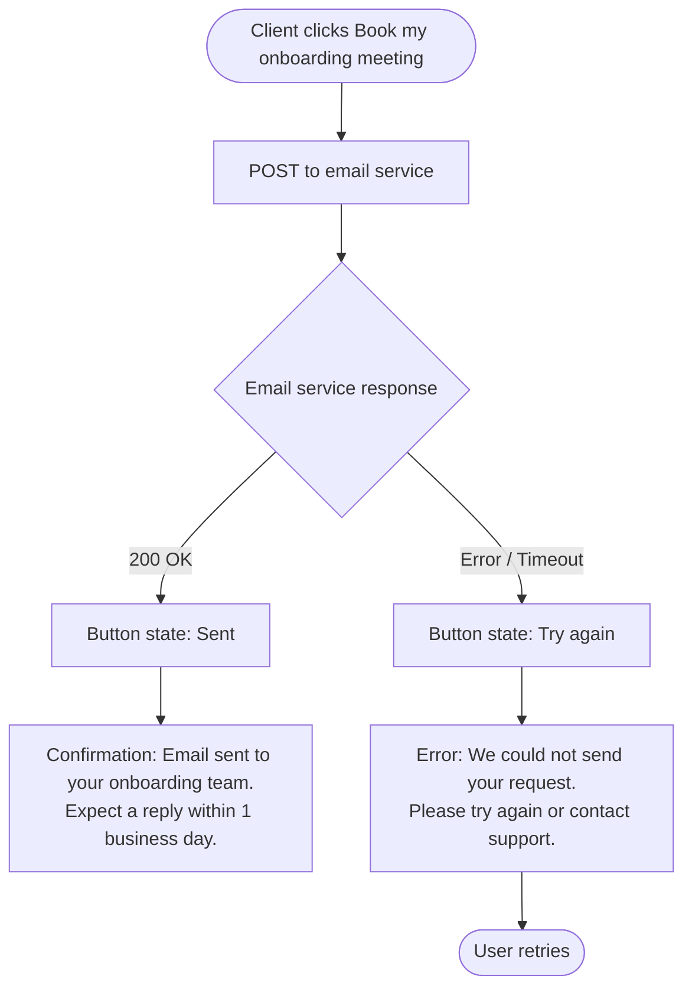

## Product Specification v4: AIM Onboarding Decision Tool

**AISDLC Phase:** 2 — Product Spec
**PRD:** 061-aim-onboarding-decision-tool
**Date:** 2026-08-12
**Version:** v4 — Reconciliation of shipped implementation deviations
**Supersedes:** product-spec-v3.md (2026-08-06)
**Builds on:** the shipped frontend implementation, specifically its own "Post-implementation deviations" record (`frontend-mos`, `docs/superpowers/plans/2026-08-10-data-mapping-tab.md`), which is still actively growing as implementation continues past this document's own first draft — this version already incorporates deviations through D26. Most logged deviations are UI/UX polish with no bearing on this spec (verified against the live components, not just the deviation log's own wording); the spec-relevant ones are: D1 (Source Event pre-fill), D4 (Source Field default, still provisional), D10 (exact copy correction), D21 (Primary KPI badge, additive), and — superseding an earlier, now-reverted call this same document made from D3 — D24 (AIM Schema Element is a dropdown after all) and D26 (Media Metrics & Dimensions is 6 rows, not 8; the impressions/clicks/installs split this document originally specified turned out to be wrong). This version folds all of these back into the numbered spec so it accurately reflects what's live as of the date above — expect further updates as implementation continues.
**Status:** Draft — for Gary's re-review of the three changes below

---

## 1. Executive Summary

The AIM Onboarding Decision Tool is an 8-step guided wizard embedded as a tab inside the existing MMM Insights Configuration view in the Kochava portal, replacing Kochava's prior open-ended onboarding questionnaire (a static spreadsheet) with a constrained, progressive-disclosure flow. It collects everything the data science team needs to configure an AIM model — platforms, business model, KPI, funnel events, data sources, and objectives — and auto-generates output documents: a draft Scope of Work, a delivery Timeline, a filtered Data Schema, and a field-level **Data Mapping** tab. Model Config remains a future, unnumbered Phase 2 concept and is not yet built. The tool is the prerequisite for AIM X zero-touch onboarding and the primary mechanism for eliminating scope creep from the AIM delivery process.

> **v4 change:** The Data Mapping tab (§4.2, Tab 4) has now shipped, and implementation is still finding things to correct — this document has itself already been updated once since its first draft (AIM Schema Element and the Media Metrics & Dimensions row count both flip-flopped and are now back to something closer to the original v3 shape). See Revision Summary, §16 (v4), for the full, still-growing list.

---

## 2. Problem & Goals

### Problem Statement

> "At the moment we give them a spreadsheet. It's got all questions. It's ignorant of their business model. There is no decision tree there." — Robert Pawlowicz, Lead Data Scientist

The original AIM onboarding process was open-ended: clients were asked what they want, they asked for everything, and the team said yes. This created scope creep, delayed model builds, and over-engineered ETL pipelines — the #1 internal pain point identified across every persona interviewed (CSM, Data Engineering, Data Science) in Gary's 8-interview discovery exercise (April 2026). The Klook incident is the defining case study: Kochava promised a feature not yet built, Robert had to build a new framework from scratch, the client was lost, and the TikTok partnership was damaged.

The shipped wizard and its Scope of Work / Timeline / Data Schema outputs addressed the *what* — which events, which platforms, which sources. The Data Mapping tab addresses a second, deeper layer of the same problem: *how* those sources map onto AIM's internal schema field-by-field, which was previously discovered informally, after ingestion had already begun.

### Goals

- Eliminate scope creep at source — constrained wizard produces a deterministic, agreed Scope of Work before any engineering begins
- Enable AIM X zero-touch onboarding — wizard self-serve path requires no CSM or engineering effort per client
- Reduce model configuration time — auto-generated app_config from wizard answers; Robert's current manual interpretation time drops from hours/days to < 10 minutes
- Give clients exact data requirements — filtered Data Schema shows only what they need, not the full master schema
- Reduce CSM discovery burden — structured wizard replaces open-ended call
- Eliminate late-discovered field-mapping mismatches — give the client and CSM an explicit, sign-off-gated checkpoint to confirm exactly how their raw data maps onto AIM's schema, before ETL/ingestion work begins

### Success Metrics

| Metric | Baseline | Target | Measurement |
|---|---|---|---|
| Onboarding scope changes post-SoW | Multiple per quarter per CSM | < 1 per quarter per CSM | SoW amendment log |
| Model config time (Robert) | Hours/days per client | < 10 minutes | Time from wizard completion to app_config finalised |
| AIM X CSM touches per onboarding | High | ≤ 1 (CSM Approval button activation only) | CSM effort log |
| Client data schema delivery time | Days | Same day as wizard completion | ETL pipeline start date |
| Field-mapping rework incidents post-ingestion-start | Undocumented, informal | 0 per client | ETL/ingestion incident log |

---

## 3. User Stories

### CSM — Kade / Jacob

As a CSM, I want to run a structured onboarding questionnaire with a new AIM client so that I receive a pre-populated Data Schema and draft Scope of Work without manual interpretation work.

**Acceptance criteria:**

- CSM can launch the tool with Super Admin role and see CSM-mode additions throughout
- CSM can activate the CSM Approval button post-offline-meeting, unlocking the client SoW signoff
- Timeline milestone statuses are editable by both client and CSM
- Model Config (not yet built, unnumbered) is NOT visible — Phase 2 only
- CSM can see the Data Mapping tab and its approval state, but Data Mapping approval is a client action gated on Scope of Work already being approved

### Client — Data Team / Marketing Manager

As a new AIM client, I want to complete an onboarding questionnaire in under 10 minutes so that I know exactly what tier I need, what data to provide, and what my delivery timeline looks like.

**Acceptance criteria:**

- Client can complete all 8 steps unassisted in client mode
- Output screen shows a clear tier recommendation (AIM X or AIM Pro) with rationale
- Data Schema tab shows only the data they need based on their answers
- Client can approve the Scope of Work in-tool (name + job title + timestamp)
- Client can save progress and return to a partially completed wizard
- Model Config tab (internal CSM document) is NOT visible in client mode
- Once Scope of Work is approved, client can review and correct the field-level Data Mapping table, then give it its own explicit sign-off

### Data Scientist — Robert

As a Lead Data Scientist, I want to receive a complete, validated model configuration from the onboarding wizard so that I can begin the AIM model build without a discovery call or manual interpretation.

**Acceptance criteria:**

- Model Config tab (Phase 2) outputs all fields required for app_config MongoDB entry
- Funnel events expressed as dep_var slugs
- UA/UE routing flag and brand routing flag computed and shown
- SKAN configuration and ATT rate estimate included for iOS

### Data Engineer — Jaya / Anupam

As a Data Engineer, I want to receive a filtered, client-specific data schema so that I can begin ETL configuration without waiting for a discovery call.

**Acceptance criteria:**

- Data Schema tab shows only schema rows relevant to the client's answers
- Each client-supplied item includes a full schema table (field name, format, required/optional)
- CSV template download available per schema type
- "Other" data source selections generate a TBC milestone in the Timeline tab
- As a Data Engineer, I want the client's literal field/event names and their mapping to AIM's internal schema recorded explicitly, so that ETL configuration does not require a separate discovery call to learn what the client's raw data actually looks like

---

## 4. Feature Requirements

### 4.1 Core Features (P1 — Must Ship, already shipped)

The wizard shell and 8 steps below are unchanged by this version and are already live in production. They are restated here for completeness since this is now the spec of record.

#### Wizard Shell & Navigation

- **Requirement:** 8-step linear wizard with stepper navigation, embedded inside the existing MMM Insights Configuration view (alongside its Marketplaces and Validate Onboarding tabs).
- **Behaviour:** Every step accessible from the stepper at any time. Stepper shows a completion indicator for completed steps and an error indicator for validation issues (evaluated at output). "Next" on Step 8 triggers a short loader animation, then the output screen.
- **Validation:** Non-blocking. Users can proceed with incomplete answers. Hard blocks apply only on "Next" when critical fields are empty. Full validation at output screen — surfaces as a banner with jump-back links per offending step.
- **State persistence:** All state autosaved. Restored on page load. Returning clients see a "Continue" or "View your onboarding record" entry point depending on completion state.
- **Phase routing:** Phases 1–8 map to wizard steps 1–8. Phase 9 = loader. Phase 10 = output screen. No phases skipped.

#### Step 1 — Your Team

- **Requirement:** Collect company identity and key contacts
- **Fields:**
    - Company name — text input, required
    - Project lead(s) — repeating name + email rows. At least one required. "+ Add another lead" / × remove. "Same as project lead" checkbox syncs data leads in real time.
    - Data lead(s) — same repeating row pattern. At least one required (unless synced)
- **Feeds output:** Company name and lead names populate SoW header and signoff block verbatim.

#### Step 2 — About Your Product

- **Requirement:** Establish product name, platforms, conversion split, model approach, and primary market
- **Fields:**
    - App/brand name — required
    - Platform selection — multi-select toggle cards: iOS, Android, Web. At least one required. iOS triggers ATT/SKAN callout.
    - Conversion share allocator — shown when ≥2 platforms. Sliders must total 100%. 2 platforms: moving one auto-adjusts other. 3 platforms: proportional redistribution.
    - Spend separable? — shown only when Web + ≥1 mobile. Yes / No / Not sure. "Not sure" reveals optional textarea.
    - Cross-journey migration? — shown after spend separability. Yes / No / Not sure with "See an example" disclosure.
    - Recommended model structure — Unified / Separate. Auto-recommended badge. User can override.
    - Primary market — US, UK, Germany, France, Canada, Other. Required. Locked until ≥1 platform selected.
- **Feeds output:** Platform list, share%, modelling approach, and region populate SoW and Setup Summary model count.

#### Step 3 — Marketing Setup

- **Requirement:** Collect media budget, channel mix, attribution reliability, campaign type split, and campaign grouping preference
- **Fields:**
    - Total paid media budget — slider with Monthly/Annual toggle. Monthly: $50K→$10M (hardcoded; $50K is AIM minimum). Annual: $5M→$200M+. Required.
    - Offline media — Yes/No. Required. If Yes: digital/offline spend split slider (default 80/20).
    - Digital media types — multi-select chips: Self-attributed (Meta, Google, TikTok, ASA), Standard attributed (DSP/programmatic), Affiliates/partner networks, Other. At least one required.
    - Attribution data reliability — Yes/No/Not sure. Required. If Yes or Not sure: gap category chip multi-select.
    - Coverage confidence — Yes/No/Not sure. Required.
    - Organic/paid split per platform — slider per platform. Defaults: iOS 65%, Android 80%, Web 50%. Never defaults to 50/50 for all platforms.
    - Campaign types — UA / UE / Brand toggle cards. At least one required. Toggling a type initialises its share at an equal split.
    - Budget split across campaign types — shown when ≥1 type selected. Warning banners if type is <5% or >90%.
    - **Campaign grouping** — "Should similar campaigns be grouped together in the model?" Yes / No / Not sure. Shown after budget split answered. If Yes: "Which campaigns would you group?" free-text or chip multi-select.
- **Feeds output:** Campaign shares → UA/UE and brand routing flags. Campaign grouping choice → Model Config (Phase 2) and SoW campaign notes.

#### Step 4 — Business Model & Conversion Funnel

- **Requirement:** Determine the KPI event and funnel structure
- **Fields:**
    - Business model — Subscription / E-commerce / Gaming. Required. Changing this resets the funnel and clears LTV-related answers to prevent stale LTV schema rows in Data Schema output.
    - Gaming revenue type — IAP / Ads / Both. Required if Gaming.
    - App funnel events — checklist per business type. Required events locked; optional togglable. Min 3 on. One KPI must be set.
    - Funnel defaults: Subscription → Install (req) + Registration + Trial Start + Subscription Start (KPI: Trial Start) + Revenue. E-commerce → Install (req) + Registration + First Purchase (req, KPI) + Total Purchases + Revenue. Gaming follows e-commerce funnel.
    - **Internal event names** — optional free-text field per funnel item, asking the client for "your MMP's internal event name" for that funnel step (e.g. placeholder text like `trial_started`, `sign_up_complete`).
    - Web funnel — shown if Web selected. Min 2 on.
    - LTV model — Yes/No. If Yes: cohort data available? Yes/No/Partial.
- **Feeds output:** Funnel events → dep_var slugs. KPI → SoW. LTV cohort → conditional cohort rows in Data Schema. Funnel events are the row source for the Data Mapping tab's Conversion Events table; **(v4)** any internal event name already entered here pre-fills that row's Source Event on the Data Mapping tab (see §4.2, V4-001).

#### Step 5 — Data Sources

- **Requirement:** Collect MMP, web attribution, and ad spend data source configuration
- **Fields:**
    - Historical data per platform — 12–24 months / 24–36 months / 36 months+ per platform. 12–24 months: informational-only seasonality note, not a tier gate.
    - MMP selection — AppsFlyer, Adjust, Singular, Branch, Kochava, Other/none. Required if mobile. "Other/none" → TBC milestone injected into Timeline.
    - MMP collection method — Direct API (Recommended) / File / cloud.
    - AppsFlyer cohort access — Yes/No. Shown only if AppsFlyer.
    - Web attribution sources — shown if Web. Multi-select chips. Required if Web.
    - Ad spend data — collection method first, then source chips. Required.
- **Feeds output:** MMP + method → provision plan in Data Schema. "Other" → TBC milestones in Timeline. History → seasonality note in SoW. These same source selections drive the read-only "Source" column on both Data Mapping tables.

#### Step 6 — External Factors (Optional)

- No hard validation.
- Auto-included factors: Seasonality and National holidays (region-aware).
- Additional factors — 6-item multi-select grid: Promotional activity, Competitor activity, Major product launch/rebrand, PR/earned media spike, Macro economic event, Other.
- Free-text description — shown when any factor selected.
- Feeds output: Selected factors and notes appear in SoW.

#### Step 7 — Objectives (Optional)

- All fields optional. No validation.
- Three free-text textareas: goal, success definition, marketing context.
- Feeds output: All three fields appear in Step 8 review and in a dedicated Objectives section in Tab 1 (SoW).

#### Step 8 — Review Your Answers

- No new input collected. Review sections each with an Edit link.
- CTA: "Generate my AIM setup" — triggers a short loader, then the output screen. No backend call, no email, no notification fires from this action.
- Validation surfaces at output screen only.

---

### 4.2 Output Screen — 4 Tabs

Default tab: Tab 1 (Scope of Work). Tier recommendation summary above tab strip.

**Post-approval:** Once client approves SoW, the wizard questionnaire is hidden. Only the output tabs remain visible. Approval is **terminal** — there is no CSM "Unlock to Edit" action; once approved, the generated Scope of Work content does not reopen for editing.

#### Tab 1 — Scope of Work (All Users · Default)

- Generated document pre-populated from all wizard answers.
- Sections: engagement details, platform & region, campaign types, client ad channels, business model & KPI, funnel events, data sources, external factors, model structure, objectives.
- Each section has an editable inline notes field. Inline notes remain editable after approval and are included in the PDF export.
- **Approval block:** Name field + job title field (both required). Captures approver name, job title, and full approval timestamp.
- **"Download Scope of Work (PDF)"** — real implementation. Scope: SoW sections + inline notes + approval block. Does not include Timeline or Data Schema.
- Approval timestamp anchors Timeline tab date calculations.

**"Book my onboarding meeting" button:**



Recipient list: currently a fixed CSM team configuration; future phase will be driven by the advertiser's assigned CSM.

#### Tab 2 — Timeline (All Users)

- Delivery plan showing estimated milestones from onboarding kickoff to first insights.
- **Milestone list:** Both tiers share the same 6 milestones. AIM Pro has longer durations on milestones 3–5 due to additional data complexity.

| # | Milestone name | Responsible | AIM X week | AIM X duration | AIM Pro week | AIM Pro duration |
|---|---|---|---|---|---|---|
| 1 | Onboarding kickoff call | Client + Kochava | Week 1 | 90 min | Week 1 | 90 min |
| 2 | Scope of Work approval | Client + Kochava | Week 1 | 1 hour | Week 1 | 1 hour |
| 3 | Data connection / file upload | Client | Week 2 | 2-3 weeks | Week 2 | 3-5 weeks |
| 4 | Data QA and validation | Kochava | Week 4 | ~1 week | Week 6 | 1-2 weeks |
| 5 | Model training | Kochava | Week 5 | 1-2 weeks | Week 7 | 2-3 weeks |
| 6 | First insights delivered | Kochava | Week 7 | 1 hour | Week 9 | 1 hour |

- Date anchoring: cascades from the Scope of Work approval timestamp if set, otherwise from today. All start dates fall on the next Monday on or after the calculated date.
- Cascade delay logic: marking a milestone "Delayed" and saving a new date shifts all subsequent milestones by the corresponding offset.
- **Milestone names and durations are fixed** — dates can be adjusted via cascade delay, but milestones cannot be added or removed.
- **Editable by both client and CSM.**
- Per-milestone: status selector, delay date picker, notes, expand/collapse. All changes written to an audit Change Log with the author's session identity (no free-text name entry).
- **Tier override logging:** any manual change to the tier recommendation writes an entry to the audit Change Log with timestamp, user identity, original auto-recommendation, and override value.
- Custom connector rows (for "Other/none" MMP/web/ad spend) are injected after milestone 2 with a default duration, and cascade applies.

#### Tab 3 — Data Schema (All Users)

- Split: "Kochava collects automatically" vs "You need to provide."
- Conditional rows: offline media, LTV cohorts (if opted in and cohort data available), web schema (if Web selected), MMP-specific column names.
- Each client-supplied item: full schema table + CSV template download.
- If all sources are direct: a confirmation banner is shown.
- **Integration with Validate Onboarding tab:** the wizard does not replace the existing Validate Onboarding tab. Flow: client downloads the custom CSV template from Data Schema, then uploads it to the existing Validate Onboarding tab.

#### Tab 4 — Data Mapping

**Purpose:** Gives the client (and CSM) a field-level checkpoint to confirm or correct how their raw data maps onto AIM's internal schema, with its own explicit sign-off, before ETL/ingestion work begins. Positioned after Data Schema.

**Editability lifecycle:** the tab itself is always visible — it is never hidden or locked out entirely. Its fields go through three states:

1. **Before Scope of Work is approved** — every field on both tables is **read-only**. The client can see the auto-populated Source columns and the system-suggested defaults, but cannot yet edit anything.
2. **After Scope of Work is approved, before Field Mapping is approved** — every editable field (Source Event, Source Field, AIM Metric, Display Label, AIM Schema Element, Rule / Note) becomes editable.
3. **After Field Mapping is approved** — every field returns to read-only, permanently (terminal, see Approval below).

**Upstream wizard-answer changes:** while Field Mapping is not yet approved, both tables always reflect the wizard's *current* answers — if the client goes back and changes Step 4's funnel events or Step 5's data sources, the row set and the read-only Source columns recompute immediately to match. Any previously entered value for a row that no longer exists (e.g., a funnel event that was toggled off) is simply not shown again — no warning, confirmation, or explicit clearing step is needed, since the row itself has already disappeared from view.

**Two tables:**

**Conversion Events** — one row per conversion event configured in Step 4 (app and/or web funnel). This is one shared row per funnel item, not one per platform — a client with both iOS and Android uses the same Source Event value for both, even if their MMP technically uses different literal event names per platform. Per-platform overrides are not supported in this version; revisit if this proves insufficient in practice.

- **Source** — read-only, auto-populated from the data source already selected in Step 5 (e.g., the client's MMP name, or the resolved web attribution source).
- **Source Event** — editable. **(Corrected in v4 — see V4-001)** For app-funnel rows, pre-fills from the internal event name the client already typed in Step 4 (`Funnel.Names[id]`), when one was provided — Step 4 already asks for exactly this, contrary to this spec's earlier premise that the wizard never collects it. Ships blank only when no such value exists. Web-funnel rows always ship blank (no equivalent Step 4 input exists for web).
- **AIM Metric** — a selectable list of AIM's internal conversion metrics, pre-selected with a system-suggested default based on the event type, and user-overridable. No "Other"/custom option — the client picks one of the loaded options or leaves it unselected; an unselected value is a required-field validation error, same category as a blank Source Event (see Approval below).
- **Display Label** — editable, pre-filled with a default human-readable label based on the event type. **(Clarified in v4 — see V4-005)** The row corresponding to the client's chosen KPI event (Step 4) additionally shows a "Primary KPI" badge alongside the Display Label — consistent with the "Primary KPI" concept already surfaced elsewhere in the wizard (Step 4's KPI selector, the Scope of Work's "Primary KPI: {label}" line, Step 8's review screen).

**Media Metrics & Dimensions** — **(Corrected in v4 — see V4-008; supersedes v3's 8-row model)** always exactly **6** rows (never combined further): **Media Metrics** (impressions + clicks + installs, together as one row), spend, ad network, campaign, country, event date. v3 had split Media Metrics into three separate rows (impressions/clicks/installs); that split turned out to be wrong — the client-facing prototype always showed these as one combined row, and only `media_metrics` (not `impressions`/`clicks`/`installs` individually) was ever a real, resolvable value in AIM's internal schema:

- **Source** — read-only, auto-populated from the ad-spend and attribution sources already selected in Step 5.
- **Source Field** — editable. **(Corrected in v4, and flagged as still provisional — see V4-003)** Pre-fills with the same default value as that row's AIM Schema Element default, for every row **except the combined Media Metrics row**, which defaults to a comma-separated list of the three underlying metric names ("impressions, clicks, installs") — not blank-by-default as previously specified. This default rule is placeholder logic pending a final product decision, not yet a settled requirement; do not treat the current default as final. Never duplicated across rows — entering a value that duplicates another row's Source Field is a validation error, blocking approval.
- **AIM Schema Element** — **(Corrected in v4 — see V4-007; supersedes V4-002)** a selectable list of AIM's internal schema elements, pre-selected per row with a system-suggested default, user-overridable — a dropdown after all, exactly like AIM Metric. v4's earlier free-text call (V4-002) itself turned out to be wrong and is superseded by this entry. No "Other" option; unselected counts as a required-field validation error, same as AIM Metric.
- **Rule / Note** — editable free text, blank by default (no pre-filled descriptive copy).

**Field length limit:** all four free-text fields — Source Event, Source Field, Display Label, Rule / Note — are capped at 50 characters.

**Approval:**

- Field Mapping has its own explicit sign-off — separate from the Scope of Work approval — capturing approver name, job title, and timestamp. **Approval itself** is a **client action**; the CSM can edit the tables (same editability rules as the client, see §4.6) but does not itself approve Field Mapping, and there is no separate CSM-initiated unlock step (unlike Scope of Work's CSM Approval button) — the only gate is Scope of Work already being approved.
- **Field Mapping can only be approved after Scope of Work has already been approved.** The Approve control is disabled until then, showing: **"Approve Scope of Work first to unlock Field Mapping approval."**
- **Every "Source Event"/"AIM Metric" (Conversion Events) and "Source Field"/"AIM Schema Element" (Media Metrics & Dimensions) value must be filled in before the Approve control can be submitted** — mirrors how the wizard already blocks progression on empty required fields elsewhere. **(Updated in v4)** The two dropdowns (AIM Metric, and — per V4-007 — AIM Schema Element again) plus the free-text Source Field cells all start pre-filled with a system-suggested default, so this will rarely trigger in practice; an unselected dropdown value or an emptied default text cell is validated identically to any other blank required field. While any required value is blank, the Approve control is disabled and shows a count-based message — **(corrected in v4 — see V4-006, verified against the live component)** **"1 item still needs attention before you can approve."** / **"{n} items still need attention before you can approve."** (replaces v3's originally-specified "field(s) still need a value" wording) — followed by a list of the specific blank rows by name, still present as originally specified.
- Once approved, every value on both tables becomes read-only. Approval is terminal, mirroring the Scope of Work approval's behaviour.
- Values entered before approval persist across navigation and page reloads.
- **Escalation:** if Field Mapping remains unapproved for an extended period after Scope of Work approval, an email alert is sent to the CSM team — mirroring the existing "Book my onboarding meeting" recipient configuration. Exact trigger timing (e.g., number of days) is TBD, to be set alongside engineering planning.
- **Approval does not trigger any automatic downstream action** (e.g., a notification to Data Engineering, or an ETL kickoff) in this phase — record-keeping only, matching how Scope of Work approval itself has no automatic downstream trigger (the "Book my onboarding meeting" email is a separate, client-initiated action, not a side effect of approval).

> **Open item, v4 (re-widened — see V4-007, V4-009):** the `AIM Metric` **and** `AIM Schema Element` options are **not** a hardcoded list — they load from centrally-maintained reference collections that Data Engineering owns and can update directly, independent of a frontend release. This reduces (but does not eliminate — see OQ-15) the risk of an approved mapping going stale, since Data Engineering can add missing values at any time without waiting for an engineering deploy cycle. Both collections' *initial* contents are still an engineering-authored starting point pending Data Engineering sign-off (tracked in this PRD's `open-questions.md`, items J4/J5). (v4 briefly narrowed this to `AIM Metric` only after `AIM Schema Element` shipped as free text — V4-002/V4-004 — but that free-text decision was itself reverted, V4-007, so OQ-13/OQ-15 cover both fields again.)

---

### 4.3 Tier Recommendation Algorithm

Starts at AIM X. Upgrades to AIM Pro if any of three conditions are met:

**Condition 1 — Spend + history:** effective monthly budget (annual budget divided by 12, if the client used the annual toggle) is ≥ $250,000, and at least 12 months of historical data is available.

**Condition 2 — Data sources:** ≥ 2 additional non-MMP data sources connected.

**Condition 3 — UA/UE routing flag:** the computed UA/UE routing flag indicates AIM Pro eligibility.

**Override policy:** AIM Pro can always be manually downgraded to AIM X. AIM X can only be manually upgraded if the auto-recommendation is already Pro. Override is intentionally asymmetric. Any manual override is logged to the Timeline audit Change Log.

---

### 4.4 Onboarding Status & Portal Entry Point

The portal must know whether to show an advertiser the onboarding wizard, the wizard in progress, or a completed read-only record. This is backed by a persisted session per advertiser (one active session, latest state).

**Status values:**

| Value | Meaning | Portal behaviour |
|---|---|---|
| Not started | No session exists | Show wizard with "Start onboarding" CTA |
| In progress | Session started, SoW not approved | Show wizard with "Continue onboarding" CTA |
| Complete | SoW approved | Hide wizard questionnaire. Show output tabs only. CTA: "View your onboarding record" |

**Post-completion:**

- The wizard entry does not disappear — it becomes a read-only record.
- CTA changes from "Continue onboarding" to "View your onboarding record."
- Wizard steps are read-only. Output tabs (Scope of Work, Timeline, Data Schema, Data Mapping) remain accessible.
- CSM can still update Timeline milestone statuses post-completion, and — once Scope of Work is approved — the client can review and approve Data Mapping.

### 4.5 Setup Summary Panel

- Hovering panel visible during steps 2–6 only.
- Reflects every answer in real time: platform list, model count estimate, business model, KPI event, MMP, data sources.
- Hidden at Step 8 — replaced by the full review layout.

### 4.6 User Modes & Server-Side Enforcement

| Mode | Who | Access | Trigger |
|---|---|---|---|
| Client | New AIM advertiser | Steps 1–8, all output tabs, Timeline edits. Data Mapping tab always visible; its fields are read-only until SoW is approved, editable after, and Data Mapping approval itself is only submittable once SoW is approved (see §4.2) | Default (no Super Admin role) |
| CSM | Kochava CSM | Steps 1–8, all output tabs, Timeline edits, Data Mapping edits (same editability rules as Client, see §4.2; approval itself remains client-only), CSM Approval button | Super Admin role (automatic) |

**Primary persona:** Advertiser completes the wizard. CSM reviews the generated SoW after the client submits.

**CSM mode trigger:** Super Admin role. No URL param, no separate login. Auto-activates.

**Server-side enforcement:** The CSM Approval action, timeline status updates, and tier override logging must be validated server-side against the caller's Super Admin role — UI-only visibility checks are insufficient.

---

### 4.7 Extended / Future Features (Phase 2)

- Model Config — CSM-only internal technical document (full model configuration fields for `app_config`). Not yet built; not tab-numbered in this version since its prior "Tab 4" slot is now occupied by the shipped Data Mapping tab.
- MongoDB `app_config` auto-population (LLM layer)
- Multi-session dashboard (list of past onboarding sessions per advertiser)
- Airflow trigger API auto-start
- Submission/CRM handoff flow
- Re-opening Data Mapping after approval (currently terminal, matching Scope of Work) — a future decision if a real need emerges
- **(v4)** A final, settled default-value rule for Source Field (see V4-003) — the current shipped behavior is explicitly placeholder logic

---

### 4.8 Out of Scope

- Campaign-level attribution
- Offline media handling (separate ETL project)
- In-form regional routing
- Airbyte direct client access
- Full data quality validation of the client's stated field mapping (the Data Mapping tab records what the client asserts; validating it against actual connected/uploaded data is a separate, existing capability — the Validate Onboarding tab)
- AIM Enterprise bespoke configuration
- Look-back periods and weekly grouping
- A "preview ingestion" / dry-run capability for testing the field mapping before real ETL starts

---

## 5. User Flows

### Flow 1: Client Self-Serve (AIM X Path)

1. Client lands on the portal — wizard shown with "Start onboarding"
2. Completes Steps 1–8 (stepper navigation; Setup Summary panel live steps 2–6)
3. Step 8: reviews all answers, clicks "Generate my AIM setup"
4. Short loader animation
5. Output screen appears. Tier recommendation shown.
6. Reviews Tab 1 (SoW). Clicks "Book my onboarding meeting" — email sent to CSM team (with retry on failure)
7. Offline onboarding meeting takes place
8. CSM (Super Admin) activates CSM Approval button — SoW approval unlocks
9. Client approves SoW (name + job title + timestamp). Wizard hidden — output tabs only.
10. Reviews Tab 2 (Timeline). Milestone dates anchored from approval timestamp.
11. Reviews Tab 3 (Data Schema). Downloads custom CSV template. Uploads to Validate Onboarding tab.
12. Reviews Tab 4 (Data Mapping) — fills in the literal event/field names, confirms or adjusts the suggested AIM Metric/Schema mappings, then approves Data Mapping (name + job title).
13. ETL begins.

### Flow 2: CSM-Assisted Onboarding

1. CSM logs in — Super Admin role activates CSM mode automatically
2. CSM supports advertiser through wizard
3. Output screen: all tabs visible
4. Offline meeting takes place
5. CSM activates CSM Approval button
6. Client provides final SoW approval (name + job title + timestamp)
7. CSM manages Timeline milestone status updates (client can also edit)
8. Data Engineering uses Data Schema and Data Mapping tabs once both are approved

### Flow 3: Return Visit (Already Complete)

1. Client returns to the portal — session shows a completed status
2. Wizard entry shows "View your onboarding record"
3. Wizard steps read-only. Output tabs accessible.
4. CSM can still update Timeline statuses; client can complete Data Mapping if not yet approved.

---

## 6. UX / Design Reference

**Sources:** Claude Design prototype `AIM Onboarding.html` (15 May 2026) for the shipped wizard and first 3 output tabs; `mockup-standalone-v3.html` (2026) for the Data Mapping tab, reviewed alongside its accompanying update note; the shipped `frontend-mos` implementation itself, since several visual/UX details were refined post-prototype during build (see Revision Summary, v4).

**Design source of truth:** Claude Design prototypes are the authoritative source for step/tab content and interaction patterns; the production embed's navigation chrome (portal stepper/tabs) differs from the prototypes' own chrome, but content and interaction logic carry over. For the Data Mapping tab specifically, the shipped code is now the source of truth where it differs from the original prototype (several rounds of screenshot-driven polish occurred during implementation).

### Key Design Decisions

| # | Principle | Decision |
|---|---|---|
| 01 | Progressive disclosure | Sub-questions hidden until parent answered |
| 02 | Recommendations over blank slates | Default funnel events pre-selected; system-suggested defaults badge-marked |
| 03 | Contextual reassurance | Attribution gaps, iOS ATT, short history — warned, never blocked |
| 04 | Non-blocking validation | All validation deferred to output screen; hard blocks only on "Next" for empty required fields |
| 05 | Live read-back | Setup Summary panel (steps 2–6) with model count estimate |
| 06 | Mode parity | CSM and Client share the same UI; CSM additions are inline, never a separate screen |
| 07 | No visual noise | No emoji, no decorative gradients, minimal icon set |
| 08 | Immediately useful outputs | SoW editable and approvable; Schema has copy-ready field names + CSV download; Data Mapping has editable, click-to-correct fields rather than a static readout |

### Design System

Production uses the portal's own design system tokens (Vuetify-based). Primary, secondary, success/warning/error colors follow the existing design system already used elsewhere in the portal.

---

## 7. Data Requirements

### State Shape (conceptual — not an implementation/schema spec)

| Data point | Conceptual key | Type | Required? |
|---|---|---|---|
| Company name | company name | string | Yes |
| Project leads | project leads | list of {name, email} | Yes (min 1) |
| Data leads | data leads | list of {name, email} | Yes (min 1, or synced) |
| App/brand name | app name | string | Yes |
| Platforms | platforms | list of iOS/Android/Web | Yes (min 1) |
| Platform shares | platform shares | per-platform percentage | Yes if ≥2 platforms |
| Modelling approach | modelling approach | unified/separate | Yes if Web + mobile |
| Primary market | region / region-other | string | Yes |
| Total budget | budget + period | number + monthly/annual | Yes |
| Offline media | uses offline + split | boolean + 0–100 | Yes |
| Digital media types | digital media types | list of strings | Yes (min 1) |
| Attribution gaps | has gaps + categories | yes/no/not-sure + list | Yes |
| Coverage confidence | coverage confidence | yes/no/not-sure | Yes |
| Organic/paid split | paid split | per-platform percentage | Platform-specific defaults |
| Campaign types + shares | UA/UE/Brand + shares | boolean + share | Yes (min 1 type) |
| Campaign grouping | campaign grouping + choice | boolean + string | Yes |
| Business model | business model | subscription/ecommerce/gaming | Yes |
| Funnel events + KPI | funnel | items, kpi, names | Yes |
| Web funnel | web funnel | same shape as funnel | Yes if Web selected |
| LTV scope | wants LTV + cohort availability | boolean chain | Yes if funnel configured |
| MMP | mmp + collection method | string + delivery method | Yes if mobile |
| Web attribution | web attribution sources | list of strings | Yes if Web |
| Ad spend | spend collection + sources | delivery method + source list | Yes |
| Data history | history | per-platform range | Yes |
| External factors | external factors + notes | list of IDs + free text | Optional |
| Objectives | goal, success, marketing context | strings | Optional |
| SoW approval | approver name, job title, approved-at | string, string, timestamp | Client action |
| Conversion event mapping | per-event source event name, AIM metric, display label | string, selection, string | User-entered/selected on Data Mapping tab; Source Event pre-fills from Step 4's internal event name when available (v4, see V4-001) |
| Media mapping | per-row source field name, AIM schema element, rule/note | string, selection (dropdown — v4 briefly changed this to free text via V4-002, then reverted back to a selection via V4-007), string | User-entered/selected on Data Mapping tab, across 6 rows (v4 merged the impressions/clicks/installs split back into one row, V4-008). Source Field pre-fills with a default value; its exact default rule is still provisional (see V4-003) |
| Field Mapping approval | approver name, job title, approved-at | string, string, timestamp | Client action, gated on SoW approval |

### Outputs Produced

| Output | Format | Destination |
|---|---|---|
| Tier recommendation | Computed value | Output screen header + all tabs |
| Scope of Work | Generated doc | Tab 1. Client approval in-tool. PDF export. |
| Delivery Timeline | Milestone list with dates | Tab 2. Cascade delay. Audit log. |
| Data Schema | Filtered schema tables + CSV templates | Tab 3. CSV download per schema type. |
| Data Mapping | Field-level source-to-schema mapping tables | Tab 4. Own approval gate (after SoW). |
| Model Config | Internal technical document | Future — Phase 2 only, not yet built. |

---

## 8. Integration Points

| System | Integration type | Notes |
|---|---|---|
| Portal (MMM Insights Configuration) | Embed — wizard as a tab in an existing view | Upstream of ETL config UI |
| CSM notification email | Sent on "Book my onboarding meeting" | Failure/retry state defined |
| CSM escalation email | Sent if Field Mapping stays unapproved too long after SoW approval | Trigger timing TBD; reuses the existing CSM team email configuration |
| Validate Onboarding tab | Read — CSV template from wizard uploaded here | Wizard does NOT replace this tab |
| Authentication / session | Read — Super Admin role check; session identity for audit logs | Server-side enforcement required |
| Airflow trigger | Future — Phase 2 only | Not in current scope |
| CRM | Future — post-SoW handoff | Architecture decision pending |
| Airbyte | Internal only | AIM is the client-facing layer |

---

## 9. Technical Constraints

- **Persistence:** the wizard and its output tabs are backed by real, persisted session state — this is not a browser-local-only feature. State is restored across devices and sessions.
- **Approval is terminal for both gates** (Scope of Work, and Data Mapping): once approved, the approved content does not reopen for editing.
- **Data Mapping approval sequencing:** the system must prevent Data Mapping approval from being submitted until Scope of Work approval has already been recorded.
- **Brand campaigns:** ~30-day ad stock vs 7-day for UA/UE. Must be flagged explicitly in the generated SoW.
- **AIM X zero-touch mandate:** ≤ 1 CSM touch (CSM Approval button) per AIM X onboarding.

---

## 10. Non-Functional Requirements & Guardrails

```gherkin
Scenario: Wizard step transition performance
  Given user is on any wizard step
  When user clicks Next or navigates via stepper
  Then the target step renders within 100ms
```

```gherkin
Scenario: Output screen generation performance
  Given a fully-completed 8-step wizard (all fields populated)
  When the output screen initialises
  Then Tab 1 (Scope of Work) is fully rendered within 500ms
```

- **Security:** Wizard answers include company name, lead contacts, and budget — commercial confidential. Server-side Super Admin validation on all CSM actions.
- **Authentication:** Super Admin role required for CSM actions. Timeline and Field Mapping approval audit fields read from authenticated session identity, never free-text entry.
- **Accessibility:** WCAG 2.1 AA. All form controls keyboard-navigable. Error messages via `aria-describedby`. Focus management on step transitions.
- **Browser support:** Chrome, Safari, Firefox, Edge (latest 2 major versions). Mobile not required.
- **Risk mitigation:** field-mapping mismatches discovered after ingestion begins — mitigated by requiring the client to explicitly enter/confirm literal event/field names and by requiring an explicit approval step before the mapping is considered final. Mapping edits lost before approval — mitigated by requiring persistence of in-progress edits across navigation/reload. Mapping approved out of business-sequence order — mitigated by the SoW-must-be-approved-first gate.

---

## 11. Open Questions for Engineering

| # | Question | Status |
|---|---|---|
| OQ-1 | Data Schema tab collection model (downloadable schema vs API credential collection vs both) | Resolved — downloadable templates, shipped |
| OQ-5 | Multi-region UX | Dropped for current phase — single-region only |
| OQ-6 | `mmm-insights.jsx` preview — fifth output tab or remove? | Still open, unrelated to Data Mapping |
| OQ-10 | app_config MongoDB field mapping (Model Config, Phase 2) | Open — pending Robert |
| **OQ-13** | Final confirmed *initial contents* of the **AIM Metrics and AIM Schema Elements** reference collections for the Data Mapping dropdowns. (v4 briefly narrowed this to AIM Metric only — V4-004 — after AIM Schema Element shipped as free text; that free-text decision was itself reverted, V4-007, so this question covers both fields again.) | Open — pending Data Engineering (Jaya), tracked as J4/J5 in this PRD's `open-questions.md`. Lower urgency than before — both collections are Data-Engineering-editable post-launch, not a one-time hardcoded sign-off. |
| OQ-14 | Should Data Mapping approval, once complete, trigger any downstream signal (e.g., to Data Engineering or an ETL kickoff), or is it record-keeping only for this phase? | ✅ Resolved — record-keeping only for this phase, no automatic downstream trigger (see §4.2 Tab 4 Approval) |
| **OQ-15** | Approval is terminal, and the **AIM Metric and AIM Schema Element** values load from Data-Engineering-editable reference collections. (Re-widened in v4 — see OQ-13's note above.) Since these collections can be updated post-launch without a redeploy, Data Engineering can add missing values as they're discovered, reducing how often this occurs. Still genuinely open: what happens to an already-approved record if a value it references is later removed or renamed (not just added-to)? | 🔴 Open — reduced severity, not yet decided |

---

## 12. Engineering Impact Matrix

| Top-level | Next-level | Impacted component | Lift |
|---|---|---|---|
| Analytics | New View | 8-step wizard UI (already shipped) | 3 |
| Analytics | New View | Output screen — now 4-tab results view | 3 |
| Analytics | Modify existing | Data Schema tab (already shipped) | 2 |
| Attribution | Modify logic | AIM X vs AIM Pro tier recommendation algorithm (already shipped) | 2 |
| Analytics | New View | Data Mapping tab — Conversion Events + Media Metrics & Dimensions tables (already shipped) | 3 |
| Analytics | New logic | Field-level mapping derivation + editable overrides + its own approval gate (already shipped) | 3 |
| Auth | Modify | Super Admin server-side enforcement for CSM actions (already shipped) | 1 |
| Notifications | New | Email to CSM team on "Book my onboarding meeting" (already shipped) | 1 |
| **Analytics (v4)** | **Follow-up decision** | **A final, settled default-value rule for Source Field** (currently placeholder logic, V4-003) | 1 |

---

## 13. Revision History

| Version | Date | Changes |
|---|---|---|
| v1 | 18 May 2026 | Initial draft from Context Seed |
| v2 | 4 June 2026 | Post spec-critique — 10 critique items resolved |
| (reconciliation) | 11 June 2026 | Engineering-session corrections layered on v2 (Vue not React, real backend persistence, `campaignGrouping` naming, Demo mode dropped, etc.) — captured in `product-spec-v2-reconciliation.md` and `design-consolidated.md`, not previously folded into a numbered spec version |
| v3 | 6 August 2026 | Folds the reconciliation-era corrections into the numbered spec, and adds the Data Mapping tab (Tab 4) as an enhancement, refined through a spec-critique pass (see v3's own Revision Summary) |
| **v4 (this)** | **12 August 2026, updated same day** | Reconciles shipped implementation deviations from v3's approved requirements — Source Event now pre-fills from Step 4 when available (V4-001), Source Field's default-value logic changed and is flagged as still provisional (V4-003), documents a "Primary KPI" badge on the Conversion Events table that was always shipped but never spec'd (V4-005), and corrects the blank-fields gate copy to what actually shipped (V4-006). **Updated same day:** AIM Schema Element briefly shipped as free text (V4-002) but that was itself reverted back to a dropdown (V4-007); Media Metrics & Dimensions briefly shipped with the impressions/clicks/installs 3-row split intact but that was found wrong and merged back to a single row, 6 rows total, not 8 (V4-008); OQ-13/OQ-15 accordingly un-narrowed back to covering both AIM Metric and AIM Schema Element (V4-009). |

---

## 14. Decisions Required

A few items from this version need Gary's re-review (see Revision Summary, v4, below) — none of them block anything currently in progress, since the tab has already shipped with this behavior:

- **V4-001 (Source Event pre-fill):** confirm this reversal of the original "always ships blank" decision is correct going forward, not just an implementation-time call.
- **V4-003 (Source Field default value):** this one is explicitly *not* settled — the shipped default rule is placeholder logic pending a real product decision. Needs Gary's input on what the actual rule should be, or confirmation that the current placeholder is acceptable to leave as-is for now.

**Note on V4-002/V4-007 and the row-count change (V4-008):** this version's *first draft* asked Gary to confirm AIM Schema Element as free text (V4-002) and documented the 8-row Media Metrics & Dimensions split. Both were reversed by the implementation team the same day, before that review happened — AIM Schema Element is a dropdown again (V4-007), and the table is 6 rows again (V4-008), matching the original prototype more closely than v3 did. Gary doesn't need to weigh in on these two specifically — they're already back to a shape closer to what was originally shown him — but it's worth him knowing the spec moved twice in one day so he isn't reviewing a stale mental model.

OQ-15 (§11) remains open at reduced severity, independent of the above — still tracked, still not blocking.

---

## 15. Source Documents

- product-spec-v2.md — 2026-06-04
- product-spec-v2-reconciliation.md — 2026-06-11
- design-consolidated.md — 2026-06-11
- product-context-seed.md
- product-spec-v3.md — 2026-08-06
- product-spec-v3-critique.md — 2026-08-06
- eng-research-v3.md — 2026-08-06
- UX prototype (shipped scope): `mockup-standalone.html` / `mockup-standalone-v2.html`
- UX prototype (Data Mapping tab): `mockup-standalone-v3.html` and its accompanying update note
- PRD 061 `open-questions.md` (J4/J5 — funnel-event/field to internal schema mapping, still pending Data Engineering sign-off)
- Shipped implementation, `frontend-mos` (`packages/advertiser/.../AimOnboardingTab/`) — verified directly as the current source of truth for what has already been built
- **(New, v4)** Shipped frontend implementation plan, `frontend-mos` (`docs/superpowers/plans/2026-08-10-data-mapping-tab.md`) — specifically its "Post-implementation deviations" section (D1, D3, D4, D21), the direct source for this version's corrections

---

## 16. Revision Summary

### Revision Summary (v3)

| ID | Issue | Resolution |
|---|---|---|
| V3-001 | v2 described the production stack as "React app with React Router" | Corrected — shipped implementation is Vue 3 / Vuetify, embedded as a tab in the existing portal view. React prototype is reference-only. |
| V3-002 | v2 described Phase 1 as "localStorage only," with backend persistence deferred to Phase 2 | Corrected — real backend session persistence is already shipped, not localStorage-only. |
| V3-003 | v2 described a CSM-only "Unlock to Edit" action reversing Scope of Work approval | Corrected — the shipped implementation has no unlock path; approval is fully terminal. |
| V3-004 | v2 used state key names `campaignMerge` / `campaignMergeChoice` | Corrected to `campaignGrouping` / `campaignGroupingChoice`, verified against the shipped implementation and prototype. |
| V3-005 | v2 described Timeline as CSM-only editable | Corrected — Timeline is editable by both client and CSM in the shipped implementation. |
| V3-006 | v2 included a "Demo / Sales" flow (`BRIGHTFIT_DEMO` fast path) | Removed — not carried into the shipped implementation. |
| V3-007 | No field-level mapping checkpoint existed between Data Schema and ETL/ingestion | Added Tab 4 — Data Mapping, with its own approval gate sequenced after Scope of Work approval. |
| V3-008 (from `product-spec-v3-critique.md` CG-001) | Ambiguous whether Data Mapping fields are editable before Scope of Work is approved | Resolved — three-state lifecycle specified: read-only before SoW approval, editable between SoW approval and Field Mapping approval, read-only again (terminal) after Field Mapping approval. |
| V3-009 (from `product-spec-v3-critique.md` CG-002) | `AIM Metric`/`AIM Schema Element` dropdowns had no defined behavior for a value that fits none of the options | Resolved — no "Other" option; an unselected value is a required-field validation error, same category as a blank Source Event/Source Field. |
| V3-010 (from `product-spec-v3-critique.md` CG-003) | No defined recovery path if an approved-but-placeholder-list-based mapping later turns out wrong | Partially resolved — the option lists load from a Data-Engineering-editable reference collection (not a hardcoded array), so missing values can be added post-launch without a redeploy, reducing the risk's frequency. Still tracked as OQ-15: what happens if a value is removed/renamed (not just added) remains a genuinely open product decision. |
| V3-011 (from `product-spec-v3-critique.md` edge case #1) | No rule for Data Mapping data when upstream Step 4/5 answers change after values were entered | Resolved — both tables always reflect current wizard answers; orphaned values for removed rows are simply not shown, no explicit clearing step needed. |
| V3-012 (from `product-spec-v3-critique.md` edge case #2) | Unclear whether one shared Conversion Events row per funnel item (not per platform) was intentional | Resolved — confirmed intentional for now; per-platform overrides not supported in this version. |
| V3-013 (from `product-spec-v3-critique.md` edge case #3) | CSM's edit rights on Data Mapping cells were unstated | Resolved — CSM can edit, same rules as Client; approval itself remains client-only. |
| V3-014 (from `product-spec-v3-critique.md` Testability Review) | Exact copy for the two Approve-gate "explanatory note" moments was never specified | Resolved — exact copy specified for both (SoW-not-approved; required-fields-blank, count-based with a named list). |
| V3-015 (from `product-spec-v3-critique.md` edge case #4) | No escalation mechanism if Data Mapping stays incomplete indefinitely | Resolved — CSM escalation email added, mirroring the "Book my onboarding meeting" pattern; exact trigger timing TBD with engineering. |
| V3-016 (from `product-spec-v3-critique.md` edge case #5) | Duplicate `Source Field` values across Media rows were unaddressed | Resolved — never allowed; duplicate values are a validation error. |
| V3-017 (from `product-spec-v3-critique.md` edge case #6) | No length limits stated on the tab's free-text fields | Resolved — 50-character limit on all four (Source Event, Source Field, Display Label, Rule / Note). |
| V3-018 (from `product-spec-v3-critique.md` edge case #7) | Concurrent-edit race between sessions | Confirmed as an engineering-level decision, intentionally left unspecified at the product-spec level. |
| V3-019 (architectural clarification, 2026-08-06) | `AIM Metric`/`AIM Schema Element` were assumed to be a hardcoded frontend list | Clarified — these load from a Data-Engineering-maintained reference collection instead, updatable post-launch without a redeploy. |

### Revision Summary (v4)

| ID | Issue | Resolution |
|---|---|---|
| V4-001 (from `frontend-mos`'s implementation plan, deviation D1) | v3 stated Source Event always ships blank, and that Step 4 never collects literal event names | Corrected — Source Event pre-fills from `Funnel.Names[id]` for app-funnel rows when available; Step 4's existing "internal event names" field already asks for this. Web-funnel rows still always ship blank (no equivalent Step 4 input for web). |
| V4-002 (from `frontend-mos`'s implementation plan, deviation D3) | v3 specified AIM Schema Element as a selectable dropdown with no "Other" option | Corrected — shipped as free text instead, matching Source Field's editability model. Narrows OQ-13/OQ-15 to AIM Metric only, since there's no longer a maintained list for this field (see V4-004). **⚠ Superseded the same day — this call turned out to be wrong, see V4-007.** |
| V4-003 (from `frontend-mos`'s implementation plan, deviation D4) | v3 stated Source Field always ships blank | Corrected, and flagged as still provisional — Source Field now defaults to the same value as that row's AIM Schema Element default (or, for the combined Media Metrics row post-V4-008, a comma-separated list of the three underlying metric names). This default rule is explicitly placeholder logic pending a final product decision, not a settled requirement (see §14 Decisions Required). |
| V4-004 | OQ-13/OQ-15's scope covered both AIM Metric and AIM Schema Element | Narrowed to AIM Metric only, since AIM Schema Element is no longer a constrained list (see V4-002). **⚠ Superseded the same day — see V4-009.** |
| V4-007 (from `frontend-mos`'s implementation plan, deviation D24) | V4-002 (AIM Schema Element as free text) turned out to be wrong | Reverted — AIM Schema Element is a selectable dropdown again, identical to AIM Metric (no "Other" option, unselected = validation error). Supersedes V4-002. |
| V4-008 (from `frontend-mos`'s implementation plan, deviation D26) | v3 specified Media Metrics & Dimensions as 8 individually-listed rows, splitting the prototype's combined "impressions · clicks · installs" row into three separate rows | Reverted — that split turned out to be wrong (only `media_metrics`, not the three individual metric names, was ever a real value in AIM's internal schema). Media Metrics & Dimensions is 6 rows again: a single combined "Media Metrics" row (impressions + clicks + installs), spend, ad network, campaign, country, event date. The combined row's Source Field default is a comma-separated list of the three metric names. |
| V4-009 | OQ-13/OQ-15 had been narrowed to AIM Metric only (V4-004), following V4-002 | Re-widened back to cover both AIM Metric and AIM Schema Element, since V4-007 reverted AIM Schema Element back to a maintained dropdown list. |
| V4-005 (from `frontend-mos`'s implementation plan, deviation D21) | v3/v4 never documented a "Primary KPI" indicator on the Conversion Events table, even though the prototype had one and the concept already exists elsewhere in the wizard (Step 4's KPI selector, the Scope of Work's "Primary KPI" line, Step 8's review screen) | Clarified, not reversed — the KPI row's Display Label cell shows a "Primary KPI" badge. Purely additive; no data model change (`isKpi` was already computed, just previously unrendered here). |
| V4-006 (from `frontend-mos`'s implementation plan, deviation D10; verified directly against `FieldMappingApprovalBlock.vue`) | v3 specified the blank-fields gate message as "field(s) still need a value before you can approve" (this was the exact copy resolved by V3-014, to close a Testability Review finding) | Corrected — shipped copy is "1 item still needs attention before you can approve." / "{n} items still need attention before you can approve." The per-row blank-field list is unchanged. Minor unspec'd terminology also changed in the same component (section label "Client Approval," name-input placeholder "Full name") — neither was previously pinned to exact copy by the spec, so no correction needed for those. |

---
> Generated by: claude-sonnet-5
