## Implementation Task Matrix — wi_prd074_d27abc

**Matrix ID:** `wi_prd074_d27abc-r2` · **Generated:** 2026-10-07T15:32:55.535324+00:00 · **Source:** `tasks` · **Verdict:** **READY with 17 warnings**

### Summary

| Metric | Value |
| :--- | :--- |
| Tasks total | 104 |
| AI-allocated | 104 |
| Manual-allocated | 0 |
| Waves | 18 |
| Conflicts | 15 |
| Requirements uncovered | 0 |
| Low-confidence allocations (<0.6) | 4 |

### Wave 0

| Task | Title | Repo | Owner | Allocation | Confidence | Status |
| :--- | :--- | :--- | :--- | :--- | :--- | :--- |
| T001 | Scaffold a `WebApplicationFactory`-based HTTP integration test host in `Kochava… | Kochava/mmm-portal-api | coding-agent | ai | 0.70 | planned |
| T002 | Run `dotnet test` across all `mmm-portal-api` projects to confirm a clean basel… | Kochava/mmm-portal-api | coding-agent | ai | 0.70 | planned |
| T003 | Add `network_intelligence` collection name constant to `Kochava.Aim.Portal.Data… | Kochava/mmm-portal-api | coding-agent | ai | 0.70 | planned |
| T004 | Create `INetworkIntelligenceDataLayer` in `Kochava.Aim.Portal.DataAccess/Mongo/… | Kochava/mmm-portal-api | coding-agent | ai | 0.70 | planned |
| T006 | Extend `Kochava.Aim.Portal.Models/Mongo/Models/DateSpend.cs` with `NetworkId`/`… | Kochava/mmm-portal-api | coding-agent | ai | 0.70 | planned |
| T007 | Create `NetworkPacingDto` in `Kochava.Aim.Portal.Models/DTOs/NetworkPacingDto.c… | Kochava/mmm-portal-api | coding-agent | ai | 0.70 | planned |
| T101 | Verify `frontend-mos` dev environment builds and existing tests pass (`npm run… | Kochava/frontend-mos | coding-agent | ai | 0.80 | planned |
| T102 | Confirm the onboarding-tour library-vs-hand-built decision is resolved (BLOCKED… | Kochava/frontend-mos | coding-agent | ai | 0.80 | planned |
| T103 | Add `services/investmentDashboard.ts` thin axios instance in `packages/advertis… | Kochava/frontend-mos | coding-agent | ai | 0.80 | planned |
| T105 | Add a new lazy-loaded route for the Investment Dashboard in `packages/advertise… | Kochava/frontend-mos | coding-agent | ai | 0.60 | planned |
| T106 | Add a new child menu item in `packages/advertiser/src/shared/composables/useAdv… | Kochava/frontend-mos | coding-agent | ai | 0.60 | planned |
| T107 | Scaffold `InvestmentDashboard.vue` skeleton in `packages/advertiser/src/views/A… | Kochava/frontend-mos | coding-agent | ai | 0.80 | planned |

### Wave 1

| Task | Title | Repo | Owner | Allocation | Confidence | Status |
| :--- | :--- | :--- | :--- | :--- | :--- | :--- |
| T005 | Implement `NetworkIntelligenceDataLayer` in `Kochava.Aim.Portal.DataAccess/Mong… | Kochava/mmm-portal-api | coding-agent | ai | 0.70 | planned |
| T008 | Create `NetworkIntelligenceDto` in `Kochava.Aim.Portal.Models/DTOs/NetworkIntel… | Kochava/mmm-portal-api | coding-agent | ai | 0.70 | planned |
| T104 | Add `aim_x`/`aim_pro` feature-flag checks to `packages/advertiser/src/shared/st… | Kochava/frontend-mos | coding-agent | ai | 0.60 | planned |
| T108 | Verify the new route is confirmed lazy-loaded and does not regress the 910kB gz… | Kochava/frontend-mos | coding-agent | ai | 0.80 | planned |

### Wave 2

| Task | Title | Repo | Owner | Allocation | Confidence | Status |
| :--- | :--- | :--- | :--- | :--- | :--- | :--- |
| T009 | Create `SystemHealthDto` in `Kochava.Aim.Portal.Models/DTOs/SystemHealthDto.cs`… | Kochava/mmm-portal-api | coding-agent | ai | 0.70 | planned |
| T109 | Implement the per-network pacing tile component (grid mode) inside `InvestmentD… | Kochava/frontend-mos | coding-agent | ai | 0.80 | planned |
| T110 | Implement the List view variant of the same data (View Toggle) | Kochava/frontend-mos | coding-agent | ai | 0.80 | planned |
| T116 | Implement the Totals & Investment Efficiency summary row | Kochava/frontend-mos | coding-agent | ai | 0.80 | planned |
| T117 | Implement the Platform Filter (`All`/`iOS`/`Android`/`Web` — corrected option p… | Kochava/frontend-mos | coding-agent | ai | 0.80 | planned |
| T119 | Implement drag-reorder for grid cards/list columns, persisted to `localStorage`… | Kochava/frontend-mos | coding-agent | ai | 0.80 | planned |
| T122 | Playwright E2E test covering the FR-041/FR-042/FR-024 edge states | Kochava/frontend-mos | coding-agent | ai | 0.80 | planned |
| T123 | browser-use E2E task in `playwright/browser-use/tasks/{admin,basic}/investment-… | Kochava/frontend-mos | coding-agent | ai | 0.80 | planned |
| T126 | Implement FR-043 `Unknown` state rendering, visually distinct from stale/Action… | Kochava/frontend-mos | coding-agent | ai | 0.80 | planned |
| T129 | browser-use E2E task covering all four System Health states Checkpoint: User St… | Kochava/frontend-mos | coding-agent | ai | 0.80 | planned |
| T134 | Implement the investment comparison table rendering | Kochava/frontend-mos | coding-agent | ai | 0.80 | planned |
| T137 | browser-use E2E task covering the empty-state and full-data drawer flows Checkp… | Kochava/frontend-mos | coding-agent | ai | 0.80 | planned |
| T141 | Implement `SubscriptionTrendChart.vue` in `packages/advertiser/src/views/AimInv… | Kochava/frontend-mos | coding-agent | ai | 0.80 | planned |
| T143 | Vitest unit tests for the brief widget's collapse-persistence and attribution c… | Kochava/frontend-mos | coding-agent | ai | 0.80 | planned |
| T147 | Implement `AimProCard.vue` static upsell card in `packages/advertiser/src/views… | Kochava/frontend-mos | coding-agent | ai | 0.60 | planned |
| T158 | Vitest unit tests for `useAimTour.ts`'s step-through and seen-flag logic | Kochava/frontend-mos | coding-agent | ai | 0.80 | planned |
| T159 | browser-use E2E task covering the full onboarding tour → Help drawer relaunch f… | Kochava/frontend-mos | coding-agent | ai | 0.60 | planned |
| T160 | Final bundle-size CI check confirming the new lazy-loaded route stays within th… | Kochava/frontend-mos | coding-agent | ai | 0.80 | planned |
| T161 | Full i18n regeneration pass (`npm run i18n:generate`) confirming all new keys t… | Kochava/frontend-mos | coding-agent | ai | 0.80 | planned |

### Wave 3

| Task | Title | Repo | Owner | Allocation | Confidence | Status |
| :--- | :--- | :--- | :--- | :--- | :--- | :--- |
| T010 | Add AutoMapper profiles for `NetworkPacingDto`, `NetworkIntelligenceDto`, and `… | Kochava/mmm-portal-api | coding-agent | ai | 0.70 | planned |
| T111 | Implement client-side MTD/daily-target computation from raw `dailySpendRecords`… | Kochava/frontend-mos | coding-agent | ai | 0.80 | planned |
| T118 | Implement FR-042 account-level empty-state (zero configured networks) | Kochava/frontend-mos | coding-agent | ai | 0.80 | planned |
| T120 | Add i18n keys for all US1 UI copy (badges, empty states, filter labels) to `pac… | Kochava/frontend-mos | coding-agent | ai | 0.80 | planned |
| T148 | Wire `aim_x`/`aim_pro` feature-flag checks (T104) into route/nav visibility and… | Kochava/frontend-mos | coding-agent | ai | 0.60 | planned |
| T151 | browser-use E2E task covering the Account Type Changes Mid-Session error/edge s… | Kochava/frontend-mos | coding-agent | ai | 0.80 | planned |
| T162 | Code review cleanup pass across all new `AimInvestmentDashboard/` components | Kochava/frontend-mos | coding-agent | ai | 0.80 | planned |

### Wave 4

| Task | Title | Repo | Owner | Allocation | Confidence | Status |
| :--- | :--- | :--- | :--- | :--- | :--- | :--- |
| T011 | Implement `InvestmentDashboardService` in `Kochava.Aim.Portal.Services/Investme… | Kochava/mmm-portal-api | coding-agent | ai | 0.70 | planned |
| T014 | Confirm whether `NetworkTarget`/`BudgetConfirmation` reuse `OptimizationScenari… | Kochava/mmm-portal-api | coding-agent | ai | 0.70 | planned |
| T018 | HTTP integration test for the investment-dashboard endpoint using the `WebAppli… | Kochava/mmm-portal-api | coding-agent | ai | 0.70 | planned |
| T024 | Unit tests for FR-043 `Unknown`-state detection as a distinct path from 'stale' | Kochava/mmm-portal-api | coding-agent | ai | 0.70 | planned |
| T025 | HTTP integration test for the system-health endpoint using the `WebApplicationF… | Kochava/mmm-portal-api | coding-agent | ai | 0.70 | planned |
| T032 | HTTP integration tests for both intelligence endpoints using the `WebApplicatio… | Kochava/mmm-portal-api | coding-agent | ai | 0.70 | planned |
| T112 | Implement FR-041 'No target set for this filter' rendering when `targetAmount`… | Kochava/frontend-mos | coding-agent | ai | 0.80 | planned |
| T121 | Vitest unit tests for the pacing tile component's action/guidance-band/empty-st… | Kochava/frontend-mos | coding-agent | ai | 0.80 | planned |
| T127 | Add i18n keys for System Health chip/drawer copy to `packages/app/src/locales/e… | Kochava/frontend-mos | coding-agent | ai | 0.80 | planned |
| T163 | Full Vitest + Playwright + browser-use test suite pass before merge Checkpoint:… | Kochava/frontend-mos | coding-agent | ai | 0.80 | planned |

### Wave 5

| Task | Title | Repo | Owner | Allocation | Confidence | Status |
| :--- | :--- | :--- | :--- | :--- | :--- | :--- |
| T012 | Implement FR-042 empty-portfolio-state (`hasConfiguredNetworks: false`) branch… | Kochava/mmm-portal-api | coding-agent | ai | 0.70 | planned |
| T015 | Implement `InvestmentDashboardController` in `Areas/App/Controllers/InvestmentD… | Kochava/mmm-portal-api | coding-agent | ai | 0.70 | planned |
| T021 | Implement per-network freshness-tier computation (`Good`/`Medium`/`Low`) from `… | Kochava/mmm-portal-api | coding-agent | ai | 0.70 | planned |
| T036 | Add `CLAUDE.md` to `mmm-portal-api` documenting the new domain surface (recomme… | Kochava/mmm-portal-api | coding-agent | ai | 0.70 | planned |
| T113 | Implement FR-024 unconfigured-network empty-state card (`optimizerConfigured: f… | Kochava/frontend-mos | coding-agent | ai | 0.80 | planned |
| T124 | Implement the top-bar System Health chip component (color/label per `status`) i… | Kochava/frontend-mos | coding-agent | ai | 0.80 | planned |
| T128 | Vitest unit tests for the health chip's state-to-color/label mapping | Kochava/frontend-mos | coding-agent | ai | 0.80 | planned |
| T135 | Add i18n keys for drawer copy to `packages/app/src/locales/en.json` | Kochava/frontend-mos | coding-agent | ai | 0.80 | planned |

### Wave 6

| Task | Title | Repo | Owner | Allocation | Confidence | Status |
| :--- | :--- | :--- | :--- | :--- | :--- | :--- |
| T013 | Implement FR-041 no-target-state (`targetAmount: null` under an active Platform… | Kochava/mmm-portal-api | coding-agent | ai | 0.70 | planned |
| T016 | Wire `period`, `cadence`, `platform`, `start_date`, `end_date` query parameters… | Kochava/mmm-portal-api | coding-agent | ai | 0.70 | planned |
| T022 | Implement `SystemHealthController` in `Areas/App/Controllers/SystemHealthContro… | Kochava/mmm-portal-api | coding-agent | ai | 0.70 | planned |
| T037 | Confirm exact `feature_flags[]` key names (`aim_x`/`aim_pro` or similar) with t… | Kochava/mmm-portal-api | coding-agent | ai | 0.50 | planned |
| T114 | Implement FR-026 stale-spend warning based on `freshnessTier`/`lastNonZeroSpend… | Kochava/frontend-mos | coding-agent | ai | 0.80 | planned |
| T130 | Implement `NetworkIntelligenceDrawer.vue` in `packages/advertiser/src/views/Aim… | Kochava/frontend-mos | coding-agent | ai | 0.80 | planned |
| T136 | Vitest unit tests for the drawer's empty-state and two-independent-loads behavi… | Kochava/frontend-mos | coding-agent | ai | 0.80 | planned |
| T142 | Add i18n keys for brief/chart copy to `packages/app/src/locales/en.json` | Kochava/frontend-mos | coding-agent | ai | 0.80 | planned |

### Wave 7

| Task | Title | Repo | Owner | Allocation | Confidence | Status |
| :--- | :--- | :--- | :--- | :--- | :--- | :--- |
| T017 | Unit tests for `InvestmentDashboardService` in `Kochava.Aim.Portal.Tests/Invest… | Kochava/mmm-portal-api | coding-agent | ai | 0.70 | planned |
| T019 | Implement `SystemHealthService` in `Kochava.Aim.Portal.Services/SystemHealthSer… | Kochava/mmm-portal-api | coding-agent | ai | 0.70 | planned |
| T115 | Implement Forward Month Planning Mode (3 forward periods) reusing the same tile… | Kochava/frontend-mos | coding-agent | ai | 0.80 | planned |
| T125 | Implement `SystemHealthDrawer.vue` in `packages/advertiser/src/views/AimInvestm… | Kochava/frontend-mos | coding-agent | ai | 0.80 | planned |
| T131 | Implement the header-table fields (Model Updated, MAPE Score, Network Confidenc… | Kochava/frontend-mos | coding-agent | ai | 0.80 | planned |
| T138 | Implement the AI Investment Brief widget within `InvestmentDashboard.vue`, usin… | Kochava/frontend-mos | coding-agent | ai | 0.80 | planned |
| T144 | Implement `ConfigWarningBanner.vue` in `packages/advertiser/src/views/AimInvest… | Kochava/frontend-mos | coding-agent | ai | 0.80 | planned |
| T149 | Add i18n keys for banner/upsell copy to `packages/app/src/locales/en.json` | Kochava/frontend-mos | coding-agent | ai | 0.80 | planned |

### Wave 8

| Task | Title | Repo | Owner | Allocation | Confidence | Status |
| :--- | :--- | :--- | :--- | :--- | :--- | :--- |
| T020 | Implement FR-043 `Unknown` state detection (signal not computable, e.g | Kochava/mmm-portal-api | coding-agent | ai | 0.70 | planned |
| T023 | Unit tests for `SystemHealthService` in `Kochava.Aim.Portal.Tests/SystemHealthS… | Kochava/mmm-portal-api | coding-agent | ai | 0.70 | planned |
| T132 | Implement FR-039 empty-state rendering when `hasData: false` | Kochava/frontend-mos | coding-agent | ai | 0.80 | planned |
| T139 | Implement FR-044 persist-on-failure behavior (never show a 'failed' error state… | Kochava/frontend-mos | coding-agent | ai | 0.60 | planned |
| T150 | Vitest unit tests for `ConfigWarningBanner`'s confirmed/predicted/dismissal log… | Kochava/frontend-mos | coding-agent | ai | 0.80 | planned |

### Wave 9

| Task | Title | Repo | Owner | Allocation | Confidence | Status |
| :--- | :--- | :--- | :--- | :--- | :--- | :--- |
| T026 | Implement `NetworkIntelligenceService` in `Kochava.Aim.Portal.Services/NetworkI… | Kochava/mmm-portal-api | coding-agent | ai | 0.70 | planned |
| T133 | Implement the cost-curve chart binding once ML Services confirms single-point v… | Kochava/frontend-mos | coding-agent | ai | 0.60 | planned |
| T140 | Implement collapse/expand state persisted to `localStorage` under `aimx_narrati… | Kochava/frontend-mos | coding-agent | ai | 0.80 | planned |
| T152 | Finalize the onboarding-tour library-vs-hand-built decision (Dependency Standar… | Kochava/frontend-mos | coding-agent | ai | 0.60 | planned |

### Wave 10

| Task | Title | Repo | Owner | Allocation | Confidence | Status |
| :--- | :--- | :--- | :--- | :--- | :--- | :--- |
| T027 | Implement FR-039 empty-state (`hasData: false`) branch when no `network_intelli… | Kochava/mmm-portal-api | coding-agent | ai | 0.70 | planned |
| T145 | Implement per-issue dismissal persisted to `localStorage` under `aimx_config_ba… | Kochava/frontend-mos | coding-agent | ai | 0.80 | planned |
| T153 | Implement `useAimTour.ts` composable in `packages/advertiser/src/views/AimInves… | Kochava/frontend-mos | coding-agent | ai | 0.80 | planned |

### Wave 11

| Task | Title | Repo | Owner | Allocation | Confidence | Status |
| :--- | :--- | :--- | :--- | :--- | :--- | :--- |
| T028 | Implement AI-insight retrieval in `NetworkIntelligenceService.cs` once ML Servi… | Kochava/mmm-portal-api | coding-agent | ai | 0.50 | planned |
| T146 | Wire `ConfigWarningBanner.vue` into `InvestmentDashboard.vue`'s render tree — `… | Kochava/frontend-mos | coding-agent | ai | 0.80 | planned |
| T154 | Implement the tour 'seen' flag persistence to `localStorage` (key pattern TBD,… | Kochava/frontend-mos | coding-agent | ai | 0.80 | planned |

### Wave 12

| Task | Title | Repo | Owner | Allocation | Confidence | Status |
| :--- | :--- | :--- | :--- | :--- | :--- | :--- |
| T029 | Implement `NetworkIntelligenceController` in `Areas/App/Controllers/NetworkInte… | Kochava/mmm-portal-api | coding-agent | ai | 0.70 | planned |
| T155 | Implement `AimHelp.vue` in `packages/advertiser/src/views/AimInvestmentDashboar… | Kochava/frontend-mos | coding-agent | ai | 0.80 | planned |

### Wave 13

| Task | Title | Repo | Owner | Allocation | Confidence | Status |
| :--- | :--- | :--- | :--- | :--- | :--- | :--- |
| T030 | Implement GET `/networks/{networkId}/intelligence/insights` sub-endpoint for AI… | Kochava/mmm-portal-api | coding-agent | ai | 0.70 | planned |
| T038 | Final code review cleanup pass across `InvestmentDashboardController`/`Service`… | Kochava/mmm-portal-api | coding-agent | ai | 0.70 | planned |
| T156 | Implement FR-049/051 tour-to-Help-drawer relaunch handoff | Kochava/frontend-mos | coding-agent | ai | 0.80 | planned |

### Wave 14

| Task | Title | Repo | Owner | Allocation | Confidence | Status |
| :--- | :--- | :--- | :--- | :--- | :--- | :--- |
| T031 | Unit tests for `NetworkIntelligenceService` in `Kochava.Aim.Portal.Tests/Networ… | Kochava/mmm-portal-api | coding-agent | ai | 0.70 | planned |
| T033 | Resolve with Backend/ML Services whether `AIInvestmentBrief` is embedded in `In… | Kochava/mmm-portal-api | coding-agent | ai | 0.50 | planned |
| T039 | Full `dotnet test` pass across `mmm-portal-api` before merge Checkpoint: `mmm-p… | Kochava/mmm-portal-api | coding-agent | ai | 0.70 | planned |
| T157 | Add i18n keys for tour/help copy to `packages/app/src/locales/en.json` | Kochava/frontend-mos | coding-agent | ai | 0.80 | planned |

### Wave 15

| Task | Title | Repo | Owner | Allocation | Confidence | Status |
| :--- | :--- | :--- | :--- | :--- | :--- | :--- |
| T034 | Once resolved: add the chosen contract shape to `contracts/mmm-portal-api.yaml`… | Kochava/mmm-portal-api | coding-agent | ai | 0.70 | planned |
| TG1 | Run tests & validate build | Kochava/frontend-mos | test-change-gate | ai | 0.90 | planned |

### Wave 16

| Task | Title | Repo | Owner | Allocation | Confidence | Status |
| :--- | :--- | :--- | :--- | :--- | :--- | :--- |
| T035 | Implement FR-044's persist-on-failure rule (retain last successful `generatedAt… | Kochava/mmm-portal-api | coding-agent | ai | 0.50 | planned |

### Wave 17

| Task | Title | Repo | Owner | Allocation | Confidence | Status |
| :--- | :--- | :--- | :--- | :--- | :--- | :--- |
| TG2 | Run tests & validate build | Kochava/mmm-portal-api | test-change-gate | ai | 0.90 | planned |

### Dependency Graph

```mermaid
graph LR
    T001["T001: Scaffold a `WebApplicationFactory`-based HTTP integration t…"]
    T002["T002: Run `dotnet test` across all `mmm-portal-api` projects to c…"]
    T003["T003: Add `network_intelligence` collection name constant to `Koc…"]
    T004["T004: Create `INetworkIntelligenceDataLayer` in `Kochava.Aim.Port…"]
    T005["T005: Implement `NetworkIntelligenceDataLayer` in `Kochava.Aim.Po…"]
    T006["T006: Extend `Kochava.Aim.Portal.Models/Mongo/Models/DateSpend.cs…"]
    T007["T007: Create `NetworkPacingDto` in `Kochava.Aim.Portal.Models/DTO…"]
    T008["T008: Create `NetworkIntelligenceDto` in `Kochava.Aim.Portal.Mode…"]
    T009["T009: Create `SystemHealthDto` in `Kochava.Aim.Portal.Models/DTOs…"]
    T010["T010: Add AutoMapper profiles for `NetworkPacingDto`, `NetworkInt…"]
    T011["T011: Implement `InvestmentDashboardService` in `Kochava.Aim.Port…"]
    T012["T012: Implement FR-042 empty-portfolio-state (`hasConfiguredNetwo…"]
    T013["T013: Implement FR-041 no-target-state (`targetAmount: null` unde…"]
    T014["T014: Confirm whether `NetworkTarget`/`BudgetConfirmation` reuse…"]
    T015["T015: Implement `InvestmentDashboardController` in `Areas/App/Con…"]
    T016["T016: Wire `period`, `cadence`, `platform`, `start_date`, `end_da…"]
    T017["T017: Unit tests for `InvestmentDashboardService` in `Kochava.Aim…"]
    T018["T018: HTTP integration test for the investment-dashboard endpoint…"]
    T019["T019: Implement `SystemHealthService` in `Kochava.Aim.Portal.Serv…"]
    T020["T020: Implement FR-043 `Unknown` state detection (signal not comp…"]
    T021["T021: Implement per-network freshness-tier computation (`Good`/`M…"]
    T022["T022: Implement `SystemHealthController` in `Areas/App/Controller…"]
    T023["T023: Unit tests for `SystemHealthService` in `Kochava.Aim.Portal…"]
    T024["T024: Unit tests for FR-043 `Unknown`-state detection as a distin…"]
    T025["T025: HTTP integration test for the system-health endpoint using…"]
    T026["T026: Implement `NetworkIntelligenceService` in `Kochava.Aim.Port…"]
    T027["T027: Implement FR-039 empty-state (`hasData: false`) branch when…"]
    T028["T028: Implement AI-insight retrieval in `NetworkIntelligenceServi…"]
    T029["T029: Implement `NetworkIntelligenceController` in `Areas/App/Con…"]
    T030["T030: Implement GET `/networks/{networkId}/intelligence/insights`…"]
    T031["T031: Unit tests for `NetworkIntelligenceService` in `Kochava.Aim…"]
    T032["T032: HTTP integration tests for both intelligence endpoints usin…"]
    T033["T033: Resolve with Backend/ML Services whether `AIInvestmentBrief…"]
    T034["T034: Once resolved: add the chosen contract shape to `contracts/…"]
    T035["T035: Implement FR-044's persist-on-failure rule (retain last suc…"]
    T036["T036: Add `CLAUDE.md` to `mmm-portal-api` documenting the new dom…"]
    T037["T037: Confirm exact `feature_flags[]` key names (`aim_x`/`aim_pro…"]
    T038["T038: Final code review cleanup pass across `InvestmentDashboardC…"]
    T039["T039: Full `dotnet test` pass across `mmm-portal-api` before merg…"]
    T101["T101: Verify `frontend-mos` dev environment builds and existing t…"]
    T102["T102: Confirm the onboarding-tour library-vs-hand-built decision…"]
    T103["T103: Add `services/investmentDashboard.ts` thin axios instance i…"]
    T104["T104: Add `aim_x`/`aim_pro` feature-flag checks to `packages/adve…"]
    T105["T105: Add a new lazy-loaded route for the Investment Dashboard in…"]
    T106["T106: Add a new child menu item in `packages/advertiser/src/share…"]
    T107["T107: Scaffold `InvestmentDashboard.vue` skeleton in `packages/ad…"]
    T108["T108: Verify the new route is confirmed lazy-loaded and does not…"]
    T109["T109: Implement the per-network pacing tile component (grid mode)…"]
    T110["T110: Implement the List view variant of the same data (View Togg…"]
    T111["T111: Implement client-side MTD/daily-target computation from raw…"]
    T112["T112: Implement FR-041 'No target set for this filter' rendering…"]
    T113["T113: Implement FR-024 unconfigured-network empty-state card (`op…"]
    T114["T114: Implement FR-026 stale-spend warning based on `freshnessTie…"]
    T115["T115: Implement Forward Month Planning Mode (3 forward periods) r…"]
    T116["T116: Implement the Totals & Investment Efficiency summary row"]
    T117["T117: Implement the Platform Filter (`All`/`iOS`/`Android`/`Web`…"]
    T118["T118: Implement FR-042 account-level empty-state (zero configured…"]
    T119["T119: Implement drag-reorder for grid cards/list columns, persist…"]
    T120["T120: Add i18n keys for all US1 UI copy (badges, empty states, fi…"]
    T121["T121: Vitest unit tests for the pacing tile component's action/gu…"]
    T122["T122: Playwright E2E test covering the FR-041/FR-042/FR-024 edge…"]
    T123["T123: browser-use E2E task in `playwright/browser-use/tasks/{admi…"]
    T124["T124: Implement the top-bar System Health chip component (color/l…"]
    T125["T125: Implement `SystemHealthDrawer.vue` in `packages/advertiser/…"]
    T126["T126: Implement FR-043 `Unknown` state rendering, visually distin…"]
    T127["T127: Add i18n keys for System Health chip/drawer copy to `packag…"]
    T128["T128: Vitest unit tests for the health chip's state-to-color/labe…"]
    T129["T129: browser-use E2E task covering all four System Health states…"]
    T130["T130: Implement `NetworkIntelligenceDrawer.vue` in `packages/adve…"]
    T131["T131: Implement the header-table fields (Model Updated, MAPE Scor…"]
    T132["T132: Implement FR-039 empty-state rendering when `hasData: false`"]
    T133["T133: Implement the cost-curve chart binding once ML Services con…"]
    T134["T134: Implement the investment comparison table rendering"]
    T135["T135: Add i18n keys for drawer copy to `packages/app/src/locales/…"]
    T136["T136: Vitest unit tests for the drawer's empty-state and two-inde…"]
    T137["T137: browser-use E2E task covering the empty-state and full-data…"]
    T138["T138: Implement the AI Investment Brief widget within `Investment…"]
    T139["T139: Implement FR-044 persist-on-failure behavior (never show a…"]
    T140["T140: Implement collapse/expand state persisted to `localStorage`…"]
    T141["T141: Implement `SubscriptionTrendChart.vue` in `packages/adverti…"]
    T142["T142: Add i18n keys for brief/chart copy to `packages/app/src/loc…"]
    T143["T143: Vitest unit tests for the brief widget's collapse-persisten…"]
    T144["T144: Implement `ConfigWarningBanner.vue` in `packages/advertiser…"]
    T145["T145: Implement per-issue dismissal persisted to `localStorage` u…"]
    T146["T146: Wire `ConfigWarningBanner.vue` into `InvestmentDashboard.vu…"]
    T147["T147: Implement `AimProCard.vue` static upsell card in `packages/…"]
    T148["T148: Wire `aim_x`/`aim_pro` feature-flag checks (T104) into rout…"]
    T149["T149: Add i18n keys for banner/upsell copy to `packages/app/src/l…"]
    T150["T150: Vitest unit tests for `ConfigWarningBanner`'s confirmed/pre…"]
    T151["T151: browser-use E2E task covering the Account Type Changes Mid-…"]
    T152["T152: Finalize the onboarding-tour library-vs-hand-built decision…"]
    T153["T153: Implement `useAimTour.ts` composable in `packages/advertise…"]
    T154["T154: Implement the tour 'seen' flag persistence to `localStorage…"]
    T155["T155: Implement `AimHelp.vue` in `packages/advertiser/src/views/A…"]
    T156["T156: Implement FR-049/051 tour-to-Help-drawer relaunch handoff"]
    T157["T157: Add i18n keys for tour/help copy to `packages/app/src/local…"]
    T158["T158: Vitest unit tests for `useAimTour.ts`'s step-through and se…"]
    T159["T159: browser-use E2E task covering the full onboarding tour → He…"]
    T160["T160: Final bundle-size CI check confirming the new lazy-loaded r…"]
    T161["T161: Full i18n regeneration pass (`npm run i18n:generate`) confi…"]
    T162["T162: Code review cleanup pass across all new `AimInvestmentDashb…"]
    T163["T163: Full Vitest + Playwright + browser-use test suite pass befo…"]
    TG1["TG1: Run tests & validate build"]
    TG2["TG2: Run tests & validate build"]
    T004 --> T005
    T007 --> T008
    T008 --> T009
    T009 --> T010
    T010 --> T011
    T003 --> T011
    T005 --> T011
    T006 --> T011
    T011 --> T012
    T012 --> T013
    T003 --> T014
    T005 --> T014
    T006 --> T014
    T010 --> T014
    T014 --> T015
    T015 --> T016
    T016 --> T017
    T011 --> T017
    T003 --> T018
    T005 --> T018
    T006 --> T018
    T010 --> T018
    T016 --> T019
    T019 --> T020
    T003 --> T021
    T005 --> T021
    T006 --> T021
    T010 --> T021
    T021 --> T022
    T022 --> T023
    T019 --> T023
    T003 --> T024
    T005 --> T024
    T006 --> T024
    T010 --> T024
    T003 --> T025
    T005 --> T025
    T006 --> T025
    T010 --> T025
    T023 --> T026
    T026 --> T027
    T027 --> T028
    T028 --> T029
    T029 --> T030
    T030 --> T031
    T003 --> T032
    T005 --> T032
    T006 --> T032
    T010 --> T032
    T030 --> T033
    T033 --> T034
    T034 --> T035
    T014 --> T036
    T003 --> T037
    T005 --> T037
    T006 --> T037
    T010 --> T037
    T037 --> T038
    T029 --> T038
    T038 --> T039
    T107 --> T108
    T108 --> T109
    T103 --> T109
    T104 --> T109
    T105 --> T109
    T106 --> T109
    T103 --> T110
    T104 --> T110
    T105 --> T110
    T106 --> T110
    T108 --> T110
    T110 --> T111
    T111 --> T112
    T112 --> T113
    T113 --> T114
    T114 --> T115
    T103 --> T116
    T104 --> T116
    T105 --> T116
    T106 --> T116
    T108 --> T116
    T103 --> T117
    T104 --> T117
    T105 --> T117
    T106 --> T117
    T108 --> T117
    T117 --> T118
    T103 --> T119
    T104 --> T119
    T105 --> T119
    T106 --> T119
    T108 --> T119
    T119 --> T120
    T120 --> T121
    T103 --> T122
    T104 --> T122
    T105 --> T122
    T106 --> T122
    T108 --> T122
    T103 --> T123
    T104 --> T123
    T105 --> T123
    T106 --> T123
    T108 --> T123
    T121 --> T124
    T124 --> T125
    T103 --> T126
    T104 --> T126
    T105 --> T126
    T106 --> T126
    T108 --> T126
    T126 --> T127
    T127 --> T128
    T103 --> T129
    T104 --> T129
    T105 --> T129
    T106 --> T129
    T108 --> T129
    T128 --> T130
    T130 --> T131
    T131 --> T132
    T132 --> T133
    T103 --> T134
    T104 --> T134
    T105 --> T134
    T106 --> T134
    T108 --> T134
    T134 --> T135
    T135 --> T136
    T103 --> T137
    T104 --> T137
    T105 --> T137
    T106 --> T137
    T108 --> T137
    T136 --> T138
    T138 --> T139
    T139 --> T140
    T119 --> T140
    T103 --> T141
    T104 --> T141
    T105 --> T141
    T106 --> T141
    T108 --> T141
    T141 --> T142
    T103 --> T143
    T104 --> T143
    T105 --> T143
    T106 --> T143
    T108 --> T143
    T142 --> T144
    T144 --> T145
    T140 --> T145
    T145 --> T146
    T103 --> T147
    T104 --> T147
    T105 --> T147
    T106 --> T147
    T108 --> T147
    T147 --> T148
    T148 --> T149
    T149 --> T150
    T103 --> T151
    T104 --> T151
    T105 --> T151
    T106 --> T151
    T108 --> T151
    T150 --> T152
    T152 --> T153
    T153 --> T154
    T145 --> T154
    T154 --> T155
    T155 --> T156
    T156 --> T157
    T103 --> T158
    T104 --> T158
    T105 --> T158
    T106 --> T158
    T108 --> T158
    T103 --> T159
    T104 --> T159
    T105 --> T159
    T106 --> T159
    T108 --> T159
    T103 --> T160
    T104 --> T160
    T105 --> T160
    T106 --> T160
    T108 --> T160
    T103 --> T161
    T104 --> T161
    T105 --> T161
    T106 --> T161
    T108 --> T161
    T161 --> T162
    T162 --> T163
    T101 --> TG1
    T102 --> TG1
    T109 --> TG1
    T115 --> TG1
    T116 --> TG1
    T118 --> TG1
    T122 --> TG1
    T123 --> TG1
    T125 --> TG1
    T129 --> TG1
    T133 --> TG1
    T137 --> TG1
    T143 --> TG1
    T146 --> TG1
    T151 --> TG1
    T157 --> TG1
    T158 --> TG1
    T159 --> TG1
    T160 --> TG1
    T163 --> TG1
    T001 --> TG2
    T002 --> TG2
    T013 --> TG2
    T017 --> TG2
    T018 --> TG2
    T020 --> TG2
    T024 --> TG2
    T025 --> TG2
    T031 --> TG2
    T032 --> TG2
    T035 --> TG2
    T036 --> TG2
    T039 --> TG2
```

### Conflicts

| Wave | File | Tasks | Resolution |
| :--- | :--- | :--- | :--- |
| 0 | `` | T103, T104 | T104 moved to wave 1 (file conflict with T103 in wave 0) |
| 2 | `product-spec-v3.md` | T117, T151 | T151 moved to wave 3 (file conflict with T117 in wave 2) |
| 3 | `packages/app/src/locales/en.json` | T120, T127 | T127 moved to wave 4 (file conflict with T120 in wave 3) |
| 3 | `packages/app/src/locales/en.json` | T120, T135 | T135 moved to wave 4 (file conflict with T120 in wave 3) |
| 4 | `packages/app/src/locales/en.json` | T127, T135 | T135 moved to wave 5 (file conflict with T127 in wave 4) |
| 3 | `packages/app/src/locales/en.json` | T120, T142 | T142 moved to wave 4 (file conflict with T120 in wave 3) |
| 4 | `packages/app/src/locales/en.json` | T127, T142 | T142 moved to wave 5 (file conflict with T127 in wave 4) |
| 5 | `packages/app/src/locales/en.json` | T135, T142 | T142 moved to wave 6 (file conflict with T135 in wave 5) |
| 4 | `` | T014, T021 | T021 moved to wave 5 (file conflict with T014 in wave 4) |
| 4 | `` | T014, T037 | T037 moved to wave 5 (file conflict with T014 in wave 4) |
| 5 | `` | T021, T037 | T037 moved to wave 6 (file conflict with T021 in wave 5) |
| 4 | `packages/app/src/locales/en.json` | T127, T149 | T149 moved to wave 5 (file conflict with T127 in wave 4) |
| 5 | `packages/app/src/locales/en.json` | T135, T149 | T149 moved to wave 6 (file conflict with T135 in wave 5) |
| 6 | `packages/app/src/locales/en.json` | T142, T149 | T149 moved to wave 7 (file conflict with T142 in wave 6) |
| 6 | `SideDrawer.vue` | T130, T125 | T125 moved to wave 7 (file conflict with T130 in wave 6) |

### Open Questions

- `T028` — ML Services' AI-insight access mechanism (direct Mongo read vs. HTTP API) (ML Services team, needed by Phase 5 (US3))
- `T133` — Cost-curve data shape (single point vs. multi-point curve) (ML Services team, needed by Phase 5 (US3, frontend))
- `T033` — AI Investment Brief delivery mechanism (embedded in main payload vs. separate endpoint) (Backend / ML Services, needed by Phase 6 (US4))
- `T035` — AI Investment Brief delivery mechanism (embedded in main payload vs. separate endpoint) (Backend / ML Services, needed by Phase 6 (US4))
- `T139` — AI Investment Brief delivery mechanism (embedded in main payload vs. separate endpoint) (Backend / ML Services, needed by Phase 6 (US4))
- `T104` — Exact `feature_flags[]` key names for AIM X / AIM Pro (K4A / Accounts team, needed by Phase 2 (Foundational) both repos)
- `T148` — Exact `feature_flags[]` key names for AIM X / AIM Pro (K4A / Accounts team, needed by Phase 2 (Foundational) both repos)
- `T037` — Exact `feature_flags[]` key names for AIM X / AIM Pro (K4A / Accounts team, needed by Phase 2 (Foundational) both repos)
- `T152` — Onboarding tour library vs. hand-built decision (Frontend engineering + dependency-approval process, needed by Phase 8)
- `T159` — Onboarding tour library vs. hand-built decision (Frontend engineering + dependency-approval process, needed by Phase 8)
- `US6` — Onboarding tour library vs. hand-built decision (Frontend engineering + dependency-approval process, needed by Phase 8)
- `T147` — `AimProCard.vue` visual design (Design, needed by Phase 7)
- `US5` — `AimProCard.vue` visual design (Design, needed by Phase 7)
- `T105` — Nav-placement/tier-routing UX finalization (which tier sees which "Dashboard" nav entry) (PM / Design — explicitly non-blocking for this release, revisit before the subsequent client-facing release)
- `T106` — Nav-placement/tier-routing UX finalization (which tier sees which "Dashboard" nav entry) (PM / Design — explicitly non-blocking for this release, revisit before the subsequent client-facing release)
- `T148` — Nav-placement/tier-routing UX finalization (which tier sees which "Dashboard" nav entry) (PM / Design — explicitly non-blocking for this release, revisit before the subsequent client-facing release)
- Sprinkler-based account-type authenticator for `mmm-portal-api` (Backend engineering / Accounts-Auth team, subsequent release only)

### Warnings

- Open item T028: ML Services' AI-insight access mechanism (direct Mongo read vs. HTTP API)
- Open item T133: Cost-curve data shape (single point vs. multi-point curve)
- Open item T033: AI Investment Brief delivery mechanism (embedded in main payload vs. separate endpoint)
- Open item T035: AI Investment Brief delivery mechanism (embedded in main payload vs. separate endpoint)
- Open item T139: AI Investment Brief delivery mechanism (embedded in main payload vs. separate endpoint)
- Open item T104: Exact `feature_flags[]` key names for AIM X / AIM Pro
- Open item T148: Exact `feature_flags[]` key names for AIM X / AIM Pro
- Open item T037: Exact `feature_flags[]` key names for AIM X / AIM Pro
- Open item T152: Onboarding tour library vs. hand-built decision
- Open item T159: Onboarding tour library vs. hand-built decision
- Open item US6: Onboarding tour library vs. hand-built decision
- Open item T147: `AimProCard.vue` visual design
- Open item US5: `AimProCard.vue` visual design
- Open item T105: Nav-placement/tier-routing UX finalization (which tier sees which "Dashboard" nav entry)
- Open item T106: Nav-placement/tier-routing UX finalization (which tier sees which "Dashboard" nav entry)
- Open item T148: Nav-placement/tier-routing UX finalization (which tier sees which "Dashboard" nav entry)
- Open item: Sprinkler-based account-type authenticator for `mmm-portal-api`

---
> Generated by: taskmatrix 0.1.0
