## Implementation Task Matrix — wi_prd080_267b60

**Matrix ID:** `wi_prd080_267b60-r1` · **Generated:** 2026-10-07T21:11:01.569914+00:00 · **Source:** `tasks` · **Verdict:** **READY with 3 warnings**

### Summary

| Metric | Value |
| :--- | :--- |
| Tasks total | 96 |
| AI-allocated | 96 |
| Manual-allocated | 0 |
| Waves | 20 |
| Conflicts | 0 |
| Requirements uncovered | 0 |
| Low-confidence allocations (<0.6) | 0 |

### Wave 0

| Task | Title | Repo | Owner | Allocation | Confidence | Status |
| :--- | :--- | :--- | :--- | :--- | :--- | :--- |
| T001 | Create `airbyte-blend-combiner` Gradle module skeleton (`build.gradle.kts`, `se… | Kochava/airbyte-platform-2.0.0 | coding-agent | ai | 0.90 | planned |
| T002 | Pin `org.duckdb:duckdb_jdbc` version in `deps.toml`'s version catalog, followin… | Kochava/airbyte-platform-2.0.0 | coding-agent | ai | 0.70 | planned |
| T003 | Write Flyway migration `V1_0_0_018__CreateBlendCoreTables.kt` — `blends`, `blen… | Kochava/airbyte-platform-2.0.0 | coding-agent | ai | 0.90 | planned |
| T004 | Write Flyway migration `V1_0_0_019__CreateCanonicalFieldTables.kt` — `canonical… | Kochava/airbyte-platform-2.0.0 | coding-agent | ai | 0.90 | planned |
| T005 | Write Flyway migration `V1_0_0_020__CreateJoinUnionConfigTables.kt` — `join_con… | Kochava/airbyte-platform-2.0.0 | coding-agent | ai | 0.90 | planned |
| T006 | Write Flyway migration `V1_0_0_021__CreateRunOutcomeTables.kt` — `partial_failu… | Kochava/airbyte-platform-2.0.0 | coding-agent | ai | 0.90 | planned |
| T008 | Create `Blend.kt`, `BlendSource.kt` entities + repositories in `airbyte-kochava… | Kochava/airbyte-platform-2.0.0 | coding-agent | ai | 0.90 | planned |
| T009 | Create `CanonicalField.kt`, `RatioMetricComponent.kt`, `CanonicalMapping.kt` en… | Kochava/airbyte-platform-2.0.0 | coding-agent | ai | 0.90 | planned |
| T010 | Create `JoinConfig.kt`, `JoinKeyPair.kt`, `UnionRowIdentity.kt`, `UnionAggregat… | Kochava/airbyte-platform-2.0.0 | coding-agent | ai | 0.90 | planned |
| T011 | Create `PartialFailurePolicy.kt`, `BlendRunOutcome.kt`, `ConnectorBlendDependen… | Kochava/airbyte-platform-2.0.0 | coding-agent | ai | 0.90 | planned |
| T101 | Add Blend route entries to `router/index.ts` (`/dataconnect/blends`, `/dataconn… | Kochava/frontend-mos | coding-agent | ai | 0.80 | planned |
| T102 | Add `Blend`, `BlendType`, `BlendMembership`, `CanonicalField`, `CanonicalMappin… | Kochava/frontend-mos | coding-agent | ai | 0.80 | planned |
| T103 | Create `services/blends.ts`, modeled on `services/pipelines.ts` | Kochava/frontend-mos | coding-agent | ai | 0.80 | planned |
| T104 | Create `services/canonicalMappings.ts` | Kochava/frontend-mos | coding-agent | ai | 0.80 | planned |
| T106 | Create `stores/canonicalMappings.ts` Checkpoint: Types/stores/services compile… | Kochava/frontend-mos | coding-agent | ai | 0.80 | planned |
| T201 | [SRE-owned, own issue — do not fold into an application-code task] | Kochava/ko-infrastructure | sre-agent | ai | 0.70 | planned |
| T202 | Confirm the `blend-staging/` GCS prefix convention with whoever owns the shared… | Kochava/ko-infrastructure | sre-agent | ai | 0.90 | planned |
| T203 | Add `nodeSelector`/`toleration` wiring for the combine-Job pod in `ko-k8s-apps/… | Kochava/ko-infrastructure | sre-agent | ai | 0.90 | planned |

### Wave 1

| Task | Title | Repo | Owner | Allocation | Confidence | Status |
| :--- | :--- | :--- | :--- | :--- | :--- | :--- |
| T007 | Write Flyway migration `V1_0_0_022__AddBlendColumnsToPipelines.kt` — adds `blen… | Kochava/airbyte-platform-2.0.0 | coding-agent | ai | 0.90 | planned |
| T012 | Add `blendId`/`scheduleCron`/`scheduleEnabled` fields to existing `Pipeline.kt`… | Kochava/airbyte-platform-2.0.0 | coding-agent | ai | 0.90 | planned |
| T105 | Create `stores/blends.ts`, modeled on `stores/pipelines.ts`'s `notificationsSto… | Kochava/frontend-mos | coding-agent | ai | 0.80 | planned |
| TG3 | Run tests & validate build | Kochava/ko-infrastructure | test-change-gate | ai | 0.90 | planned |

### Wave 2

| Task | Title | Repo | Owner | Allocation | Confidence | Status |
| :--- | :--- | :--- | :--- | :--- | :--- | :--- |
| T013 | Create `BlendModels.kt` DTOs (`BlendRead`, `BlendListRequest/Response`, `Create… | Kochava/airbyte-platform-2.0.0 | coding-agent | ai | 0.90 | planned |
| T015 | Create `CanonicalMappingModels.kt` DTOs (`CanonicalMappingRead`, `UpdateCanonic… | Kochava/airbyte-platform-2.0.0 | coding-agent | ai | 0.90 | planned |
| T022 | Unit tests for `BlendHandler` (MockK-based, `AlertRuleHandlerTest.kt` pattern) | Kochava/airbyte-platform-2.0.0 | coding-agent | ai | 0.90 | planned |
| T023 | Unit tests for `CanonicalMappingHandler`, including concurrent-edit and field-i… | Kochava/airbyte-platform-2.0.0 | coding-agent | ai | 0.90 | planned |
| T024 | Unit tests for `CompositionGraphValidator` — depth/duplicate/cycle edge cases (… | Kochava/airbyte-platform-2.0.0 | coding-agent | ai | 0.90 | planned |
| T025 | Integration tests for all new repositories against a real Postgres instance (Te… | Kochava/airbyte-platform-2.0.0 | coding-agent | ai | 0.90 | planned |
| T034 | Extend the `AlertRule`/`AlertConditionEvaluator` system with a `run_degraded` c… | Kochava/airbyte-platform-2.0.0 | coding-agent | ai | 0.70 | planned |
| T035 | Unit tests for `BlendCombineJob` compute logic — Union/Join correctness, aggreg… | Kochava/airbyte-platform-2.0.0 | coding-agent | ai | 0.90 | planned |
| T039 | `BlendAcceptanceTest.kt` in `airbyte-tests` — happy-path E2E (create blend, tri… | Kochava/airbyte-platform-2.0.0 | coding-agent | ai | 0.90 | planned |
| T040 | Bump `MAX_SYNC_WORKERS`'s Helm default in `charts/v2/airbyte/values.yaml` — con… | Kochava/airbyte-platform-2.0.0 | coding-agent | ai | 0.70 | planned |
| T042 | Confirm/update relevant `CLAUDE.md` if warranted Checkpoint: Feature ready for… | Kochava/airbyte-platform-2.0.0 | coding-agent | ai | 0.90 | planned |
| T107 | Create `BlendsList.vue` (near-identical structure to `PipelinesList.vue`) | Kochava/frontend-mos | coding-agent | ai | 0.80 | planned |
| T125 | Unit tests for the `Monitoring.vue`/`PipelineStatusChip.vue` changes Checkpoint… | Kochava/frontend-mos | coding-agent | ai | 0.80 | planned |
| T126 | Playwright spec: Blend wizard happy path (`playwright/e2e/tests/`) | Kochava/frontend-mos | coding-agent | ai | 0.80 | planned |
| T127 | Playwright spec: Blend list + pipeline-integration happy path | Kochava/frontend-mos | coding-agent | ai | 0.80 | planned |
| T128 | Confirm/update `frontend-mos`'s root `CLAUDE.md` if warranted Checkpoint: Featu… | Kochava/frontend-mos | coding-agent | ai | 0.80 | planned |

### Wave 3

| Task | Title | Repo | Owner | Allocation | Confidence | Status |
| :--- | :--- | :--- | :--- | :--- | :--- | :--- |
| T014 | Create `BlendHandler.kt` — list/get/createDraft/update/delete/duplicate, accoun… | Kochava/airbyte-platform-2.0.0 | coding-agent | ai | 0.90 | planned |
| T016 | Create `CanonicalMappingHandler.kt` — get/update with revision-based optimistic… | Kochava/airbyte-platform-2.0.0 | coding-agent | ai | 0.90 | planned |
| T108 | Create `BlendWizard.vue` outer shell (`v-stepper`, step-gated `canProceed`, Bac… | Kochava/frontend-mos | coding-agent | ai | 0.80 | planned |
| T117 | Unit tests for `BlendsList.vue` (`vi.hoisted` mock-store pattern) | Kochava/frontend-mos | coding-agent | ai | 0.80 | planned |

### Wave 4

| Task | Title | Repo | Owner | Allocation | Confidence | Status |
| :--- | :--- | :--- | :--- | :--- | :--- | :--- |
| T017 | Create `CompositionGraphValidator.kt` — `WITH RECURSIVE` depth/duplicate/ cycle… | Kochava/airbyte-platform-2.0.0 | coding-agent | ai | 0.90 | planned |
| T109 | BlendWizard step: type selection (Union/Join) | Kochava/frontend-mos | coding-agent | ai | 0.80 | planned |
| T118 | Unit tests for `BlendWizard.vue` Checkpoint: Blend authoring fully functional a… | Kochava/frontend-mos | coding-agent | ai | 0.80 | planned |
| T124 | Unit tests for the `PipelineWizard.vue` changes | Kochava/frontend-mos | coding-agent | ai | 0.80 | planned |

### Wave 5

| Task | Title | Repo | Owner | Allocation | Confidence | Status |
| :--- | :--- | :--- | :--- | :--- | :--- | :--- |
| T018 | Wire `ConnectorBlendDependency` reverse-index maintenance into `BlendHandler`'s… | Kochava/airbyte-platform-2.0.0 | coding-agent | ai | 0.90 | planned |
| T110 | BlendWizard step: source selection — connectors + saved blends, calling `valida… | Kochava/frontend-mos | coding-agent | ai | 0.80 | planned |

### Wave 6

| Task | Title | Repo | Owner | Allocation | Confidence | Status |
| :--- | :--- | :--- | :--- | :--- | :--- | :--- |
| T019 | Implement BR-08/FR-033/FR-034 dependent-block logic in `BlendHandler` update/de… | Kochava/airbyte-platform-2.0.0 | coding-agent | ai | 0.90 | planned |
| T111 | BlendWizard step: canonical field mapping — manual-only (BR-03), no auto-match… | Kochava/frontend-mos | coding-agent | ai | 0.80 | planned |

### Wave 7

| Task | Title | Repo | Owner | Allocation | Confidence | Status |
| :--- | :--- | :--- | :--- | :--- | :--- | :--- |
| T020 | Create `BlendController.kt` — POST endpoints per [contracts/api.yaml](./contrac… | Kochava/airbyte-platform-2.0.0 | coding-agent | ai | 0.90 | planned |
| T112 | BlendWizard step: Join config — direction selector, composite key-pair editor w… | Kochava/frontend-mos | coding-agent | ai | 0.80 | planned |

### Wave 8

| Task | Title | Repo | Owner | Allocation | Confidence | Status |
| :--- | :--- | :--- | :--- | :--- | :--- | :--- |
| T021 | Create `CanonicalMappingController.kt` — `/api/v1/kochava/canonical_mappings/*` | Kochava/airbyte-platform-2.0.0 | coding-agent | ai | 0.90 | planned |
| T041 | Reconcile the final hand-written DTO shapes against [contracts/api.yaml](./cont… | Kochava/airbyte-platform-2.0.0 | coding-agent | ai | 0.90 | planned |
| T113 | BlendWizard step: Union config — row-identity chevron-reorder editor (no drag-a… | Kochava/frontend-mos | coding-agent | ai | 0.80 | planned |

### Wave 9

| Task | Title | Repo | Owner | Allocation | Confidence | Status |
| :--- | :--- | :--- | :--- | :--- | :--- | :--- |
| T026 | Create `BlendScheduler.kt` — Kochava-owned cron scheduler for blend-backed pipe… | Kochava/airbyte-platform-2.0.0 | coding-agent | ai | 0.90 | planned |
| T043 | Write Flyway migration `V1_0_0_028__AddAccountIdToBlendChildTables.kt` — denorm… | Kochava/airbyte-platform-2.0.0 | coding-agent | ai | 0.90 | planned |
| T044 | Add `accountId: String` to the corresponding entity classes (`BlendSource.kt`,… | Kochava/airbyte-platform-2.0.0 | coding-agent | ai | 0.90 | planned |
| T046 | Replace the duplicated `if (row.accountId != accountId) throw NoSuchElementExce… | Kochava/airbyte-platform-2.0.0 | coding-agent | ai | 0.70 | planned |
| T050 | Add `account_id` to `BlendCombinePodLauncher.kt`'s pod labels/log fields | Kochava/airbyte-platform-2.0.0 | coding-agent | ai | 0.90 | planned |
| T052 | `AccountContextFilter` + `CurrentAccountContext`/`RequestAccountContext` — gate… | Kochava/airbyte-platform-2.0.0 | coding-agent | ai | 0.90 | planned |
| T053 | `account_workspaces` table (`V1_0_0_029__CreateAccountWorkspacesTable.kt`) + `A… | Kochava/airbyte-platform-2.0.0 | coding-agent | ai | 0.90 | planned |
| T114 | BlendWizard step: pre-commit preview — schema-only `computed()` over wizard sta… | Kochava/frontend-mos | coding-agent | ai | 0.80 | planned |

### Wave 10

| Task | Title | Repo | Owner | Allocation | Confidence | Status |
| :--- | :--- | :--- | :--- | :--- | :--- | :--- |
| T027 | Implement the staging writer — concurrent pull from all N contributing sources… | Kochava/airbyte-platform-2.0.0 | coding-agent | ai | 0.90 | planned |
| T045 | Create `TenantOwnershipGuard.kt` — one shared ownership-check utility | Kochava/airbyte-platform-2.0.0 | coding-agent | ai | 0.90 | planned |
| T047 | Fix `CanonicalMappingHandler.kt`'s acknowledged no-op `accountId` check, wired… | Kochava/airbyte-platform-2.0.0 | coding-agent | ai | 0.90 | planned |
| T051 | Cross-tenant data-isolation test suite — all 7 newly-covered tables, the `canon… | Kochava/airbyte-platform-2.0.0 | coding-agent | ai | 0.90 | planned |
| T054 | `AccountConnectorsController`/`AccountConnectorsHandler` — account-scoped read-… | Kochava/airbyte-platform-2.0.0 | coding-agent | ai | 0.90 | planned |
| T115 | BlendWizard step: name and save | Kochava/frontend-mos | coding-agent | ai | 0.80 | planned |

### Wave 11

| Task | Title | Repo | Owner | Allocation | Confidence | Status |
| :--- | :--- | :--- | :--- | :--- | :--- | :--- |
| T028 | Implement `BlendCombineJob.kt` in `airbyte-blend-combiner` — DuckDB `httpfs` re… | Kochava/airbyte-platform-2.0.0 | coding-agent | ai | 0.90 | planned |
| T036 | Unit tests for `BlendScheduler` | Kochava/airbyte-platform-2.0.0 | coding-agent | ai | 0.90 | planned |
| T048 | Fix the cross-account sub-blend composition gap in `CompositionGraphValidator.v… | Kochava/airbyte-platform-2.0.0 | coding-agent | ai | 0.90 | planned |
| T055 | Oathkeeper rule for `dc.qa.kochava.com` capturing numeric `{accountId}` from th… | Kochava/airbyte-platform-2.0.0 | coding-agent | ai | 0.90 | planned |
| T116 | Blocked-action UI for BR-08 dependent conflicts — render the structured depende… | Kochava/frontend-mos | coding-agent | ai | 0.80 | planned |

### Wave 12

| Task | Title | Repo | Owner | Allocation | Confidence | Status |
| :--- | :--- | :--- | :--- | :--- | :--- | :--- |
| T029 | Implement Join compute logic in `BlendCombineJob.kt` — all 4 directions (BR-13)… | Kochava/airbyte-platform-2.0.0 | coding-agent | ai | 0.90 | planned |
| T037 | Integration test: end-to-end concurrent-pull → combine → outcome | Kochava/airbyte-platform-2.0.0 | coding-agent | ai | 0.90 | planned |
| T049 | `airbyte-blend-combiner` defense-in-depth — `BlendCombineSpecLoader`/ `BlendTre… | Kochava/airbyte-platform-2.0.0 | coding-agent | ai | 0.90 | planned |
| T056 | Frontend `dataConnectApi.ts` interceptor + 7 stores switched to `organizationSt… | Kochava/airbyte-platform-2.0.0 | coding-agent | ai | 0.90 | planned |
| T119 | `PipelineWizard.vue` Step 1 — saved-blends section above the existing `connecto… | Kochava/frontend-mos | coding-agent | ai | 0.80 | planned |

### Wave 13

| Task | Title | Repo | Owner | Allocation | Confidence | Status |
| :--- | :--- | :--- | :--- | :--- | :--- | :--- |
| T030 | Implement aggregation-rule execution (sum/weighted_avg/max/min/ recompute_from_… | Kochava/airbyte-platform-2.0.0 | coding-agent | ai | 0.90 | planned |
| T038 | Integration test: simulated node-loss mid-combine → full-restart-on-retry (per… | Kochava/airbyte-platform-2.0.0 | coding-agent | ai | 0.90 | planned |
| T057 | One account manually migrated end-to-end as a live-verification exercise: numer… | Kochava/airbyte-platform-2.0.0 | coding-agent | ai | 0.90 | planned |
| T120 | `PipelineWizard.vue` Step 2 — partial-source-failure policy control, reusing th… | Kochava/frontend-mos | coding-agent | ai | 0.80 | planned |

### Wave 14

| Task | Title | Repo | Owner | Allocation | Confidence | Status |
| :--- | :--- | :--- | :--- | :--- | :--- | :--- |
| T031 | Implement `BlendRunOutcome` write-back — three-outcome model + `resource_limit_… | Kochava/airbyte-platform-2.0.0 | coding-agent | ai | 0.90 | planned |
| T058 | Not started | Kochava/airbyte-platform-2.0.0 | coding-agent | ai | 0.90 | planned |
| T121 | `PipelinesList.vue` — blend indicator on blend-backed rows | Kochava/frontend-mos | coding-agent | ai | 0.80 | planned |

### Wave 15

| Task | Title | Repo | Owner | Allocation | Confidence | Status |
| :--- | :--- | :--- | :--- | :--- | :--- | :--- |
| T032 | Implement retry-then-fallback policy execution (FR-042) — a retry re-triggers t… | Kochava/airbyte-platform-2.0.0 | coding-agent | ai | 0.90 | planned |
| T059 | Not started | Kochava/airbyte-platform-2.0.0 | coding-agent | ai | 0.90 | planned |
| T122 | `Monitoring.vue` + `PipelineStatusChip.vue` — new Degraded status in the hardco… | Kochava/frontend-mos | coding-agent | ai | 0.80 | planned |

### Wave 16

| Task | Title | Repo | Owner | Allocation | Confidence | Status |
| :--- | :--- | :--- | :--- | :--- | :--- | :--- |
| T033 | Create `BlendCombineJobPodFactory.kt` — new Fabric8 `PodBuilder` factory alongs… | Kochava/airbyte-platform-2.0.0 | coding-agent | ai | 0.90 | planned |
| T060 | Not started, real gap | Kochava/airbyte-platform-2.0.0 | coding-agent | ai | 0.90 | planned |
| T123 | `AlertsPage.vue`/`stores/alerts.ts` — new `run_degraded` condition-type option | Kochava/frontend-mos | coding-agent | ai | 0.80 | planned |

### Wave 17

| Task | Title | Repo | Owner | Allocation | Confidence | Status |
| :--- | :--- | :--- | :--- | :--- | :--- | :--- |
| T061 | Unconfirmed | Kochava/airbyte-platform-2.0.0 | coding-agent | ai | 0.90 | planned |
| TG2 | Run tests & validate build | Kochava/frontend-mos | test-change-gate | ai | 0.90 | planned |

### Wave 18

| Task | Title | Repo | Owner | Allocation | Confidence | Status |
| :--- | :--- | :--- | :--- | :--- | :--- | :--- |
| T062 | Not started | Kochava/airbyte-platform-2.0.0 | coding-agent | ai | 0.90 | planned |

### Wave 19

| Task | Title | Repo | Owner | Allocation | Confidence | Status |
| :--- | :--- | :--- | :--- | :--- | :--- | :--- |
| TG1 | Run tests & validate build | Kochava/airbyte-platform-2.0.0 | test-change-gate | ai | 0.90 | planned |

### Dependency Graph

```mermaid
graph LR
    T001["T001: Create `airbyte-blend-combiner` Gradle module skeleton (`bu…"]
    T002["T002: Pin `org.duckdb:duckdb_jdbc` version in `deps.toml`'s versi…"]
    T003["T003: Write Flyway migration `V1_0_0_018__CreateBlendCoreTables.k…"]
    T004["T004: Write Flyway migration `V1_0_0_019__CreateCanonicalFieldTab…"]
    T005["T005: Write Flyway migration `V1_0_0_020__CreateJoinUnionConfigTa…"]
    T006["T006: Write Flyway migration `V1_0_0_021__CreateRunOutcomeTables.…"]
    T007["T007: Write Flyway migration `V1_0_0_022__AddBlendColumnsToPipeli…"]
    T008["T008: Create `Blend.kt`, `BlendSource.kt` entities + repositories…"]
    T009["T009: Create `CanonicalField.kt`, `RatioMetricComponent.kt`, `Can…"]
    T010["T010: Create `JoinConfig.kt`, `JoinKeyPair.kt`, `UnionRowIdentity…"]
    T011["T011: Create `PartialFailurePolicy.kt`, `BlendRunOutcome.kt`, `Co…"]
    T012["T012: Add `blendId`/`scheduleCron`/`scheduleEnabled` fields to ex…"]
    T013["T013: Create `BlendModels.kt` DTOs (`BlendRead`, `BlendListReques…"]
    T014["T014: Create `BlendHandler.kt` — list/get/createDraft/update/dele…"]
    T015["T015: Create `CanonicalMappingModels.kt` DTOs (`CanonicalMappingR…"]
    T016["T016: Create `CanonicalMappingHandler.kt` — get/update with revis…"]
    T017["T017: Create `CompositionGraphValidator.kt` — `WITH RECURSIVE` de…"]
    T018["T018: Wire `ConnectorBlendDependency` reverse-index maintenance i…"]
    T019["T019: Implement BR-08/FR-033/FR-034 dependent-block logic in `Ble…"]
    T020["T020: Create `BlendController.kt` — POST endpoints per [contracts…"]
    T021["T021: Create `CanonicalMappingController.kt` — `/api/v1/kochava/c…"]
    T022["T022: Unit tests for `BlendHandler` (MockK-based, `AlertRuleHandl…"]
    T023["T023: Unit tests for `CanonicalMappingHandler`, including concurr…"]
    T024["T024: Unit tests for `CompositionGraphValidator` — depth/duplicat…"]
    T025["T025: Integration tests for all new repositories against a real P…"]
    T026["T026: Create `BlendScheduler.kt` — Kochava-owned cron scheduler f…"]
    T027["T027: Implement the staging writer — concurrent pull from all N c…"]
    T028["T028: Implement `BlendCombineJob.kt` in `airbyte-blend-combiner`…"]
    T029["T029: Implement Join compute logic in `BlendCombineJob.kt` — all…"]
    T030["T030: Implement aggregation-rule execution (sum/weighted_avg/max/…"]
    T031["T031: Implement `BlendRunOutcome` write-back — three-outcome mode…"]
    T032["T032: Implement retry-then-fallback policy execution (FR-042) — a…"]
    T033["T033: Create `BlendCombineJobPodFactory.kt` — new Fabric8 `PodBui…"]
    T034["T034: Extend the `AlertRule`/`AlertConditionEvaluator` system wit…"]
    T035["T035: Unit tests for `BlendCombineJob` compute logic — Union/Join…"]
    T036["T036: Unit tests for `BlendScheduler`"]
    T037["T037: Integration test: end-to-end concurrent-pull → combine → ou…"]
    T038["T038: Integration test: simulated node-loss mid-combine → full-re…"]
    T039["T039: `BlendAcceptanceTest.kt` in `airbyte-tests` — happy-path E2…"]
    T040["T040: Bump `MAX_SYNC_WORKERS`'s Helm default in `charts/v2/airbyt…"]
    T041["T041: Reconcile the final hand-written DTO shapes against [contra…"]
    T042["T042: Confirm/update relevant `CLAUDE.md` if warranted Checkpoint…"]
    T043["T043: Write Flyway migration `V1_0_0_028__AddAccountIdToBlendChil…"]
    T044["T044: Add `accountId: String` to the corresponding entity classes…"]
    T045["T045: Create `TenantOwnershipGuard.kt` — one shared ownership-che…"]
    T046["T046: Replace the duplicated `if (row.accountId != accountId) thr…"]
    T047["T047: Fix `CanonicalMappingHandler.kt`'s acknowledged no-op `acco…"]
    T048["T048: Fix the cross-account sub-blend composition gap in `Composi…"]
    T049["T049: `airbyte-blend-combiner` defense-in-depth — `BlendCombineSp…"]
    T050["T050: Add `account_id` to `BlendCombinePodLauncher.kt`'s pod labe…"]
    T051["T051: Cross-tenant data-isolation test suite — all 7 newly-covere…"]
    T052["T052: `AccountContextFilter` + `CurrentAccountContext`/`RequestAc…"]
    T053["T053: `account_workspaces` table (`V1_0_0_029__CreateAccountWorks…"]
    T054["T054: `AccountConnectorsController`/`AccountConnectorsHandler` —…"]
    T055["T055: Oathkeeper rule for `dc.qa.kochava.com` capturing numeric `…"]
    T056["T056: Frontend `dataConnectApi.ts` interceptor + 7 stores switche…"]
    T057["T057: One account manually migrated end-to-end as a live-verifica…"]
    T058["T058: Not started"]
    T059["T059: Not started"]
    T060["T060: Not started, real gap"]
    T061["T061: Unconfirmed"]
    T062["T062: Not started"]
    T101["T101: Add Blend route entries to `router/index.ts` (`/dataconnect…"]
    T102["T102: Add `Blend`, `BlendType`, `BlendMembership`, `CanonicalFiel…"]
    T103["T103: Create `services/blends.ts`, modeled on `services/pipelines…"]
    T104["T104: Create `services/canonicalMappings.ts`"]
    T105["T105: Create `stores/blends.ts`, modeled on `stores/pipelines.ts`…"]
    T106["T106: Create `stores/canonicalMappings.ts` Checkpoint: Types/stor…"]
    T107["T107: Create `BlendsList.vue` (near-identical structure to `Pipel…"]
    T108["T108: Create `BlendWizard.vue` outer shell (`v-stepper`, step-gat…"]
    T109["T109: BlendWizard step: type selection (Union/Join)"]
    T110["T110: BlendWizard step: source selection — connectors + saved ble…"]
    T111["T111: BlendWizard step: canonical field mapping — manual-only (BR…"]
    T112["T112: BlendWizard step: Join config — direction selector, composi…"]
    T113["T113: BlendWizard step: Union config — row-identity chevron-reord…"]
    T114["T114: BlendWizard step: pre-commit preview — schema-only `compute…"]
    T115["T115: BlendWizard step: name and save"]
    T116["T116: Blocked-action UI for BR-08 dependent conflicts — render th…"]
    T117["T117: Unit tests for `BlendsList.vue` (`vi.hoisted` mock-store pa…"]
    T118["T118: Unit tests for `BlendWizard.vue` Checkpoint: Blend authorin…"]
    T119["T119: `PipelineWizard.vue` Step 1 — saved-blends section above th…"]
    T120["T120: `PipelineWizard.vue` Step 2 — partial-source-failure policy…"]
    T121["T121: `PipelinesList.vue` — blend indicator on blend-backed rows"]
    T122["T122: `Monitoring.vue` + `PipelineStatusChip.vue` — new Degraded…"]
    T123["T123: `AlertsPage.vue`/`stores/alerts.ts` — new `run_degraded` co…"]
    T124["T124: Unit tests for the `PipelineWizard.vue` changes"]
    T125["T125: Unit tests for the `Monitoring.vue`/`PipelineStatusChip.vue…"]
    T126["T126: Playwright spec: Blend wizard happy path (`playwright/e2e/t…"]
    T127["T127: Playwright spec: Blend list + pipeline-integration happy pa…"]
    T128["T128: Confirm/update `frontend-mos`'s root `CLAUDE.md` if warrant…"]
    T201["T201: [SRE-owned, own issue — do not fold into an application-cod…"]
    T202["T202: Confirm the `blend-staging/` GCS prefix convention with who…"]
    T203["T203: Add `nodeSelector`/`toleration` wiring for the combine-Job…"]
    TG1["TG1: Run tests & validate build"]
    TG2["TG2: Run tests & validate build"]
    TG3["TG3: Run tests & validate build"]
    T006 --> T007
    T011 --> T012
    T012 --> T013
    T003 --> T013
    T004 --> T013
    T005 --> T013
    T007 --> T013
    T008 --> T013
    T009 --> T013
    T010 --> T013
    T013 --> T014
    T003 --> T015
    T004 --> T015
    T005 --> T015
    T007 --> T015
    T008 --> T015
    T009 --> T015
    T010 --> T015
    T012 --> T015
    T015 --> T016
    T016 --> T017
    T017 --> T018
    T018 --> T019
    T019 --> T020
    T020 --> T021
    T003 --> T022
    T004 --> T022
    T005 --> T022
    T007 --> T022
    T008 --> T022
    T009 --> T022
    T010 --> T022
    T012 --> T022
    T003 --> T023
    T004 --> T023
    T005 --> T023
    T007 --> T023
    T008 --> T023
    T009 --> T023
    T010 --> T023
    T012 --> T023
    T003 --> T024
    T004 --> T024
    T005 --> T024
    T007 --> T024
    T008 --> T024
    T009 --> T024
    T010 --> T024
    T012 --> T024
    T003 --> T025
    T004 --> T025
    T005 --> T025
    T007 --> T025
    T008 --> T025
    T009 --> T025
    T010 --> T025
    T012 --> T025
    T021 --> T026
    T026 --> T027
    T027 --> T028
    T028 --> T029
    T029 --> T030
    T030 --> T031
    T031 --> T032
    T032 --> T033
    T003 --> T034
    T004 --> T034
    T005 --> T034
    T007 --> T034
    T008 --> T034
    T009 --> T034
    T010 --> T034
    T012 --> T034
    T003 --> T035
    T004 --> T035
    T005 --> T035
    T007 --> T035
    T008 --> T035
    T009 --> T035
    T010 --> T035
    T012 --> T035
    T027 --> T036
    T036 --> T037
    T037 --> T038
    T003 --> T039
    T004 --> T039
    T005 --> T039
    T007 --> T039
    T008 --> T039
    T009 --> T039
    T010 --> T039
    T012 --> T039
    T003 --> T040
    T004 --> T040
    T005 --> T040
    T007 --> T040
    T008 --> T040
    T009 --> T040
    T010 --> T040
    T012 --> T040
    T040 --> T041
    T020 --> T041
    T003 --> T042
    T004 --> T042
    T005 --> T042
    T007 --> T042
    T008 --> T042
    T009 --> T042
    T010 --> T042
    T012 --> T042
    T041 --> T043
    T039 --> T043
    T042 --> T043
    T039 --> T044
    T041 --> T044
    T042 --> T044
    T044 --> T045
    T039 --> T046
    T041 --> T046
    T042 --> T046
    T046 --> T047
    T047 --> T048
    T048 --> T049
    T039 --> T050
    T041 --> T050
    T042 --> T050
    T039 --> T051
    T041 --> T051
    T042 --> T051
    T026 --> T051
    T039 --> T052
    T041 --> T052
    T042 --> T052
    T039 --> T053
    T041 --> T053
    T042 --> T053
    T053 --> T054
    T054 --> T055
    T055 --> T056
    T056 --> T057
    T057 --> T058
    T058 --> T059
    T059 --> T060
    T060 --> T061
    T061 --> T062
    T104 --> T105
    T105 --> T107
    T102 --> T107
    T103 --> T107
    T106 --> T107
    T107 --> T108
    T108 --> T109
    T109 --> T110
    T110 --> T111
    T111 --> T112
    T112 --> T113
    T113 --> T114
    T114 --> T115
    T115 --> T116
    T107 --> T117
    T108 --> T118
    T116 --> T119
    T119 --> T120
    T120 --> T121
    T121 --> T122
    T122 --> T123
    T108 --> T124
    T102 --> T125
    T103 --> T125
    T105 --> T125
    T106 --> T125
    T102 --> T126
    T103 --> T126
    T105 --> T126
    T106 --> T126
    T102 --> T127
    T103 --> T127
    T105 --> T127
    T106 --> T127
    T102 --> T128
    T103 --> T128
    T105 --> T128
    T106 --> T128
    T001 --> TG1
    T002 --> TG1
    T014 --> TG1
    T022 --> TG1
    T023 --> TG1
    T024 --> TG1
    T025 --> TG1
    T033 --> TG1
    T034 --> TG1
    T035 --> TG1
    T038 --> TG1
    T043 --> TG1
    T045 --> TG1
    T049 --> TG1
    T050 --> TG1
    T051 --> TG1
    T052 --> TG1
    T062 --> TG1
    T101 --> TG2
    T117 --> TG2
    T118 --> TG2
    T123 --> TG2
    T124 --> TG2
    T125 --> TG2
    T126 --> TG2
    T127 --> TG2
    T128 --> TG2
    T201 --> TG3
    T202 --> TG3
    T203 --> TG3
```

### Open Questions

- `T201` — Exact `local_ssd_ephemeral_storage_count` value (`N`) in T201 (SRE, non-blocking)
- `T040` — Exact new `MAX_SYNC_WORKERS` value in T040 (Whoever owns `charts/v2/airbyte` values, needs real-usage data)
- `T002` — `duckdb_jdbc` version pin in T002 (Backend engineer picking up T002, should be resolvable in minutes by checking the latest stable release)

### Warnings

- Open item T201: Exact `local_ssd_ephemeral_storage_count` value (`N`) in T201
- Open item T040: Exact new `MAX_SYNC_WORKERS` value in T040
- Open item T002: `duckdb_jdbc` version pin in T002

---
> Generated by: taskmatrix 0.1.0
