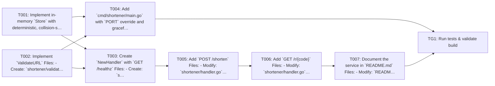

## Implementation Task Matrix — wi_prd901_80eef1

**Matrix ID:** `wi_prd901_80eef1-r1` · **Generated:** 2026-10-08T15:06:29.609767+00:00 · **Source:** `tasks` · **Verdict:** **READY with 4 warnings**

### Summary

| Metric | Value |
| :--- | :--- |
| Tasks total | 8 |
| AI-allocated | 8 |
| Manual-allocated | 0 |
| Waves | 6 |
| Conflicts | 0 |
| Requirements uncovered | 0 |
| Low-confidence allocations (<0.6) | 0 |

### Wave 0

| Task | Title | Repo | Owner | Allocation | Confidence | Status |
| :--- | :--- | :--- | :--- | :--- | :--- | :--- |
| T001 | Implement in-memory `Store` with deterministic, collision-safe codes Files: - C… | mayank-kochava/coding-agent-sandbox | coding-agent | ai | 0.70 | planned |
| T002 | Implement `ValidateURL` Files: - Create: `shortener/validate.go` - Create: `sho… | mayank-kochava/coding-agent-sandbox | coding-agent | ai | 0.90 | planned |

### Wave 1

| Task | Title | Repo | Owner | Allocation | Confidence | Status |
| :--- | :--- | :--- | :--- | :--- | :--- | :--- |
| T003 | Create `NewHandler` with `GET /healthz` Files: - Create: `shortener/handler.go`… | mayank-kochava/coding-agent-sandbox | coding-agent | ai | 0.90 | planned |
| T004 | Add `cmd/shortener/main.go` with `PORT` override and graceful shutdown Files: -… | mayank-kochava/coding-agent-sandbox | coding-agent | ai | 0.70 | planned |

### Wave 2

| Task | Title | Repo | Owner | Allocation | Confidence | Status |
| :--- | :--- | :--- | :--- | :--- | :--- | :--- |
| T005 | Add `POST /shorten` Files: - Modify: `shortener/handler.go` - Modify: `shortene… | mayank-kochava/coding-agent-sandbox | coding-agent | ai | 0.70 | planned |

### Wave 3

| Task | Title | Repo | Owner | Allocation | Confidence | Status |
| :--- | :--- | :--- | :--- | :--- | :--- | :--- |
| T006 | Add `GET /r/{code}` Files: - Modify: `shortener/handler.go` - Modify: `shortene… | mayank-kochava/coding-agent-sandbox | coding-agent | ai | 0.90 | planned |

### Wave 4

| Task | Title | Repo | Owner | Allocation | Confidence | Status |
| :--- | :--- | :--- | :--- | :--- | :--- | :--- |
| T007 | Document the service in `README.md` Files: - Modify: `README.md` (append the se… | mayank-kochava/coding-agent-sandbox | coding-agent | ai | 0.70 | planned |

### Wave 5

| Task | Title | Repo | Owner | Allocation | Confidence | Status |
| :--- | :--- | :--- | :--- | :--- | :--- | :--- |
| TG1 | Run tests & validate build | mayank-kochava/coding-agent-sandbox | test-change-gate | ai | 0.90 | planned |

### Dependency Graph

### Open Questions

- `T001` — No `eng-research.md` was provided, and the sandbox repo contents are unverified (Confirm the repo is greenfield for these paths, or supply research anchors)
- `T004` — No `eng-research.md` was provided, and the sandbox repo contents are unverified (Confirm the repo is greenfield for these paths, or supply research anchors)
- `T007` — Whether `README.md` already exists (None required)
- `T005` — Over-limit request body (Raise only if the product owner wants 413)

### Warnings

- Open item T001: No `eng-research.md` was provided, and the sandbox repo contents are unverified
- Open item T004: No `eng-research.md` was provided, and the sandbox repo contents are unverified
- Open item T007: Whether `README.md` already exists
- Open item T005: Over-limit request body

---
> Generated by: taskmatrix 0.1.0
