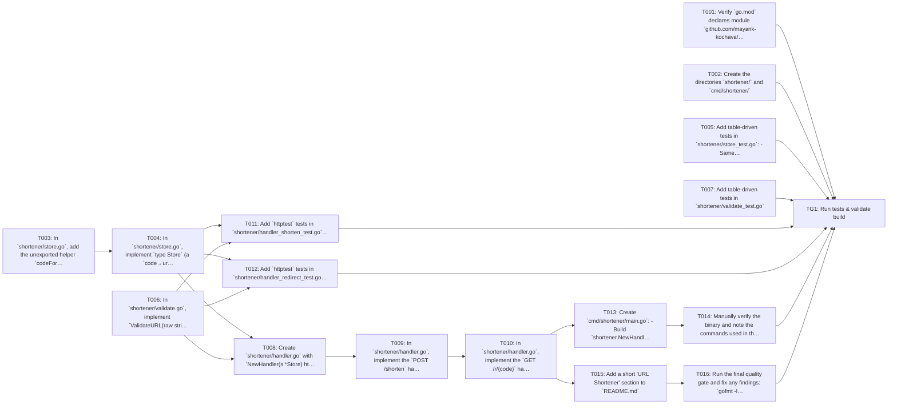

## Implementation Task Matrix — wi_prd902_cbef35

**Matrix ID:** `wi_prd902_cbef35-r1` · **Generated:** 2026-10-09T08:48:29.414956+00:00 · **Source:** `tasks` · **Verdict:** **READY**

### Summary

| Metric | Value |
| :--- | :--- |
| Tasks total | 17 |
| AI-allocated | 17 |
| Manual-allocated | 0 |
| Waves | 8 |
| Conflicts | 0 |
| Requirements uncovered | 0 |
| Low-confidence allocations (<0.6) | 0 |

### Wave 0

| Task | Title | Repo | Owner | Allocation | Confidence | Status |
| :--- | :--- | :--- | :--- | :--- | :--- | :--- |
| T001 | Verify `go.mod` declares module `github.com/mayank-kochava/coding-agent-sandbox… | mayank-kochava/coding-agent-sandbox | coding-agent | ai | 0.90 | planned |
| T002 | Create the directories `shortener/` and `cmd/shortener/` | mayank-kochava/coding-agent-sandbox | coding-agent | ai | 0.90 | planned |
| T003 | In `shortener/store.go`, add the unexported helper `codeFor(url string, attempt… | mayank-kochava/coding-agent-sandbox | coding-agent | ai | 0.90 | planned |
| T005 | Add table-driven tests in `shortener/store_test.go`: - Same URL twice returns t… | mayank-kochava/coding-agent-sandbox | coding-agent | ai | 0.90 | planned |
| T006 | In `shortener/validate.go`, implement `ValidateURL(raw string) error` | mayank-kochava/coding-agent-sandbox | coding-agent | ai | 0.90 | planned |
| T007 | Add table-driven tests in `shortener/validate_test.go` | mayank-kochava/coding-agent-sandbox | coding-agent | ai | 0.90 | planned |

### Wave 1

| Task | Title | Repo | Owner | Allocation | Confidence | Status |
| :--- | :--- | :--- | :--- | :--- | :--- | :--- |
| T004 | In `shortener/store.go`, implement `type Store` (a `code→url` map, a `url→code`… | mayank-kochava/coding-agent-sandbox | coding-agent | ai | 0.90 | planned |

### Wave 2

| Task | Title | Repo | Owner | Allocation | Confidence | Status |
| :--- | :--- | :--- | :--- | :--- | :--- | :--- |
| T008 | Create `shortener/handler.go` with `NewHandler(s *Store) http.Handler`, which b… | mayank-kochava/coding-agent-sandbox | coding-agent | ai | 0.90 | planned |
| T011 | Add `httptest` tests in `shortener/handler_shorten_test.go` for `POST /shorten`… | mayank-kochava/coding-agent-sandbox | coding-agent | ai | 0.90 | planned |
| T012 | Add `httptest` tests in `shortener/handler_redirect_test.go`: - Shorten, then `… | mayank-kochava/coding-agent-sandbox | coding-agent | ai | 0.90 | planned |

### Wave 3

| Task | Title | Repo | Owner | Allocation | Confidence | Status |
| :--- | :--- | :--- | :--- | :--- | :--- | :--- |
| T009 | In `shortener/handler.go`, implement the `POST /shorten` handler (FR-1, FR-2, F… | mayank-kochava/coding-agent-sandbox | coding-agent | ai | 0.90 | planned |

### Wave 4

| Task | Title | Repo | Owner | Allocation | Confidence | Status |
| :--- | :--- | :--- | :--- | :--- | :--- | :--- |
| T010 | In `shortener/handler.go`, implement the `GET /r/{code}` handler (FR-3) | mayank-kochava/coding-agent-sandbox | coding-agent | ai | 0.90 | planned |

### Wave 5

| Task | Title | Repo | Owner | Allocation | Confidence | Status |
| :--- | :--- | :--- | :--- | :--- | :--- | :--- |
| T013 | Create `cmd/shortener/main.go`: - Build `shortener.NewHandler(shortener.NewStor… | mayank-kochava/coding-agent-sandbox | coding-agent | ai | 0.90 | planned |
| T015 | Add a short 'URL Shortener' section to `README.md` | mayank-kochava/coding-agent-sandbox | coding-agent | ai | 0.90 | planned |

### Wave 6

| Task | Title | Repo | Owner | Allocation | Confidence | Status |
| :--- | :--- | :--- | :--- | :--- | :--- | :--- |
| T014 | Manually verify the binary and note the commands used in the PR description: -… | mayank-kochava/coding-agent-sandbox | coding-agent | ai | 0.90 | planned |
| T016 | Run the final quality gate and fix any findings: `gofmt -l .` (empty output), `… | mayank-kochava/coding-agent-sandbox | coding-agent | ai | 0.90 | planned |

### Wave 7

| Task | Title | Repo | Owner | Allocation | Confidence | Status |
| :--- | :--- | :--- | :--- | :--- | :--- | :--- |
| TG1 | Run tests & validate build | mayank-kochava/coding-agent-sandbox | test-change-gate | ai | 0.90 | planned |

### Dependency Graph

### Open Questions

None.

---
> Generated by: taskmatrix 0.1.0
